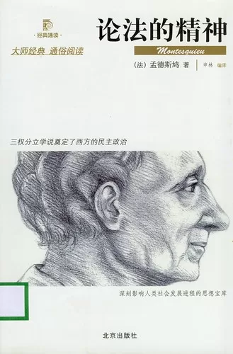

After roughly reading "The Spirit of Laws", it is of course impossible to read the original work. This is a "miniature color print", which is actually a "obscene color print". (not with pictures)

The editor may have put a lot of color pictures on each page because of his good intentions, but in my eyes, these pictures did not play a big role, on the contrary they kept disturbing my thoughts.

After spending half the night flipping through this masterpiece, I found that I was so sorry for Montesquieu. However, if many things are placed in the freshman and sophomore year, I will definitely go deeper, but now,

I feel that I don’t have a lot of time, so I can only briefly mention many theoretical things, and try to pick out some valuable viewpoints and extract them.

<!--more-->

The book has already been scratched several times with a pencil by the predecessors, but I still persisted and continued to scratch some.

I mainly read the two volumes "Law and Regime" and "Relationship between Law and Climate and National Spirit". Most of the other volumes were directly turned page by page.

I won't go into details about Montesquieu and the greatness of this book. Brother Xu said that if he talked about Rousseau, he couldn't finish it in a week. I think it would take longer if he was allowed to talk about Montesquieu.

There are very few perfect people through the ages, but Montesquieu is one of them.

Many of the views on China are quite incisive, and even predicted the current problems in China.

We don’t like to read books, so we didn’t pay much attention to the translation of "The Principle of Ten Thousand Laws" translated over 107 years ago and "Fa Yi" translated 96 years ago.

In fact, it is a miracle in itself that such an insightful book could have been written in 1748.
