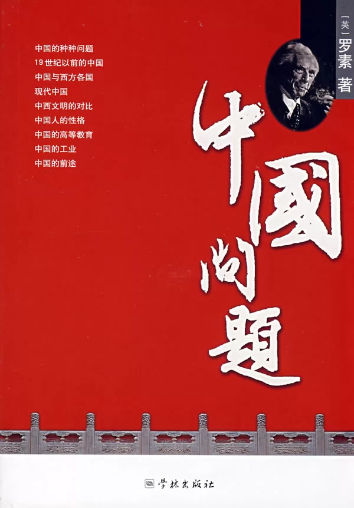

Dizzy in the afternoon, I stood in front of the bookshelf and spent more than half an hour flipping through Russell's "China Question", excerpted two pages,

I have to be convinced by Russell's vision in 1922. Most of the Chinese problems he predicted happened later.

And mostly impartial, to the point.

Among them are a few comparative viewpoints, which I have known before, and let me deepen my impression:

1. At that time, there was no big gap between China and the West in terms of morality and ethics. The biggest gap between China and the UK was science and technology;

<!--more-->

2. When Chinese learn from the West, most of them only care about morality, ethics, social value, etc., and pursue the pleasure of knowledge.

The joy of knowledge is considered by the Chinese as the door to wisdom;

3. Westerners come to China only for three things: fighting wars, making money, and preaching;

4. The purpose of Japanese learning from the West is to enrich the country and strengthen the army;

5. The Japanese think that they are the best nation, and this point of view is shown to the world through the behavior of the Japanese,

This is also the only exception to the "white-yellow-black" theory of the superiority and inferiority of races;

6. The three major weaknesses of Chinese people: greed, cowardice, and indifference;

7. The fragility of China's coastal defense before the Sino-Japanese War of 1899-1895 was due to the corruption of Japanese interests;

8. China needs to save itself, not rely on foreigners!

Of course, this is only a small part of my consciousness. This book still has a very friendly attitude towards China, but it is towards the West,

Japan is more criticized.

Although many historical facts in it are now clear, its predictability is really worth studying.
