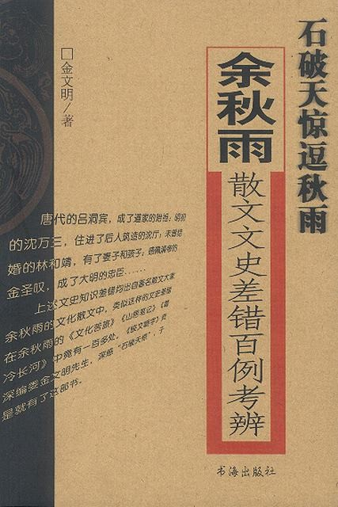

前两日，在模拟法庭上《辩论与口才》时，又见余秋雨身影。

中学时曾强读《山居笔记》、《文化苦旅》、《行者无疆》....

为什么是强读呢？

主要是因为当时作文水平太差（其实现在也是），依靠着强记散文中句子，才能成文。

后来偶然又在表哥那见书一本《石破天惊逗秋雨》，《咬文嚼字》的主编金文明先生所作。

书中尽数余秋雨在《文化苦旅》等三本书中史实、文化、文字等错误200余处（好像是这么回事，数字可能记错）。

这本书得出的结论也令年少的我相当苦闷，看罢方知想统一历史、散文与文化体系是多么大的困难。

此后，受金先生影响，对余秋雨也就少倾注意。

这些年，常见余秋雨在四处露面，俨然一电视明星形象于台前。

感觉像是被牺牲了？

文化电视明星的书籍，大抵都有关注过，三国、论语、明清史的新观点，都是详细看过，

特别是易先生的三国，因为上下两册的出版，前后隔了一个多学期，

所以两本书被我翻了两个学期有余。

当时大多能背记，不过，现在说起三国人物，恐怕只有荀彧印象是最深刻的了.

至于说到于丹的论语等，我向来对儒家思想就很是不满，

还是硬着头皮从头看了两遍，感觉忒鸡皮疙瘩。

孔孟误国、程朱更是误世！

有时意淫一下，假设汉高祖选了墨子、韩非子等的思想作为立国之本，

至于连自家下代的女儿们都嫁到西域去么？

昨天略翻了一遍唐朝的《反经》，感觉很不错，很有百家思想之精髓，

不拘泥于儒学，相当值得一观，不过现在时间不多，否则定将深入研习一下。

图书证只能借10本书，昨天匆匆还了9本，然后抱回一堆经济学类的书籍。

看了很多相关人士的建议，均说学法学的，最应该学好的相邻学科是：哲学、经济学。

于是今天又去抱了一堆中世纪末期和资产阶级早期的哲学书籍。

打头的就是笛卡尔的《哲学原理》。

很久以前就知道，

中国政治书上所写的批判”我思故我在”压根就是骗人的玩意。

但是当时也只是仅仅抱着对笛卡尔的丁点人物介绍得出的结论，现今有这个机会，

当然得大肆补血一番。

然后就是卢梭的《论人类不平等的起源和基础》，黑格尔的《法哲学原理》，帕斯卡的《思想录》

另外也有伏尔泰和其他人的。

虽然这些书都标着哲学或者法学的帽子，

但特别是笛卡尔的书，很大程度都介绍的是数学、化学、物理知识，

毕竟这些学科都是之后才从哲学分离出来的。故而期望不会太过枯燥。

书都是用朋友的证件借阅的，所以需要尽快看完额....

任务还是蛮艰巨的。

特别是我还想借着双语版的《思想录》顺带给英语六级做点准备工作。

最后再说及李贺这首诗，我记得是在高三课本上的，

而且是选学的文章。不过，作为高考范围，也是有背记过。

李凭箜篌引 唐 李贺

吴丝蜀桐张高秋，空山凝云颓不流。  
江娥啼竹素女愁，李凭中国弹箜篌。  
昆山玉碎凤凰叫，芙蓉泣露香兰笑。  
十二门前融冷光，二十三丝动紫皇。  
女娲炼石补天处，石破天惊逗秋雨。  
梦入神山教神妪，老鱼跳波瘦蛟舞。  
吴质不眠倚桂树，露脚斜飞湿寒兔。  
