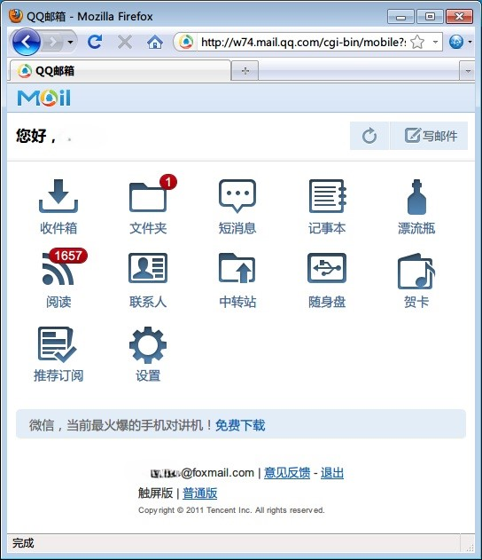

平常很少呆在宿舍，所以网线什么的，目前也就没有太大必要，偶尔临时需要上网都是用Blackberry来进行操作。

但手机上网毕竟是有一定的局限性，比如说晚上把笔记本扛回宿舍，闲来无事想跟着Foorbar2000学唱唱歌，发现不能联网下载歌词，煞是扫兴。于是把手机用USB线连接到电脑，打开Blackberry Desktop Software（就是以前的DM），启用移动网络即可方便的使电脑使用手机网络上网。

使用一个小时有余，中间还Google了一阵，发现只用了602K流量，还是算比较理想的。

下面就是一些个人在使用中的心得吧：

## **1.连接：**

打开6.0版本的DM后，选择“工具”下面的“移动Internet设置”，在“配置文件”中（如上图）选择China Mobile（移动）、China Telecom（电信）、China Unicom（联通），然后选择确定即可，用户名、密码、其他命令都是不用填写的。

设置好ISP后，只需要点击左下角的“移动Internet”就能连网了，这时候电脑会自动弹出一个网络选择窗口，一般情况选择“家庭网络”。

网络连接完成后我们会看到当前连接到网络为拨号网络:China Mobile。

 

## **2. 网络浏览：**

其实也没必要多此一举在PC上使用手机网络来浏览网页，但无可非议的是，电脑上的浏览器确实比手机上的强太多。

如果手机流量资源像我这样不是特别丰富的话，可以考虑使用Opera Mobile浏览器Windows版本（流量不够就不下载了），或者我下面介绍到的Firefox。

在电脑上安装好Firefox，在附加组件里面搜索“user agent switcher”，并进行安装，安装完选择iphone或者其他型号手机，这个插件能使Firefox在联网时，被各种网络服务器识别为手机浏览器，从而传输适合手机浏览的，省流量的页面。

开启插件选择Iphone后，登录QQ邮箱后的页面即自动变成触屏版，微博也是如此。

 

## **3.QQ使用**

由于移动网络本质上与日常网络是没有什么差别的，所以QQ、SSH、各种代理，都是可以正常使用的，囿于手机网络的传输速度，我选择使用TM2009（没有新版本QQ那么多后台小程序，看起来就不怎么耗流量），并在登录后立马把所有QQ群消息屏蔽，否则数十个超级高级群在后台接收消息，将是一个浪费流量的无底洞。

也可以考虑使用腾讯的Web mini QQ（http://w.qq.com），一个极为简洁的登录和使用界面。

 

## **4.电脑后台配置**

在启用移动网络之前，最好确认电脑后台的360、杀毒软件、自动更新等程序都是关闭的，否则移动网络流量是完全经不起这些后台程序蹂躏的。

流量特别吃紧，还可以把浏览器中的“自动载入图片”功能禁用，毕竟日常的网页流量，图片传输占用了其中一大部分资源。

