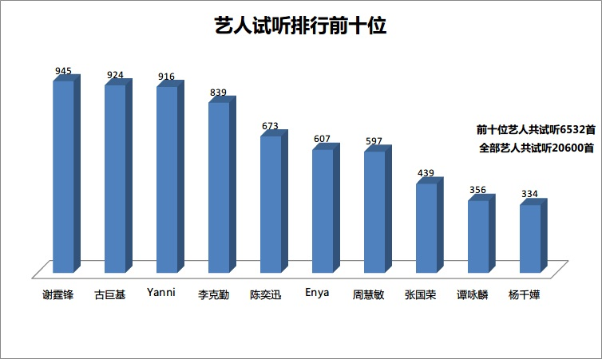

在虾米网的注册时间已近3年，在虾米网上听过的第一首歌曲是《爱得太迟》。

在校期间基本上使用foobar2000离线听歌，所以很少会用到虾米，真正开始经常使用在线听歌的时间可能也就1年多一点，至于源头，从个人在虾米网上的每日签到可以大致追溯到（至今日，为395天）。

目前，在虾米网上的记录为：

共计听歌：**20600首；**

共计听歌时间：**1375小时；**

平均每首歌刚好**4分钟**。

如果按395天计算（活跃时间），平均每天花在虾米上为**208分钟**；

如果按照947天计算（注册时间），平均每天花在虾米上的时间为**87分钟**。 在虾米网上试听次数最多的歌曲为张智霖的**《祝君好》，共229×4.2分钟=16小时。**

在虾米上听下面这10个人的歌曲次数最多，达到了**6532首，平均每人43个小时。**

**试听次数前50名的歌曲，共计次数为2703次。**

<table width="510" border="0" cellspacing="0" cellpadding="0"><colgroup><col width="72"> <col width="234"> <col width="132"> <col width="72"></colgroup><tbody><tr><td width="72" height="18">排序</td><td width="234">歌曲名</td><td width="132">演唱者</td><td width="72">次数</td></tr><tr><td height="22">1</td><td>祝君好</td><td>&nbsp;张智霖</td><td>144</td></tr><tr><td height="22">2</td><td>说谎</td><td>&nbsp;林宥嘉</td><td>129</td></tr><tr><td height="22">3</td><td>如果有来生</td><td>&nbsp;谭维维</td><td>113</td></tr><tr><td height="22">4</td><td>可不可以不勇敢</td><td>&nbsp;范玮琪</td><td>108</td></tr><tr><td height="22">5</td><td>祝君好</td><td>&nbsp;张智霖</td><td>85</td></tr><tr><td height="22">6</td><td>Truth Of Touch</td><td>&nbsp;Yanni</td><td>73</td></tr><tr><td height="22">7</td><td>I Surrender</td><td>&nbsp;Celine Dion</td><td>69</td></tr><tr><td height="22">8</td><td>留恋</td><td>&nbsp;周慧敏</td><td>65</td></tr><tr><td height="22">9</td><td>with</td><td>&nbsp;中島みゆき</td><td>64</td></tr><tr><td height="22">10</td><td>我对于你,你对于我</td><td>&nbsp;韩国原声带</td><td>62</td></tr><tr><td height="22">11</td><td>岁月如歌</td><td>&nbsp;陈奕迅</td><td>62</td></tr><tr><td height="22">12</td><td>红颜知己</td><td>&nbsp;周慧敏</td><td>62</td></tr><tr><td height="22">13</td><td>Traveling Light</td><td>&nbsp;Joel Hanson</td><td>60</td></tr><tr><td height="22">14</td><td>Autobots</td><td>&nbsp;Steve Jablonsky</td><td>58</td></tr><tr><td height="22">15</td><td>今宵多珍重</td><td>&nbsp;陈百强</td><td>58</td></tr><tr><td height="22">16</td><td>青春骊歌</td><td>&nbsp;拜金小姐</td><td>57</td></tr><tr><td height="22">17</td><td>May It Be</td><td>&nbsp;Enya</td><td>57</td></tr><tr><td height="22">18</td><td>重复犯错</td><td>&nbsp;古巨基</td><td>56</td></tr><tr><td height="22">19</td><td>藉口</td><td>&nbsp;王靖雯</td><td>56</td></tr><tr><td height="22">20</td><td>必杀技</td><td>&nbsp;古巨基</td><td>55</td></tr><tr><td height="22">21</td><td>中箭</td><td>&nbsp;古巨基</td><td>54</td></tr><tr><td height="22">22</td><td>He's a Pirate</td><td>&nbsp;Klaus Badelt</td><td>54</td></tr><tr><td height="22">23</td><td>小星星</td><td>&nbsp;杨千嬅</td><td>53</td></tr><tr><td height="22">24</td><td>爱神</td><td>&nbsp;古巨基</td><td>53</td></tr><tr><td height="22">25</td><td>Scorponok</td><td>&nbsp;Steve Jablonsky</td><td>52</td></tr><tr><td height="22">26</td><td>七友</td><td>&nbsp;梁汉文</td><td>51</td></tr><tr><td height="22">27</td><td>感冒</td><td>&nbsp;汤宝如</td><td>51</td></tr><tr><td height="22">28</td><td>男人信什么</td><td>&nbsp;JW</td><td>50</td></tr><tr><td height="22">29</td><td>任天堂流泪</td><td>&nbsp;古巨基</td><td>50</td></tr><tr><td height="22">30</td><td>With an Orchid</td><td>&nbsp;Yanni</td><td>44</td></tr><tr><td height="22">31</td><td>在你遥远的附近</td><td>&nbsp;方力申</td><td>43</td></tr><tr><td height="22">32</td><td>Echo Of A Dream</td><td>&nbsp;Yanni</td><td>43</td></tr><tr><td height="22">33</td><td>打回原形(大开眼戒)</td><td>&nbsp;陈奕迅</td><td>40</td></tr><tr><td height="22">34</td><td>When You Say Nothing At All</td><td>&nbsp;Soundtrack</td><td>39</td></tr><tr><td height="22">35</td><td>开学礼</td><td>&nbsp;李克勤</td><td>39</td></tr><tr><td height="22">36</td><td>Canon &amp; Gigue</td><td>&nbsp;Various Artists</td><td>38</td></tr><tr><td height="22">37</td><td>非走不可</td><td>&nbsp;谢霆锋</td><td>36</td></tr><tr><td height="22">38</td><td>水中花</td><td>&nbsp;谭咏麟</td><td>35</td></tr><tr><td height="22">39</td><td>永遠の嘘をついてくれ</td><td>&nbsp;中島みゆき</td><td>35</td></tr><tr><td height="22">40</td><td>Pachelbel : Cannon In D Major</td><td>&nbsp;韩国原声带</td><td>33</td></tr><tr><td height="22">41</td><td>于心有愧</td><td>&nbsp;陈奕迅</td><td>33</td></tr><tr><td height="22">42</td><td>御機嫌如何[Live]</td><td>&nbsp;中島みゆき</td><td>33</td></tr><tr><td height="22">43</td><td>CANTO DELLA TERRA</td><td>&nbsp;Andrea Bocelli</td><td>33</td></tr><tr><td height="22">44</td><td>野百合也有春天</td><td>&nbsp;永邦</td><td>32</td></tr><tr><td height="22">45</td><td>水瓶座</td><td>&nbsp;陈晓东</td><td>32</td></tr><tr><td height="22">46</td><td>The truth that you leave</td><td>&nbsp;Pianoboy</td><td>32</td></tr><tr><td height="22">47</td><td>Flower Dance</td><td>&nbsp;DJ OKAWARI</td><td>31</td></tr><tr><td height="22">48</td><td>无声仿有声</td><td>&nbsp;谢霆锋</td><td>31</td></tr><tr><td height="22">49</td><td>Only Time</td><td>&nbsp;Enya</td><td>30</td></tr><tr><td height="22">50</td><td>假如</td><td>&nbsp;李克勤</td><td>30</td></tr></tbody></table>

 **试听次数前50名的艺人，共计次数13162次，占总数20600的64%。**

<table width="582" border="0" cellspacing="0" cellpadding="0"><colgroup><col width="112"><col width="122"><col width="106"><col width="122"><col width="120"></colgroup><tbody><tr><td width="112" height="22">谢霆锋</td><td width="122">古巨基</td><td width="106">Yanni</td><td width="122">李克勤</td><td width="120">陈奕迅</td></tr><tr><td height="22">945</td><td>924</td><td>916</td><td>839</td><td>673</td></tr><tr><td height="22">Enya</td><td>周慧敏</td><td>群星</td><td>张国荣</td><td>谭咏麟</td></tr><tr><td height="22">607</td><td>597</td><td>507</td><td>439</td><td>356</td></tr><tr><td height="22">杨千嬅</td><td>Soundtrack</td><td>中島みゆき</td><td>Steve Jablonsky</td><td>林夕</td></tr><tr><td height="22">334</td><td>306</td><td>303</td><td>287</td><td>283</td></tr><tr><td height="22">周华健</td><td>张智霖</td><td>陈百强</td><td>Various Artists</td><td>陈慧娴</td></tr><tr><td height="22">275</td><td>269</td><td>262</td><td>250</td><td>249</td></tr><tr><td height="22">韩国原声带</td><td>原声带</td><td>方力申</td><td>梁静茹</td><td>Hans Zimmer</td></tr><tr><td height="22">239</td><td>224</td><td>208</td><td>175</td><td>172</td></tr><tr><td height="22">林宥嘉</td><td>王杰</td><td>张学友</td><td>林志炫</td><td>童安格</td></tr><tr><td height="22">159</td><td>152</td><td>144</td><td>137</td><td>129</td></tr><tr><td height="22">汤宝如</td><td>范玮琪</td><td>Westlife</td><td>谭维维</td><td>彭羚</td></tr><tr><td height="22">124</td><td>117</td><td>117</td><td>113</td><td>103</td></tr><tr><td height="22">王菲</td><td>黎明</td><td>Pianoboy</td><td>Beyond</td><td>永邦</td></tr><tr><td height="22">101</td><td>100</td><td>93</td><td>92</td><td>89</td></tr><tr><td height="22">梁汉文</td><td>王靖雯</td><td>Klaus Badelt</td><td>罗文</td><td>James Horner</td></tr><tr><td height="22">87</td><td>86</td><td>77</td><td>76</td><td>74</td></tr><tr><td height="22">Secret Garden</td><td>Celine Dion</td><td>刘德华</td><td>Maksim Mrvica</td><td>Joe Hisaishi</td></tr><tr><td height="22">74</td><td>72</td><td>70</td><td>69</td><td>68</td></tr></tbody></table>
