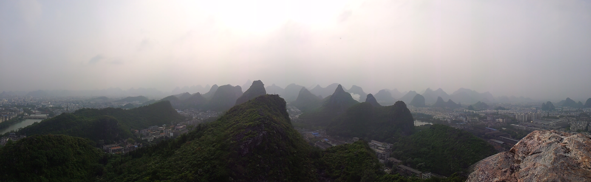

")

“桂林山水甲天下”，如此名气，如此牛逼之描述，对于吾等屁国小民来说，神往久矣。此七字，出于寡人右上方石壁碑刻，若放大之，则为下图光景，为乡贡进士张次良所作。

 石刻不可不谓桂林之一大瑰宝，此有独秀峰之石刻，又有龙隐岩等众多古人之乱涂乱画作品，虽然不乏号称国家NX级珍贵文物，但乱砸乱凿弄疼了石头总是不好的。

")

 说到石头不得不提的就是石头山了，好吧，你桂林山水甲天下，好歹是以山和水为冠的，那总的有座像样的山，有滩没臭味的水给人看吧。可，山是啥？山就是石头！妹的，坑爹呢。

无心吐槽，石头就算了，堆那么高，说它是山也不过分。但一定要说这群石头山就能扛下全中国其他名山大岳，还真感觉有点忤逆不道呀。

石头完了就是水了。漓江呀，洒下过俺几升液体排泄物的地方（沃勒个擦的，后来才知道佛山的自来水水源为河水，就是漓江下游啊），也是各种污水管废水管的收集器，不见得保护得多么好呀，只不过是因为再上游真心没啥工业企业了，污染得不多而已。

")

本来吧，山和水结合起来能有上图这个水平，我也就不准备再说啥了。但泥马哥风风火火不远千里跑来桂林，第一眼见到漓江时居然丫的看到的是这货，不禁得虎躯一震，鬼子当年打桂林真心没打够呀？

")

说到日本娃，不得不提到下面这三位了：阚维雍（131师师长）、陈济桓（桂林城防司令部参谋长）、吕旃蒙（第31军参谋长）。但似乎再多说啥也没什么用，猴子为伴略见一斑。

")

不知道AAAA级景区到底是个啥概念，只知道，随便市内公园啥的都是AAAA级景区，还都TM比京城那几堵墙的门票还贵。下面图中，就左上角那一撮小山，约莫几亩地的面积，居然也是个AAAA，沃勒割草，这TM评级机关当年收了多少钱啊？

")

好吧，我承认孤陋寡闻了，去了桂林才知道，阳朔才是丫桂林最牛叉的地方，据说阳朔山水冠桂林，坑爹的宣传。于是风尘仆仆的赶到阳朔来围观一下，本来没报多大期望，结果却是也就那么点小期待被实现了。

")

无语，给我活生生的来了一场暴雨游漓江的大戏。船家大叔，美其名曰“烟雨漓江”，好吧，暴雨蒙蒙啥都看不到的漓江，估计这辈子也没机会再见第二次了。

")

这就是阳朔最牛叉的西街了，如果把后边的石头给PS掉，说这地方是湘西凤凰，估计没人会觉得有异常。

"山顶上太阳射得厉害，亮瞎了俺双5.3视力的钛合金狗眼"

")

"一对好G友，攻受对比明显，都搞大肚子了"

")

"213青年欢乐多，谁TM说这后面是骆驼了"

")
