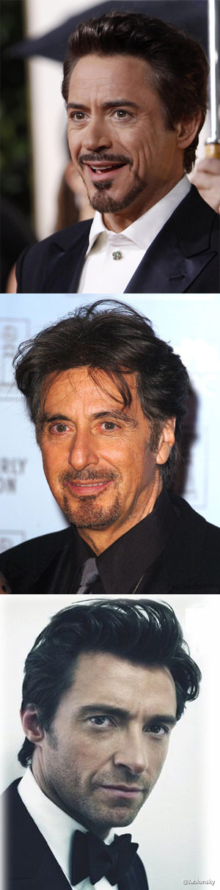

1，起因

昨天下午在办公室闲来无事，偶然发现《复仇者联盟》即日开始公映，然后微博搜索了一下附近影院的档期表，刚好看到下午5点10分有一场，速度找来德哥奔赴现场。但没想到，票还是有几张，但是被告知3D小场的电影要交100元眼镜押金，两人相对无言，都没带钱包啊，跑回办公室再过来的话，电影就已经开场一阵了。然后选了个7点半的所谓黄金时间，40元票价，有点坑爹。

7点，去卖当劳混了个10多块钱的简餐然后就开始等入场了。俗话说呀，期望有多大，失望就有多大。

2，电影院

选了个J8远位置，二楼包厢，隔着几十米，虽说俯视全场，但视觉范围内荧幕只占了1/5不到，看起来也就很累了，加上国内影院大范围使用的是亮度严重不够的3D放映机灯泡，所以观影效果实在是很差劲，很多细节黑乎乎一片，看不清。

3，战斗力

故事情节本来是基于去年《美国队长》而来的续集，但是在本片中，众所周知的原因，美国队长不可能再始终占据主角之位了，其战斗力在本片中也直线下降。

说起战斗力，本片中绿巨人无疑是No.1的，神马神，神马外星军队，神马外星战舰，在绿巨人手下，都是蝼蚁啊！要不要这么牛逼啊。并且，最疑惑的是，刚才还野性十足肆意攻击队友毫无人性的小巨人，转眼间就收放自如只打外星怪了。莫非删了啥桥段？

战斗力排第二的应该算钢铁侠吧，工业光魔的杰作，当然不会太差劲，其武器威力及源动力也是无以伦比，单扛几个外星舰队估计只是小CASE。

4，特效

ILM又赢了，出神入化啊，无敌啊。无论大型机械，近期的超级战舰、阿凡达里边的飞船、变形金刚里边的各种机器人，还是小型的钢铁侠、加勒比海盗、碟中谍手套，好像地球上已经没有啥是ILM做不出来的效果了。。。。电影中估计绝大多数场景均是ILM特效效果，神马NewYork City，神马巨型“航空”母舰，神马Stark大楼，几乎没有几个场景是实景拍摄的。

5，反派

大反派Loki，看起来比雷神老得多的角色，原本以为是个大龄演员饰演的，没想到也就30来岁，老成啊老成，但是，按照电影的说法，雷神是Loki的大哥，实际中两个演员年龄还倒差两岁，这倒是有点意思。

6，乌龙

看电影时，以为饰演绿巨人的演员是《铁达尼克》里边饰演Karl的比利·赞恩，没想到是《禁闭岛》里边那个和小李一起上岛去调查的警察。

另外一个大乌龙就是我习惯性的把小罗伯特·唐尼、阿尔·帕西诺、休·杰克曼这仨大虾混起来。

