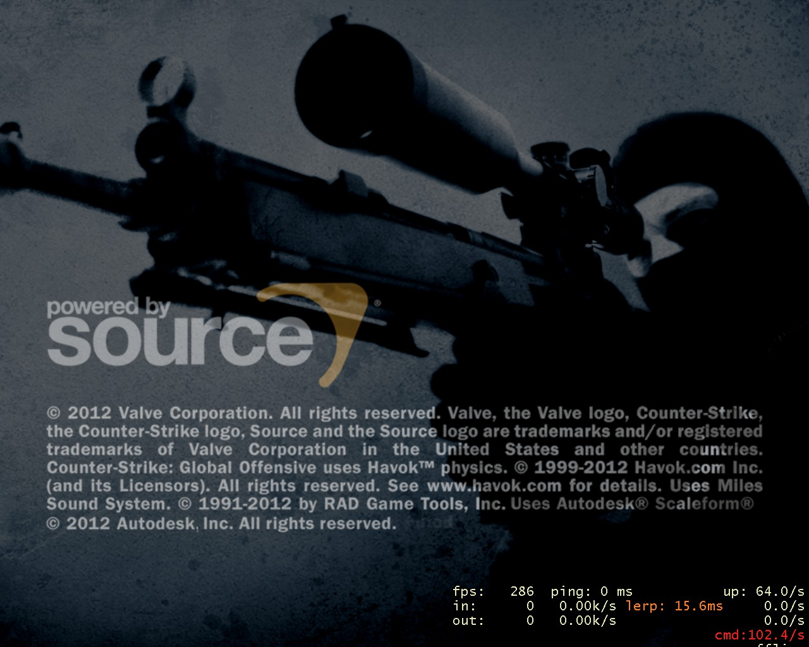

CS:GO推出试用版已经很久了，但是一直都没有找到机会去下载，平常遇到Steam强推的广告都是直接点关闭的，今天偶尔兴起就点了一下，发现原来CS:GO明天就要正式上市了。

在这即将上市的时刻，Valve也是非常给力的推出了在5折预购的基础上，再度-10%的优惠力度，原价30美元活生生的打了个4.5折，成了13.49美元（￥84.x）。这么好的机会，当然不能错过，立马添加购物车采用支付宝付款。

下载的版本是测试beta版，估计跟明天正式推出的版本还会有一些小差别。游戏本身大小为3.5GB，值得一提的是，直接点击下载安装，速度基本上达到了我目前2M宽带的极限，总共下载了约5个小时。换在以前，CS1.6无论选哪个下载服务器，下载速度永远就那么三四十K，只能去下载别人打包的备份包再覆盖安装才快点。

由于以往经在淘宝买过几次JS的黑KEY老被VALVE封帐号，所以这次还是有点小担心的，因为现在用的这个号，前边几个CS1.6啥的，也是黑KEY。。。。。。

打开游戏后，居然每次都会弹出安装DirectX的提示，虽然时间不长，但总感觉怪异。

接下来就是进入游戏了：

开始界面

和以往版本差不多，都可以按鼠标回车快速略过。

等待界面

进入游戏主界面

成就系统

个人统计

导航

游戏说明

视频-高级设置

控制设置

国际排行榜

可选对战类型

可选地图等信息

好友模式

网战服

收藏夹

查看好友所在服

 选择队伍

 等待开始

游戏画面

游戏画面

 

游戏画面

游戏画面

游戏画面

值得一提的是，该游戏对于电脑性能要求很高。截图中个人使用电脑配置为i3 550 3.2G / 4G DDR3 1333 / 8600GT / Win7 32bit

由于是老显卡，在1280×1024的情况下，fps一直维持在三四五十之间，可玩，但是对于CS这种需要灵敏反应的游戏来说，还是很不够的。而且，这是在把所有特效全关的情况下。

当然，如果把分辨率调为CS1.6常用的800×600或者640×480，FPS会升到80/120以上。

由于今天刚安装，也没来得及玩更多时间，基本的感觉是：比起CS1.6操作的流畅感受，CSGO带点网络游戏的味道，有滞阻、难控制。当然，也不是说它流畅度不行，而是相对于CS1.6而言的，比起某些渣网游，明显是好了不止百倍了。另外，CSGO的游戏画面确实做得非常出色了，各种效果全开的情况下，应该是一番很好的视觉享受。可是，这游戏的精华不是在于合作对抗和杀人的快感么？？？
