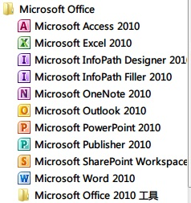
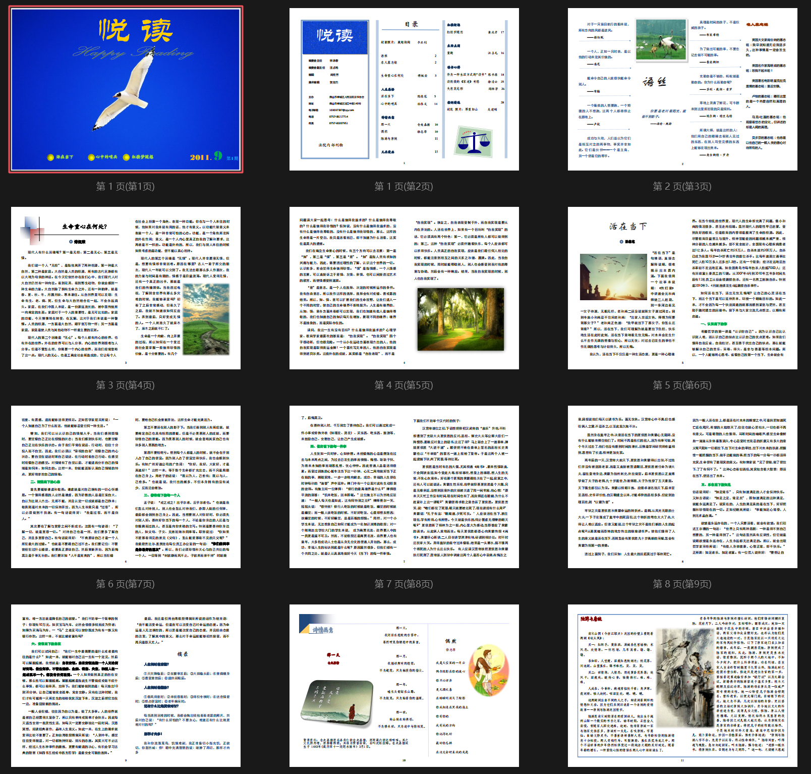

大多数人对于非专业或者不熟悉的领域都会或多或少存在误解，比如说多数人眼里，学计算机专业的就应该是对于计算机硬件、软件、编程、开发、维护等方面无所不能的人士。

我本身是读的是正统的专业代码为030101的法学专业，但偶尔在使用电脑方面稍有长处，便经常被人误会拉去做各种非常费解的事情，比如说这次落到头上的单位内刊杂志编辑工作。

对于杂志制作，大一时也曾遇上过，当时为了给班主任展示我班大一年级的一些图片和成就使用了ZCOM这款比较简单的图片杂志软件，依稀记得做出来后文件是exe格式的。

后来，也曾经常给同学论文排版、图片美化之类的工作，但都是应付了事，没有深入学习训练过。

这次被安排编辑工作也是一头雾水，不知如何开始。

起初我以为需要动用到方正飞腾等专业排版软件而非常反感做这件事情，但当第一次拿到同事给我的模板时，才发现原来只是一个WORD文档。于是这件事情便变得非常简单起来。

经过对该DOC文档一轮的整理下来，发现以下几个问题：

**文字内容多、图片少、长篇幅文章多、各种内容相关性低**

思忖良久，最后只能选择用页幅更大、插入元素更自由的Publisher来制作这次内刊。

Publisher是office中的一个选件，可能多数人在使用Word、Excel、Powerpnt之余很少会留意下剩下那些Access、Outlook、Onenote等不常用的组件，但这些东东，偶尔用一下还是会有非常不错的效果的。

制作过程与WORD无异，麻烦在于将数万字一页一页的排版，一不小心就容易错行错字错页。

下面就是这次的结果文件了。一些图片及文章Download自网络，内部传阅不对外传播，非盈利，不会对著作权造成过多损害（感觉不爽，立马改）。 

不得不提的是，对于网页内嵌文档这一问题，个人的解决方案有以下几种：

1，首选的是上面这种，将DOC等文档，先转换成PDF格式，再从PDF转换成SWF格式（用SWFTOOLS转换），使用FLASH播放器在网页中进行浏览；

a，这种方法的好处是FLASH播放器基本上所有电脑都有安装，都可以直观的在网页中看到该文档。PDF本身是可以使用ORC软件或者直接转换软件转成doc的，但PDF转SWF是不可逆的转换方式，无需担心别人会复制自己的成果文件。

b，坏处是，将PDF转换成SWF时，容易产生颜色失真，对于裁判文书之类的纯DOC还可以，对于带复杂颜色图片等文档，会有一定的影响。

2，以附件形式上传文档文件：

好处是自己省得折腾，而且各种文件通杀，不用考虑网页嵌入问题。坏处是存在如何勾引访问者的下载欲望、需要附带提供播放器等问题。

3，将文档制作成图片：

以往经常使用这种方法在内网上传一些复制的长作品，只需要在浏览器上安装一个截屏工具，可以轻松的将网页文字格式保留在图片上，无需担心再次排版问题。问题是，图片的展示，要么直接采取插入页面，依靠鼠标或滚轮不断下拉才浏览文件，要么需要使用JS图片控制器等方法。

4，DOC、PDF等文件直接嵌入网页：

在内网，由于有公司开发了IE相关ActiveX插件，也是一个选择，但在外网显然难以实现。

5，依靠其他网站服务，嵌入网页，如下边的演示：

使用豆丁、百度文库等网站服务，把文档上传后，可以方便嵌入网页。唯一蛋疼的是，国内的这些网站，均需要通过审核才能发布成功，审核时间一般很长，审核不通过的几率很高。下边使用的是GoogleDocs的服务，但在国内似乎被墙明显，能不能看到，看RP。

