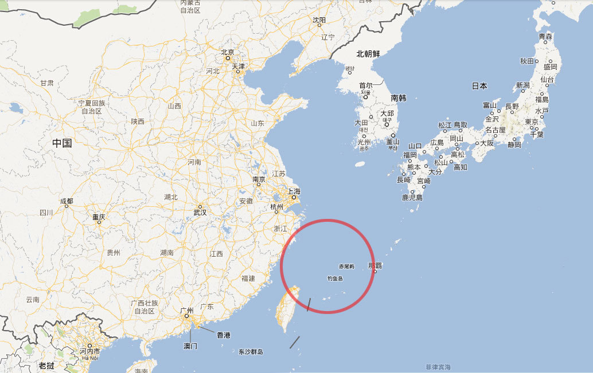

钓鱼岛说大不大说小不小，如果以钓鱼岛为中心200海里为半径，那么它所涵盖的区域近为43万平方公里，约等于安徽福建江苏浙江4省面积之和。

钓鱼岛的地理位置，在地图上可以明显看到，离陆台非常近，离日本本岛较远，历史上，钓鱼岛由于无人居住，在传统农渔业社会是一个被遗忘的岛屿，大陆、台湾、日本、琉球都没有实际有效的对其行使过管辖。

钓鱼岛问题的出现在20世纪中期开始，联合国相关组织探测到钓鱼岛附近海域的海底蕴藏的丰富油气资源。由于日本对于钓鱼岛的占有，是基于对中国、琉球的战争和征服而得来，陆台均认识到，这部分利益是有很大争取空间的，故在之后的国民教育中不断强化对于钓鱼岛主权的立场。

根据已有的各方提出的各种不同证据，钓鱼岛历史上确实可以算作一个被人遗忘的岛屿。但直至今日，大陆和台湾地区政府，均未承认日本对于琉球群岛的领土主权。这其实是在为未来下一盘很大的棋。

中国的海洋国土，如果按照国际海洋法来计算，是非常狭小的，总共300万平方公里不到，并且其中一大半是在南海。这对于14亿人的长远发展需求来看，是非常不利的。中国目前有近6亿人常住东部沿海地区，对于海洋利益的需求将在未来出现非常大的增量。而第一岛链的存在，就像一道无形的网，将完全扼杀住中国未来走向远洋的希望。第一岛链封锁中国的关键区域就在琉球群岛。

按照中国未来发展的构想，经济与人口重心将被继续转移到以沿海和沿江为带状的城市群。沿海沿江城市群交汇于长江下游地区，这一区域往太平洋进军所需要直接面临的就是琉球群岛的日美联盟。

美国重返西太平洋的计划一直在有条不紊的进行，西太平洋最大的利益群即东亚四国。这四个国家，在历史上看都是中华文化覆盖的范围。如果中国未来发展超过美国，基于传统文化心理的推断，朝鲜半岛与日本均有倒戈美欧投入中华文化圈的趋势，而这是美国最不愿意看到的事情。欧盟与美国实力相当，如果东亚再出来一个共同体，那美国的霸主地位就上没有太大存续空间了。当然，这一切都是目前的意淫方向，但不可否认，是存在这个趋势的。

美国东亚战略的核心是保持美国对于日韩的继续控制，遏制中华文明的崛起。由于中华文化最恐怖之处在于打了几千年仗，地盘越打越大。美国是决不想看到中国崛起的，表面上它暗地里想推动中国搞啥自由民主革命，实际上还是与其冷战对苏联搞和平演变一个套路，最终目的是分裂中国，让中国回到合久必分的老路。

中华文化在历史上可以是世界上最先进的，在未来仍然是有极大可能脱颖而出的。10数亿人民的智慧，爆发的能量将是美国所不能控制和不愿面对的。

至于说印度这个国家，由于其深厚的宗教底蕴导致的无欲无求的思想文化，其竞争力和影响力将受到非常大的局限，历史上其一直是被征服且没有反抗意识的民族，与中华文化在这个方面是没办法比较的。

台湾问题虽然号称是中美问题的核心，但随着大陆不断的发展，与美国差距不断的缩小，天平重心的移动是不可避免地趋势。

我们经常说钓鱼岛是我们自古以来固有领土，这个说法暂且不提。但如果换句话说“琉球自古以来是中华附属领土”则是绝对没有悬念的。但在目前我国国力与军力的实力状态下，我们还不够底气来说这句话。

日本当年对于琉球的占领，是背着大清国私底下进行的，清政府没有同意、后来的陆台政府也均未表示承认，这就为未来留下了一个很大的空间。特别是之后波茨坦公告，更是限制日本国土只局限于本土四个岛屿，完全没琉球啥事。

由于之前的方向性问题，中国军队的发展，由其是海军的发展，一直不尽如人意，也就最近10来年发展比较快。但可以预见的是，连印度这种完全没有战争欲望的国家都搞了几十年的航母，中国海军的未来还是很值得期待的。

说到底，钓鱼岛只是为了拖住日美打开第一岛链缺口的一道钥匙，如果放任日本独占，今后再打开这把链子就困难重重了。

所以保钓是必然的。

