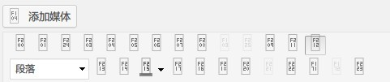
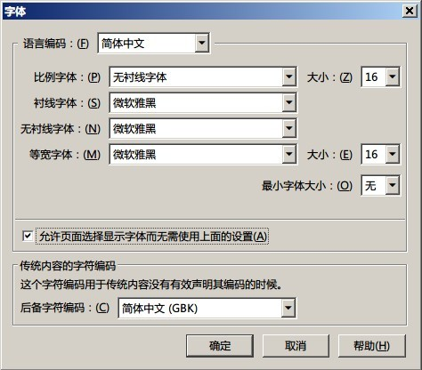
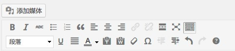
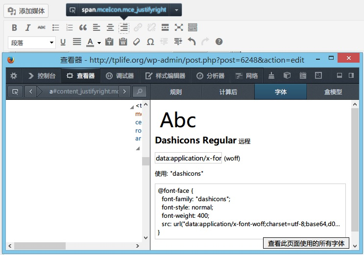
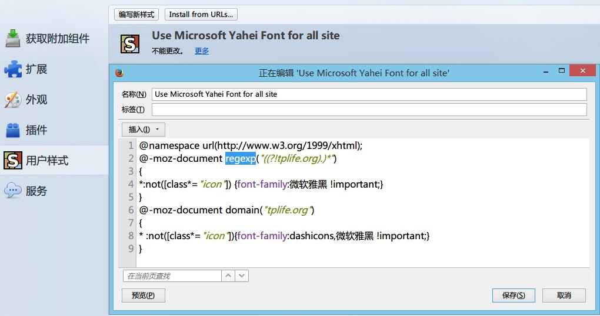
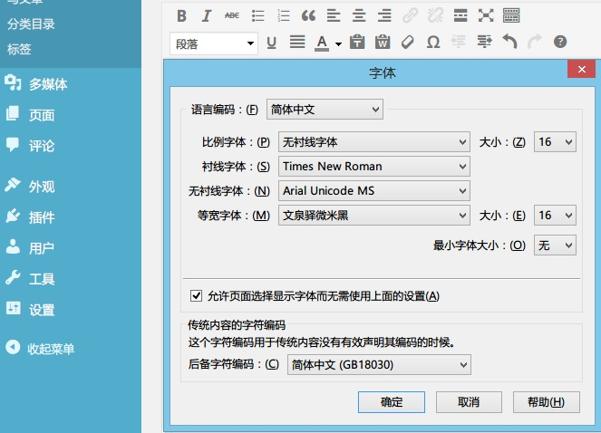

用Firefox时，经常会遇到网站后台图标不显示的问题，甚至发现有Wordpress后台编辑器等图标按钮全部丢失不显示的情况。



在Google一顿乱搜未明结果，仔细观察这些图标上显示的文字，发现都是F101 F102 F103 F201 F202 F303这种，于是想到可能是字体问题。

Firefox等浏览器的字体设置中有是否限制网站选择字体使用的选项，之前为了字体渲染方便直接禁用了。



修改后问题得以解决。



但是，如果“允许页面选择字体”，遇上国内一大堆使用各种蛋疼字体的网站，那无疑是非常郁闷的了。所以，一劳永逸的办法是将图标所使用的字体添加到Stylish里边。



使用Firefox的元素查看器可以非常容易看到，Wordpress后台MCE编辑器所使用的图标字体为font-family:"Dashicons";

于是将Dashicons添加到Stylish即可。



```
@namespace url(http://www.w3.org/1999/xhtml);
@-moz-document regexp("((?!XYZ.com).)*")
{
*{font-family:rei,iconfont,FontAwesome,Octicons,Icomoon,
Open Sans,dashicons,微软雅黑 !important;}
}
这里已经添加了网络上常用的图标字体了。

```


