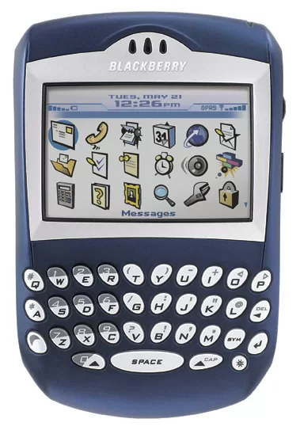
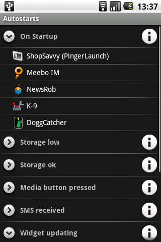
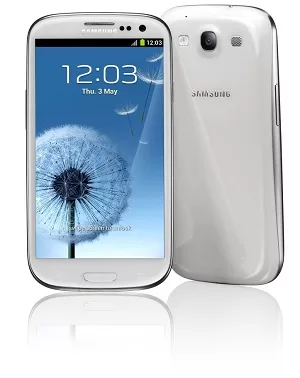

In the summer when I was 14 years old, I saw a Lenovo mobile phone advertisement on the middle page advertisement of a "Reader". At that time, Lenovo had not yet acquired the PC business of Big Blue, but it was already booming in China, with computers, mobile phones, printers, cameras, and many 3C fields having its presence. At the time, I didn’t remember much about the content of the advertisement, but the 999 yuan color-screen mobile phone left a deep impression on me, so I encouraged my mother, without telling my father, to use the mobile phone’s built-in electronic dictionary function, and successfully defrauded me of financial support.

***(The following content is nonsense, watch carefully)***

When I was young, I didn't know the heights of the heavens and the depths of the earth. I didn't know how deep the sewage was in the mobile phone industry in a small county. With 1,500 yuan in cash (at that time, the tuition fee for a semester of high school was 1,500 yuan), I walked onto the chopping block of profiteers.

After all, this mobile phone is the first real electronic device in my life. Before that, the tape machines and radios I had come into contact with were only played occasionally in the hands of older friends. Even in the second year of junior high school, in order to listen to the Korea-Japan World Cup in class, I cheated my parents 15 yuan in the name of buying an electronic alarm clock, and privately bought the simplest black FM radio. But these are unimportant. In the situation of scarcity of various resources in the big countryside, any novelty can inspire endless interests and hobbies. Internet cafes with dial-up Internet access, 10 yuan an hour Internet fee, make parents panic. And the first time I saw at my cousin's house that it was no longer running the school's MSDOS system, but could play extremely cheating games such as CS, and it left an indelible mark in my heart all year round.

As my first mobile phone, Lenovo's G620C did not disappoint me. The only regret is that it doesn't support java, so I can't run QQ or something. Other 32-polyphonic ringtones, 1.5-inch 64k color flip screen, English-Chinese Chinese-English dictionary, etc., a bunch of functions that looked tall at the time really added a lot of fun to life.

Later, with the gradual understanding of electronic products, mobile phones are no longer the only source of fun. Especially in the era when functional machines dominated, a large-screen backgammon electronic dictionary that can run rpg games, a screenless patriot mp3 with a 64MB capacity that can store nearly 100 low-bit-rate wma songs, and an entry-level Aihua cassette player The happiness it brings is far better than that of mobile phones. Especially when PHS became popular in 2005 and 2006, under the crazy pressure of getting a PHS mobile phone for 100 yuan of phone bill, the mobile phone did not seem to be as important as it was later thought. Until after college.

Before the start of university, TV shopping 999 bought Changhong Xiaozhiling. But after using it for one semester, at the beginning of the second semester, I lost it on the bus, so that I spent 120 yuan on the Internet in desperation, and bought a second (> 2) hands on Baidu Youah (which has closed down). BlackBerry 7290, this is the beginning of a new era.

The BlackBerry 7290 is an extremely classic product. The amazing side scroll wheel design, the clearer screen under sunlight, 16M large storage space, various available software, and the invincible full keyboard on the earth, make this old machine, which is several years behind Europe and the United States, come back to life in my mobile phone. After quickly falling into the quagmire of BlackBerry design, it has successively upgraded and replaced BlackBerry 8700, 7130, 8820, 8310, 8900, 9780 and other models, just like a BlackBerry lover. During this period, other brands of mobile phones also showed their splendor, but I always stick to the BlackBerry line and despise other brands. Since the BlackBerry 9700, the mobile phone platform competition has been rapidly accelerating, and the disadvantages of BlackBerry have also begun to be infinitely magnified, and the situation has been declining and leaking thousands of miles. The 9900, z10, etc. that were released later, after I have already started with Samsung galaxy note and galaxy s3, I already feel that I am not interested.

These two Samsung mobile phones do not seem to bring a better experience now. It can only be said to be an ordinary Android phone, where the stuck place is unambiguous, and there is also a flaw in the font door. The cost of the hardware and maintenance of the two mobile phones before and after is over ten thousand. This cost is already very high for the Android system. Especially after domestic brands such as Xiaomi, Meizu, and vivo have shined, the cost performance of Samsung's flagship phones is very low.

Although the Android platform is very open and various applications and functions emerge in an endless stream, after two years of experience, some deep-seated problems have been discovered. A summary of what I can't bear is probably as follows:

ROM and power consumption issues. While smartphones are generally fast drainers, Android is the winner. The power consumption of the official ROM is slightly better controlled when there are fewer applications installed. This is why many mobile phones consume less power during evaluation, but the power consumption is very fast when they are actually used. The official ROM is not well-beautified and ugly. Without ROOT, a large number of system built-in junk applications and a large number of rogue apps are running in the background, resulting in a sharp increase in power consumption; the official ROM may be unstable after rooting, especially after flashing the Internet. In some modified versions of the system, the power consumption problem is difficult to control. Many modified ROMs on the Internet will claim to improve the power consumption problem, but in fact they have not solved it.

ROM as a whole is a very serious problem. A large number of third-party ROMs or modified official ROMs appear on the Internet, resulting in a substantial increase in built-in rogue software, backdoors and hacking programs. It is very important to find a safe and secure ROM. difficult. Although there are products like MIUI that seem more reliable, power consumption is also a very big problem when running on non-Xiaomi mobile phones.

In order to fight against the background startup and permission tentacles of countless rogue software on Android, software such as autostarts or lbe optimization master was used to control it before, but the problem is that although these control software can better control the background application, they can be used in routine operations. Especially troublesome, from time to time you have to clean up memory and modify permissions. The control software itself is also very power-hungry. miui comes with an lbe control module, which is more convenient and simple, but there are still problems in supporting non-Xiaomi phones.

The brutal development of Android has led to the fact that there are almost only three roads for the development of mobile phones: the screen specifications are constantly increasing, the hardware parameters are constantly being refreshed, and the thickness of the body is constantly shrinking. None of these three have much guiding significance for me. False propaganda emerges endlessly, and all kinds of marketing that destroys the three views abound, but the product itself has no substantial development. CPU, screen, circuit, camera, the production of these main components, there are only a few companies on the market that can do it, so the components used in most mobile phones are almost the same, and the same system is used, the actual difference is only Unscrupulous marketing and after-sales behind the price and price.

Since the components of an Android phone are highly standardized, it is not difficult to assemble a mobile phone, but few manufacturers on the market can really understand these components and the connections between them. Most manufacturers only pursue the products they want to make now. According to this demand, they can make a list of purchases, assembly and marketing. There is no unified and reasonable hardware development plan. The upstream suppliers can do whatever they can provide. As for the products provided by the upstream No one cares about how effective it can be and where future products will go. Of course, consumers don’t need to know what mobile phone manufacturers have done. Consumers only need to know whether the product is good or not, and the information they get is just a series of parameters listed by the manufacturer: the parameters are not very meaningful. . The same audio decoding chip, some companies feel that the effect is not good after using it on a mobile phone once, and then replace it with another one next time. In their eyes, only the latest and highest parameter chips can bring more gimmicks; and there are also companies that, after using this chip for the first time, gradually became familiar with the functions of this chip. After several years of continuous research and software optimization on this chip, they finally formed a set that can last for a long time The scheme used. This is the true portrayal of the entire industry at present. The former is a company other than Apple, and the latter is only Apple.

The same hardware, in the hands of different manufacturers, has completely different effects. An obvious example is the 13-megapixel camera made by Sony. Most of the 13-megapixel cameras on the market use the Sony imx135 photoreceptor, but the photo effects of different mobile phones vary widely, and even Sony’s own photo effects are in the middle and low list, because the use of hardware requires algorithms Cooperating with software, excellent algorithms and software optimization cannot be reflected in hardware parameter lists and marketing advertisements. Consumers cannot feel these background virtual services before purchasing, which is not very useful for product sales. In order to save software and optimize costs, most manufacturers have led to mobile phones with exactly the same hardware parameters on the market, and the realization and effect of various functions vary greatly. 

Anyway, at the end of the day, there seems to be no other choice but Nokia and Apple. Since Nokia's new flagship has obvious shortcomings in camera speed and software richness, only Apple can choose. This is indeed a joke. There are so many mobile phones of all kinds on the market, but in the end, I have no choice.

IOS system experience time is also very long, the earliest itouch started, and then ipad and iadmini, the overall impression is very good, the quality of hardware and software is very high, although there are many obvious deficiencies, but in the end, this is a For products that don’t bother, you don’t need to worry too much about system problems, power consumption problems, mobile phone hardware performance problems, software application problems, and various multimedia tool usage problems such as taking pictures and playing music. And the current model, after throwing away the low portability of the 5-inch and 6-inch large screens, is particularly valuable. In fact, in addition to viewing pictures and videos, even if the screen is large, the visual range of the eyes to read text is also limited. It is very narrow, and even when you only look at two or three lines at a time, you will pull down the screen. This is because the convenience of touching the screen with your fingers is much easier than floating up and down with your head and eyes.

The iPhone is a simple but not mediocre product. The simple performance of the front desk represents countless optimization efforts in the background, so that the hardware parameters that are not outstanding have made the most excellent product. And this concept is also what I have been pursuing in recent years: no matter what, treatment cannot be given up.
