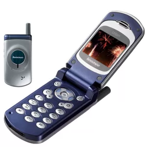
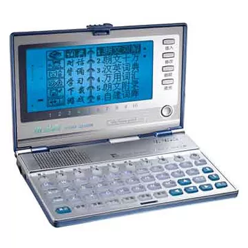
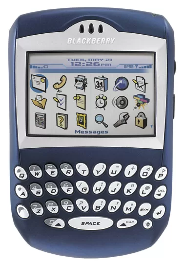
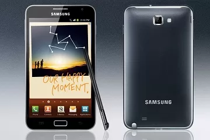
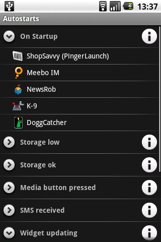
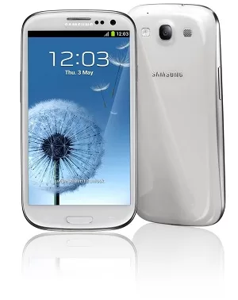
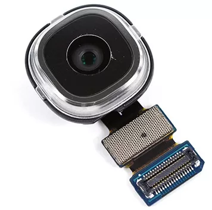

14岁那年夏天，在一本《读者》的中页广告上，看到一则联想的手机广告。彼时，联想尚未收购蓝色巨人的PC业务，但在国内已是混的风生水起，电脑、手机、打印机、相机，众多3C领域都有它的身影。当时广告内容不甚记得，但999元的彩屏手机，却给了我深刻的印象，于是鼓动母亲、瞒着父亲，以手机自带电子辞典功能，成功骗得资金支持。

年幼的我，不懂天高地厚，哪里知道一个小县城的手机行业有多深污水，独自带着1500元现金（那时候高中一学期学费就1500），走上了奸商们的砧板。

这个手机，毕竟是自己人生中第一件真正意义上的电子设备。在这之前，接触过的磁带机、收音机，都只是在大朋友的手中偶尔把玩一番。甚至初二时为了上课时能收听韩日世界杯的比赛，骗得父母15元以购买电子闹钟为名，私下买了个最简单的黑不溜秋的调频收音机。但这些都无足紧要，在大农村那种各种资源匮乏的情境下，任何新奇的物品，都是能激发自己无穷兴趣爱好的。拨号上网的网吧，10块钱一个小时的网费，让家长们惶恐不安。而第一次在表哥家看到的运行着不再是学校那啥MSDOS系统的，可以玩CS这种极度流弊游戏的电脑，更是常年在心底留下不灭的痕迹。

作为个人第一款手机，联想这个G620C倒还不负我望，唯一的遗憾是不支持java，也就没办法运行QQ什么的了。其他什么32和弦铃声、翻盖1.5寸64k色彩屏、英汉汉英字典等等，当时一堆看起来高大上的功能，着实给生活增添不少乐趣。 

后来，随着对电子产品的逐渐了解，手机不再是唯一的乐趣来源。特别是在那个功能机占主导的年代，一个可以运行rpg游戏的大屏幕步步高电子辞典、一个64MB容量可以存近100首低码率wma歌曲的无屏爱国者mp3、一部入门爱华卡带机所带来的的快乐，都远远胜过手机。特别在05、06年小灵通大行其道的时候，充100块钱话费就送一台小灵通手机的疯狂碾压下，手机似乎并没有后来想向那么重要。直到读大学后。

大学开学前，电视购物999买了台长虹小智玲。但在使用一学期后，第二学期开学时，在公交车上丢了，以至于无奈之下上网花了120块钱，在百度有啊（已倒闭）上买了个二（＞2）手的黑莓7290，这是一个全新时代的开启。

黑莓7290是一款极端经典的产品。惊奇的侧滚轮设计、太阳光下愈发清晰的屏幕、16M大存储空间、各种可用软件、地球无敌的全键盘，让这款即使落后欧美好几年的老机器在我手机焕发生机。在迅速堕入黑莓设计的泥潭后，又先后升级更换了黑莓8700、7130、8820、8310、8900、9780等型号，俨然一个黑莓控的味道。这时期，其他品牌手机也都各放异彩，但个人始终坚守黑莓路线，对其他品牌各种鄙夷。 自黑莓9700开始，手机平台竞争已经呈急剧加速趋势，黑莓的劣势也开始被无限放大，江河日下、一泄千里。之后再发的9900、z10等，在个人已经入手三星galaxy note、galaxy s3之后，已然觉得没有兴趣。

三星的这两个手机，现在看来并未带来较好的体验。只能说是一个普通的安卓手机，该卡顿的地方卡得毫不含糊，而且还有字库门的硬伤。两个手机前后光硬件及维修上花费就过万了，这个成本，在安卓系来说，已经是非常高的。特别是在之后小米、魅族、vivo等国产品牌大放异彩之后，三星旗舰机的性价比也就很低很低了。

虽然安卓平台非常开放，各种应用和功能也层出不穷，但经过这两年体验却也发现了一些很深层次的问题。总结一下个人不能忍受的大概如下：

ROM和耗电问题。虽然智能手机的耗电普遍很快，但安卓尤胜。官方ROM的耗电在应用安装较少的时候，是控制得稍好的，这也是为什么很多手机在评测的时候耗电少，但真到用起来耗电就非常快的原因。官方ROM美化不足、比较难看，不ROOT的情况下，大量系统内置废品应用和大量流氓app都在后台开着，导致耗电剧增；官方ROM在root后可能产生不稳定，特别是刷了网上一些修改版的系统，耗电问题难以控制。网上非常多的修改版ROM都会声称改善耗电问题，但实际上都没解决。

ROM整体来说是一个很严重的问题，网上大量的第三方ROM或者修改官方版的ROM出现，导致内置流氓软件大幅增加，后门和黑客程序也在增加，想要找到一个安全放心的ROM是非常困难的。虽然有像MIUI这种看起来比较放心的产品，但运行在非小米系的手机上时，耗电也是个非常大的问题。

为了对抗安卓上无数流氓软件的后台启动和权限触手，以前常用autostarts或者lbe优化大师等软件来控制，但问题就在于，虽然这些控制软件可以较好控制后台应用，可在常规操作上却又显得特别麻烦，时不时的得清理内存、修改权限。这些控制软件本身也是很耗电的。miui上是自带lbe控制模块的，比较方便简洁，但对非小米系手机的支持还是存在问题的。

安卓的蛮横发展，以至于现在手机的发展几乎只有三条路：屏幕规格不断的增大、硬件参数不断被刷新、机身厚度不断缩小。而这三者，对我来说都已经没有太大指导意义。虚假宣传层出不穷，各种毁三观的营销比比皆是，而产品的本身，却没有实质性的发展。CPU、屏幕、电路、摄像头，这些主要部件的生产，市面上就那么几家企业可以做到，所以大多数手机所采用的零部件都相差无几，加上使用着相同的系统，实际差别的只是价格和价格后面无节操的营销和售后。

由于安卓手机的各零部件高度标准化，组装一台手机并不困难，但市面上鲜有厂商能真正弄懂这些零部件及各零部件之间的连接。大多数厂商，只追求自己现在想做啥产品，根据这个需求，罗列清单采购组装营销即可，都没有统一而合理的硬件发展规划，上游供应商能提供啥就做啥，至于上游提供的产品究竟能发挥到多大的效用，未来的产品将走向何方，这些都是没人在意的。消费者当然不需要知道手机厂商干了啥，消费者只需要知道，这个产品好不好，好在哪里，而他们得到的消息，也仅仅只是厂商罗列的一系列参数：参数是没有太大意义的。同样一块音频解码芯片，有的企业在一台手机上用过一次后觉得效果不佳，下一次就换成另一块了，在他们眼里，只有最新最高参数的芯片，才能带来更多的噱头；而另外也有企业，在第一次使用这块芯片后，逐渐熟悉了此芯片的各项功效，经过几年时间持续不断地对这块芯片研究和软件优化，最后形成了一套可以长期使用的方案。这就是目前整个行业的真实写照，前者是除苹果以外的企业，后者只有苹果一家。

同样的硬件，在不同的厂商手里，是完全不一样的效果，一个明显的例子就是索尼制造的1300万像素摄像头。市面上绝大多数1300万像素摄像头都用的是索尼imx135感光器，但各款手机之间拍照的效果千差万别，甚至索尼自身拍照效果都是在中下等之列，原因在于硬件的使用需要算法和软件的配合，而优秀的算法和软件优化是无法体现在硬件参数列表和营销广告环节中的，消费者购买前感受不到这些后台虚拟的服务，对于产品的销售并没有太大用处。多数厂商为了节省软件和优化成本，导致市面上硬件参数完全一样的手机，各种功能实现和效果差距很大。

反正不论怎样，到了最后，除了诺基亚和苹果，似乎没了别的选择。由于诺基亚新旗舰在拍照速度、软件丰富程度上还有明显不足，所以唯有苹果可以选择。这确实是个笑话，市面上如此之多形形色色的手机，到头来居然让自己没了选择。

IOS系统体验时间也有很长了，最早的itouch开始，继而ipad和ipadmini，整体来说印象非常好，硬件和软件的质量都非常高，虽然也有很多明显的不足，但终究来说，这是一个不折腾的产品，不需要自己去过度担心系统问题、耗电问题、手机硬件性能发挥问题、软件应用问题、各种拍照音乐播放等多媒体工具使用问题。而且当前型号，在抛去了5寸、6寸的大屏幕的低便携性后，显得尤为可贵了，事实上，除了看图和视频，即使再大的屏幕，眼睛观看文字的可视范围也是非常狭窄的，甚至每次只看两三行就会往下拉屏幕，这是因为手指拨动屏幕的便捷性是比头和眼睛来上下浮动要容易得多的事情。

iPhone是一个简单而不平庸的产品，前台简洁的表现，代表着后台无数次优化的努力，以至于并不突出的硬件参数，却反而成就了最为优秀的产品。而这个理念也是我近年所追求的：无论如何，不能放弃治疗。
