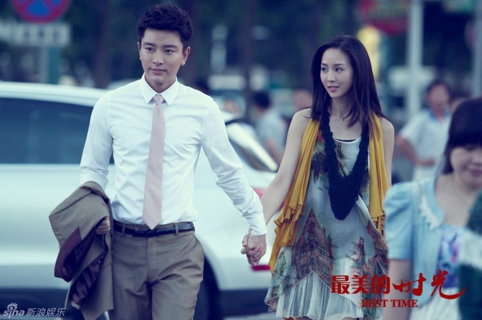
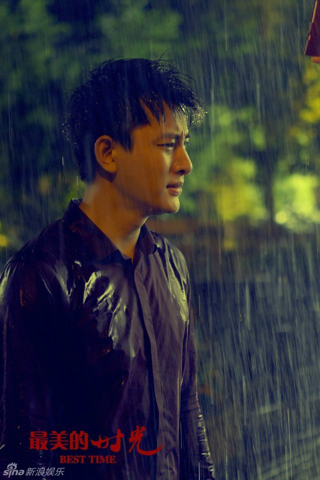

前言：仗着想学写剧评影评的念头，我这些天断断续续把前段时间芒果台引爆全国的电视剧《最美的时光》看了个十之八九，费了不少时间，这对于我，情况少有。当作是对过往的清算与告别，值了！

张爱玲早就一语道破世间的暗恋 “遇见你我变得很低很低，一直低到尘埃里去，但我的心是欢喜的。并且在那里开出一朵花来。”

《最美的时光》中的女主角苏蔓对顶着光环出场的宋翊的感情也是这般，柔软得让人心动，痴心得让人心疼。

苏 从少女时代对篮球一号宋的一见倾心开始，便拼命追逐他的脚步，因那一句无心插柳说者无意的“我在清华等你”，花痴般的情态无比逼真地展现青春无瑕的岁月里 没有设防的内心对爱情的不可抵挡。为了宋，她拼了命超乎想象地考进了清华。她来了，他却走了。而后他回国前脚进了麦古，苏后脚就辞掉高薪职位跟进麦古，对 他还停留在过往的想象，低眉顺眼间连问一句“你还记得我吗”都得在纠结着千回百转。

一颗心对一个人的爱恋就在捉迷藏似的时光游戏中与日俱增，一爱就是十年。这，对一个女人来 说，是一个史诗般的宏篇，怎能说罢就罢的呢？所以，无论如何，迟来太久的少帅陆励成纵有千好万好，都敌不过宋。只可惜宋是个错失旧爱深陷痛苦的悲情男，有 赎罪心态的男人怎么能好好爱人呢? 纵使宋对苏有片刻的动心，但当旧爱妹妹“麻辣烫”一出现就以飞蛾扑火之势移情别恋的让人生恨的行为就不难理解了。值得欣慰的是，最终他能告别悲伤过去，一心想回到苏身边，这个男人同样是值得爱的。

而说到剧中的陆励成，我猜是不是所有的女性观众都难以清楚地勾勒这样的完美恋人，风度翩翩，事业有成，情深意重，无所不能……难怪网上对他封有“万年修得陆励成”的 美誉。在苏的生活里，陆的出现可以毫不夸张地说是天使降临。在她工作遇麻烦时是他暗中相助，在她遭丧亲之痛时，还是他陪在身边。在职场叱咤风云，腹黑精明 的陆帅在爱情面前变得那么谨小慎微，温情动人。他容忍她对他的冷淡，不施压也不远离，就像天使般始终守护她，甚至连直白地表达都是那么爱在心口难开。现实 里具有这种内核的男人就是那么可爱，你爱或者不爱他，他的爱始终在那里，没有花言，没有巧语，没有负担。

湖南卫视播出的开放式大结局遭到众多芒果粉的批判，因导演把皮球踢给了善良忠实的观 众，大家只好自行想象，苏选择了谁，或者她谁也没有选择。看到最后，我打心里想说宋翊和陆励成都是一等一的经典好男人，苏蔓能得到他们由衷的尊重和爱是她 的幸运和幸福。苏蔓当是有理由得到的，她对爱情的执着对友情的仗义对生活的热情无不让人怜爱，这样美好的女人是没有理由不幸福的，而且她在山区两年的沉淀 之后，无论选择宋还是陆，她都有可能让平淡无奇的日子开出繁花来。依我个人的感受，苏更有可能选择宋翊，宋代表了她半段人生的一个梦想，当这个梦回到跟前 真实地可以被触摸的时候，她一定是不会放弃的，这符合一个正常女人对爱情的自我满足心理。而陆只能是那个迟来一步并永远被铭记的天使。

- by Jessie