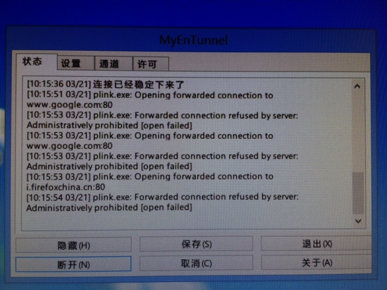

Godaddy的SSH开通倒简单，填上手机号，立马就会自动电话告知验证码(英文)，但尼玛折腾了半天autoproxy，明明myentunnel连上却无法代理，结果发现是godaddy不支持转发。

```
godaddy plink.exe: Forwarded connection refused by serve: Administratively prohibited \[open failed\] 
```




发自我的 iPhone
