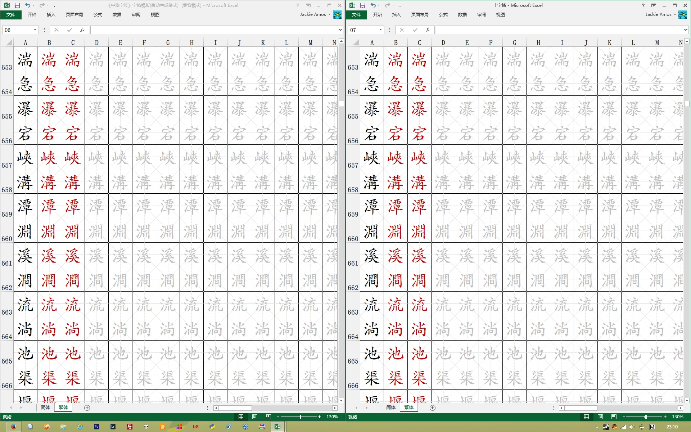
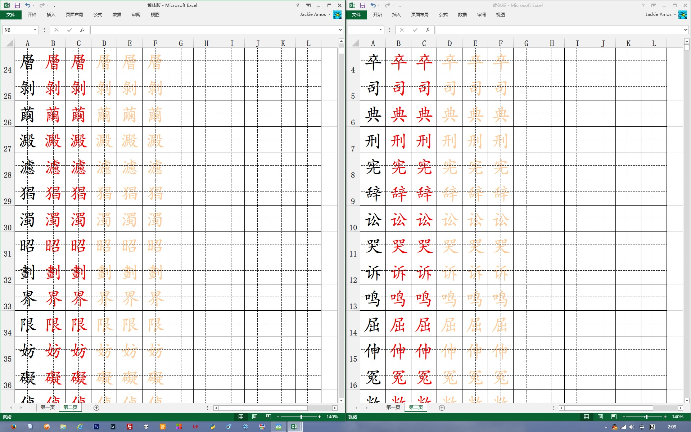
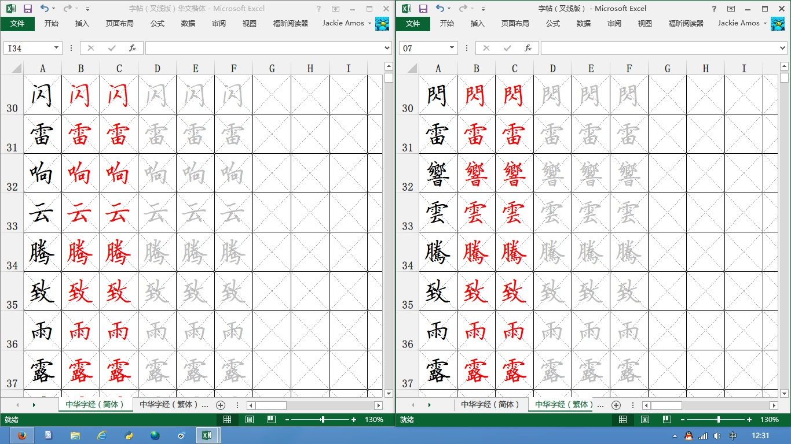
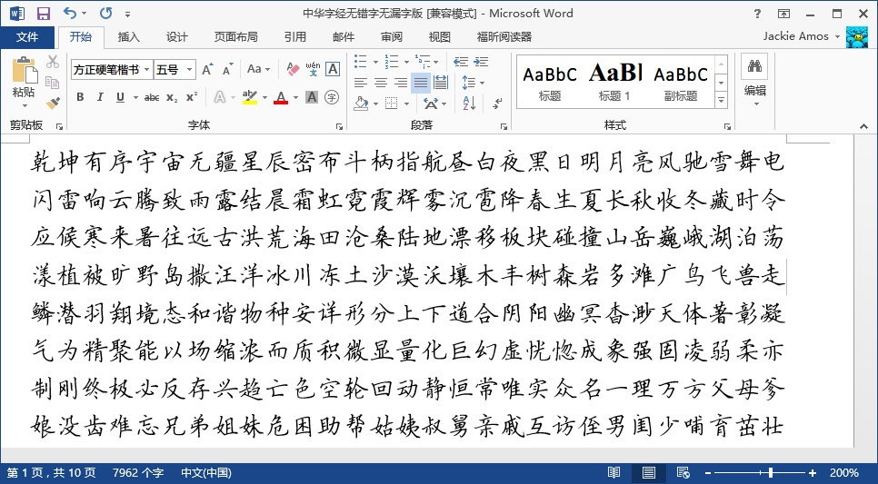
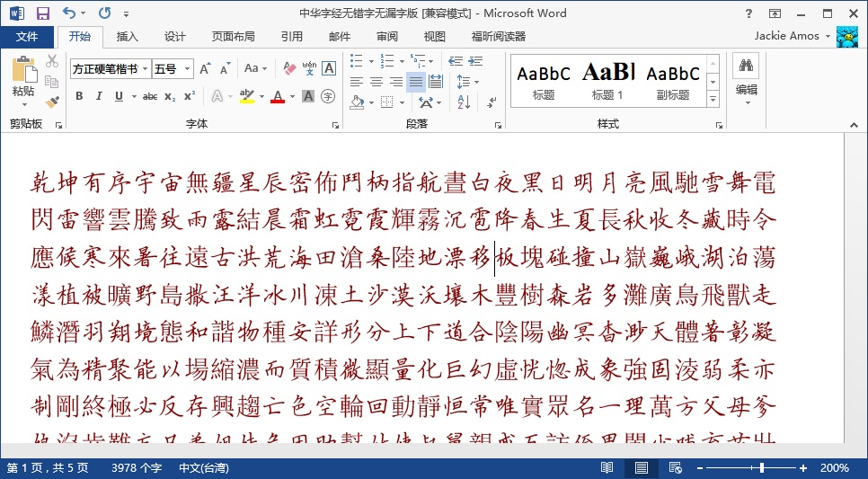
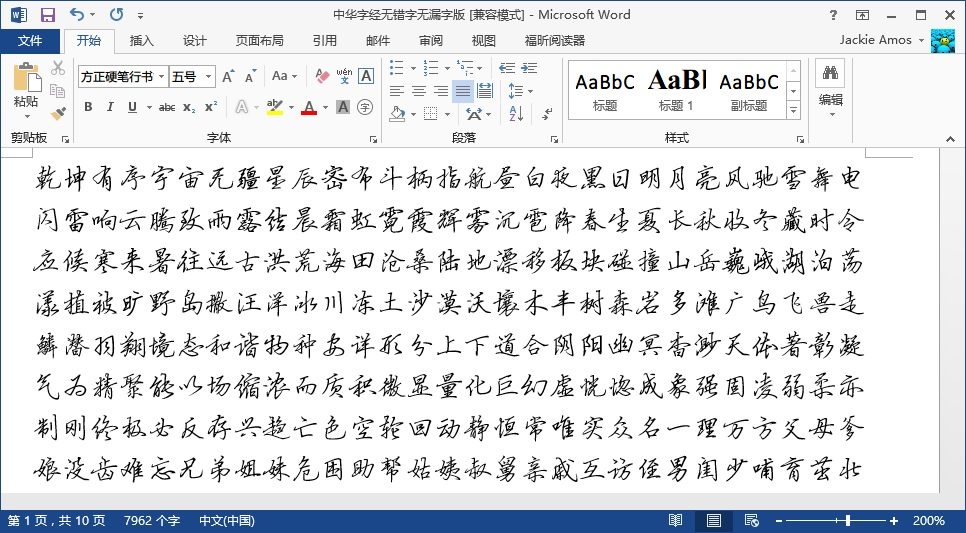
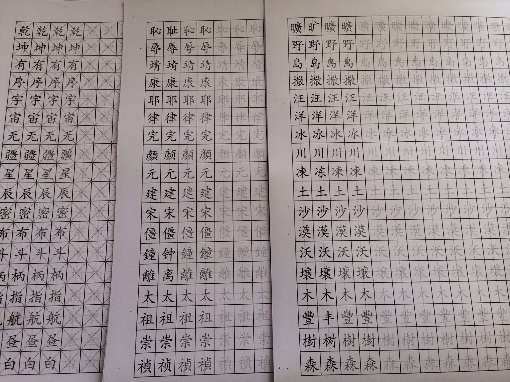

为了练字，买了几本字帖，感觉不是很好，于是按照网上思路，自己制作了一份A4纸的字帖模版。收录了简体、繁体《中华字经》4000汉字，使用自动模版设计，可以任意填充汉字打印成字帖。在zhaozi.cn等网站，可以很容易下载到各种名家硬笔字体，安装字体后在excel全选文字设置即可，或者也可以使用系统默认的华文行楷等字体练习。

十字格版本(已删除，统一使用米字格）

X字格版本(已删除，统一使用米字格）

下载地址：

[http://1drv.ms/NGU6RO](https://onedrive.live.com/redir?resid=8900F06645D3F20E%211151)

[http://pan.baidu.com/s/1c05ViNI](http://pan.baidu.com/s/1c05ViNI)

一开始制表时，受购买的字帖样本限制，使用的是十字格的样式。由于excel中只能依靠画线来解决十字问题，所以文档中包含着几千条横线、竖线，如果电脑稍微慢点，打开和修改该excel文件，会非常卡。而且由于电脑速度较慢（intel I7处理器，实在没辙了），excel一直假死而没能生成可以兼容03版的excel的xls文件，十字格的版本，需要wps或者07版以上的excel才能打开。如果处理器差点，打开十字格的文件可能要两三分钟，慢慢等就行了。

X字格版本是利用excel的单元格格式制作的，所以不存在上面十字格中会很卡的问题，但是X字格对于写字来说也是有些不便的，这个就看各自如何取舍了。

补记字体使用问题：

关于字体选择，在简体中文模式下，可以选择的字体非常丰富，网上有各种钢笔体、硬笔体可供这里使用，涵盖正楷和行楷。方正硬笔楷书简体

方正硬笔楷书繁体（只是对简体字进行替换）

> 需要注意的是，大多数标注“简体”、“繁体”的字体都是基于GB2312编码的，这些字体本身不包含繁体字，而是用繁体字替换简体字。也就是说，如果一个字输入时如果是简体，它可以将这个字替换成繁体，但是如果输入的汉字本身是繁体，这种字体是没办法显示的。

[

方正硬笔楷书繁体字体，在本身就是繁体字的文档中，无法显示繁体字。

解决的办法也比较容易，那就是在输入的时候，只选择输入简体字就可以了。这样，之前上边分别制作一份简体字帖和繁体字帖是多余的，只需要一份简体字帖，然后使用简繁两种字体即可生成两份。唯一的问题在于，简繁字体替换并不是严格对应的，简体字自动替换成繁体字时，可能与原来的繁体版本在一些字的写法会有差别，当然如果仅仅是练字，也就没必要纠结这么多了。

3月24日修改：

将原来的十字格和X字格，统一设置成了米字格，并调整虚线颜色，大幅优化文件打开及修改速度，同时支持excel03版及以上各版本。

3月26日修正： 因不同打印机输出的表格线和斜线存在非常大差别，特别是激光打印机的斜线输出问题，所以重新改回了以十字格为主，兼有米字和X字格。 在简体和繁体页面，分别添加一列对应简繁体，供辨识参考。

打印效果
