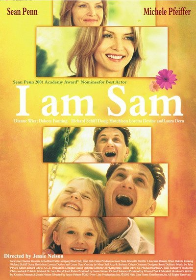
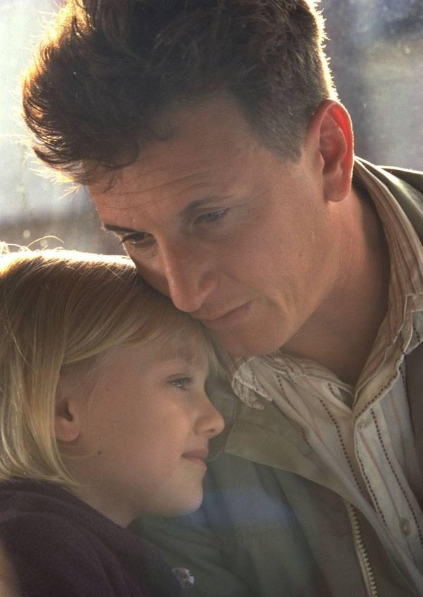
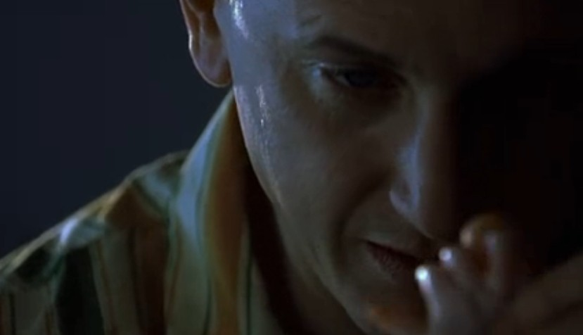
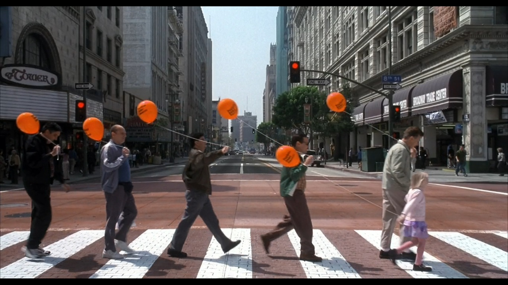
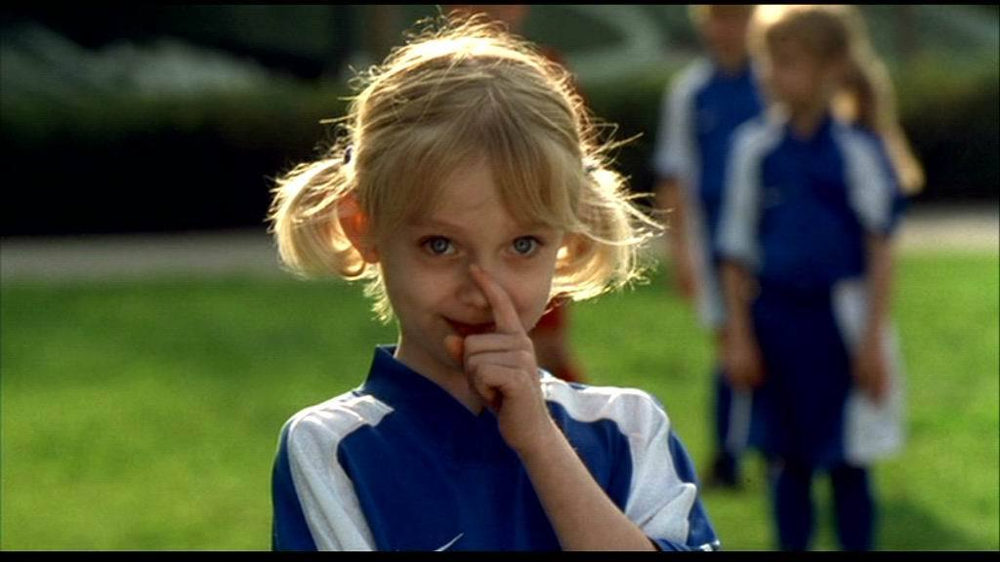
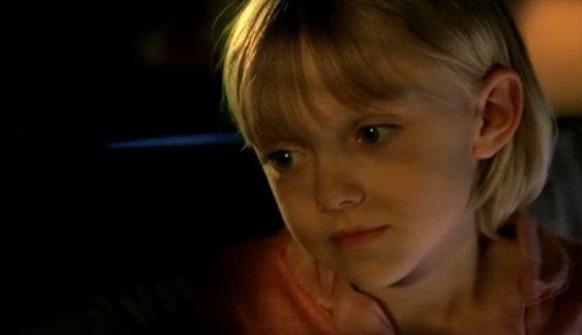

前 言：这是一部在世纪之交上映的老电影。

已经记不得是在怎样的午后与它邂逅的了。我是一个感性常常向理性低头的人，所以我不谈国外公民对权力的意识，忽略所 谓“正常人”与智障人士的区别，电影里歌唱大咖的音乐飨宴自然也不在我的思考范围之内了。我是把它当作一部记录父爱的电影的来看的，而且在两次观影过程中 我屡屡回忆起我和早年康健时的父亲的美好往事便感动得不能自已。

Lucy: Daddy, did God made for you to be like this or was it an accident?

Sam: Ok, what do you mean?

Lucy: I mean you're different.

Sam: But what do you mean?

Lucy: You're not like other daddies.

Sam: I'm sorry. I'm sorry. Yeah, I'm sorry.

Lucy: It's ok, daddy. It's ok. Don't be sorry. I'm lucky. Nobody else's daddy ever comes to the park.

 Classic Dialogues from《I am Sam》

 Sam最开始出场是双手镜头的特写。他反复笨拙地整理好星巴克桌台上饮品添加包。后来的日子，就是这样一双迟钝的手捧起了他心中沉甸甸的“钻石”女儿Lucy. \[电影中Lucy之名来源于Beatles的音乐Lucy in the sky with diamonds，与中国古典小说《红楼梦》第二回里“乳名黛玉，年方五岁，夫妻爱之如掌上明珠”算是异曲同工之妙之处\]

 Lucy意外降生，便与智力仅相当7岁孩童的父亲Sam相依为命。智力低下又何妨？Sam毫无怨尤，开始日夜陪伴，从一无所知开始学习照顾女儿。电影里就有这样的一幕深深地印在我的脑海里：Sam给半夜哭闹的Lucy换完尿布，握着那迷你细嫩的小手说，You were very beautiful this morning. 那张在黑暗中被汗水浸湿的脸庞分明写的是身为父亲的荣耀与自豪。

 Lucy小心翼翼地问起父亲，她（指抛弃了她的母亲）永远不会回来了吗？Sam沉默了一会，抬起头认真地回答，“Paul McCartney lost his mother when he was little and John Lennon lost his mother when he was little. Annie says sometimes god gotta picked some special people.”(保罗·麦卡特尼小小年纪就没了妈妈，约翰·列侬也是。安妮说有时候上帝不得不带走一些重要的人)。这个时候你还会怀疑So different 的Sam养育Lucy的能力吗？智商缺陷阻挡不了他智慧的光芒啊，我真为他叫好。

 Sam带Lucy去买鞋，钱不够的时候，那些同行的好伙伴们纷纷乐意掏出兜里为数不多的超钞票来凑齐。他们举着鞋店里送的气球，领着Lucy欢乐地走过大街。那样纯净美好的世界是让不再简单的“正常人”汗颜还是艳羡呢？

Lucy的家长见面会上，Sam懂得为女儿在同学们面前演讲卡壳时解围.当另一位形成鲜明对比的父亲试图操控孩子，现场制造紧张的时候，他悄悄在Lucy耳边说，I think he could let his boy feel better。是的，那些亲爱的高高在上的父亲，是否可以更多地把目光投向孩子的真实感受而不是自己强撑的面子？

 Sam为了给Lucy准备一个特别的生日派对，他在屋子里声嘶力竭，不厌其烦地排练，反反复复教大家在女儿进门的时候说“surprise”。

 家庭儿童保护署的工作人员以Sam没有能力抚养Lucy，生活将存在太多困难为由，“好心”地收留了Lucy,并只允许Sam一个月两次，一次两小时的频率探望女儿。

他开始想方设法争取夺回和女儿在一起生活的权利。当然最后在女律师Rita 的帮助下，他成功如愿。

 特别喜欢Sam在得到上司提拔可以在星巴克制作咖啡后，对女儿说的一句话“Always set your dream higher , Lucy ”。一个乐观积极的父亲是令人激动人心的，他永远在你失落缺乏信心的时候带给你鼓励，给你希望。

 在存够薪水买了电话答录机之后，他认真地和朋友们尝试，以求录下的留言让他被感觉良好，像一个好的父亲。这是电影中多次出现的Sam对父亲角色的思量。

 如此种种，Sam做到了一个父亲的极致，他给予了Lucy全部的爱与关怀，那种投入与专注让人相信骨肉亲情可以产生一种超能力，这并不是由智商健全与否来决定的。

-by Jessie