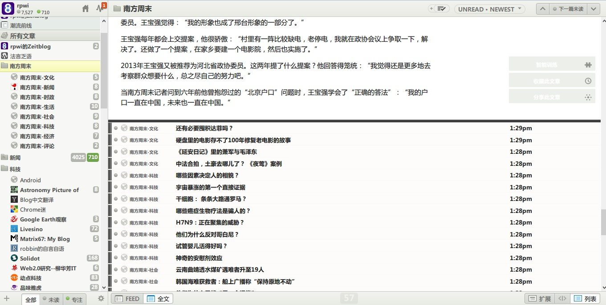
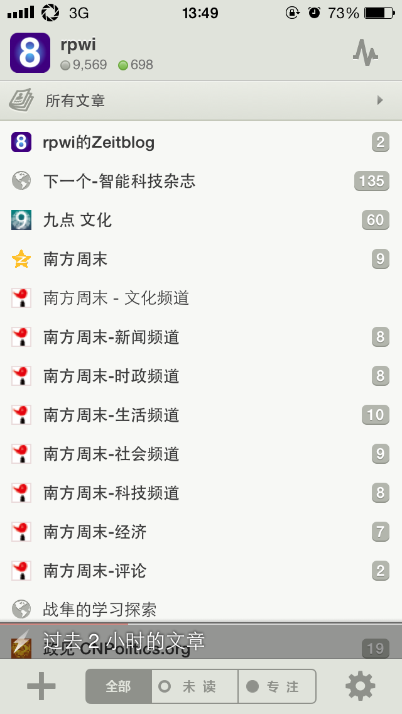
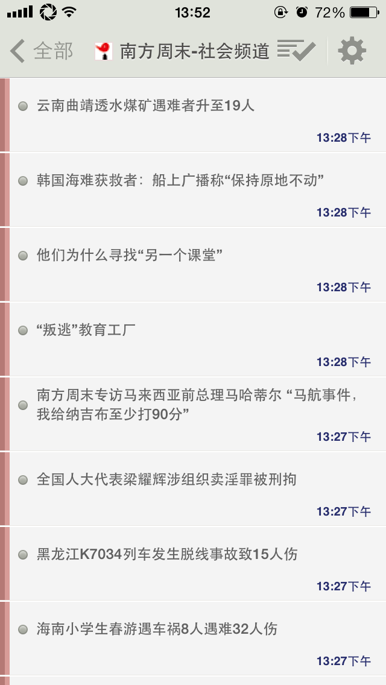
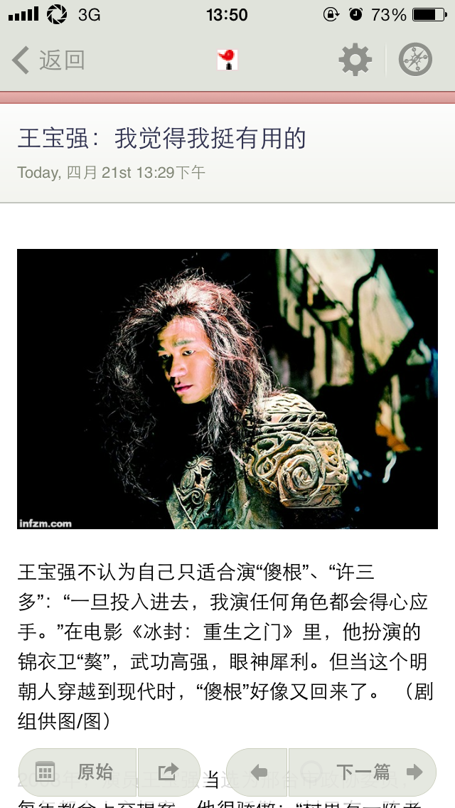
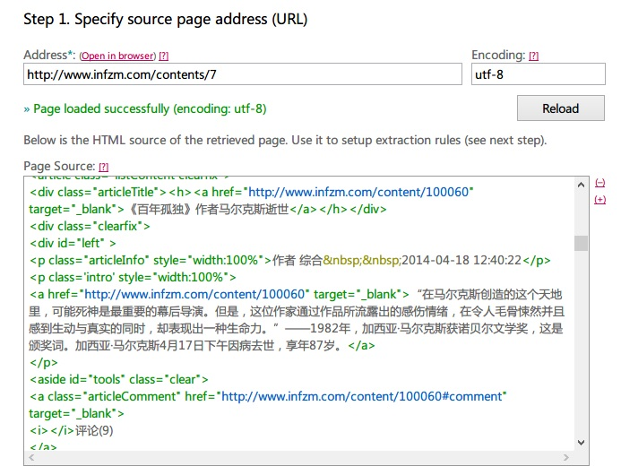
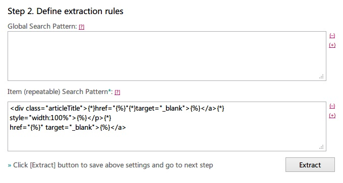
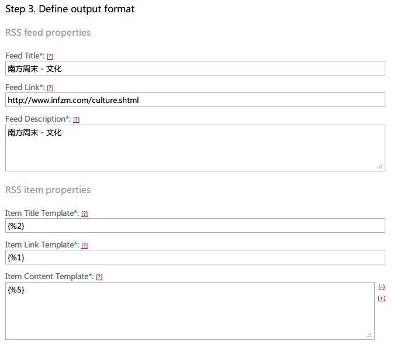

南方周末网站，在改版后取消了RSS订阅服务，由此对于广大依赖RSS阅读器来进行日常阅读的网民来说非常的不便。

网络上能搜索到的南方周末RSS源（如鲜果、newsblur、feedburner等）基本上都是南周改版以前的RSS，只能输出改版以前的老文章。

作为一个RSS阅读器的重度用户，为了解决南周RSS订阅问题，特地搜索了一下RSS自定义抓取服务，发现feed43.com这个运营了8年的网站居然现在还在免费提供RSS自定义抓取服务，确实是业界良心（比起GoogleReader这种坑爹货，简直太良心了）。

于是在feed43.com注册用户，并开始着手编辑南方周末的RSS抓取代码。

经过一番查看，发现南方周末的一级文章栏目分为9个，分别是新闻、文化、科技、图片、社会、经济、社会、评论、时政（其中“图片”这个分类已经有一年多没有过更新了，估计是改版遗留问题），这9个页面的网页地址为/contents/5 - /contents/13。

把所有网址记下后，在feed43上逐个添加（见文末），之后得到对应的xml格式rss地址，可以编辑标题和链接名字。

这里把已经制作好的8个rss源贴上：

```
 <opml version="1.0"> <head><title>南方周末</title></head> <body> <outline text="南方周末"> <outline text="南方周末-文化" xmlUrl="http://feed43.com/infzmclut.xml"/> <outline text="南方周末-新闻" xmlUrl="http://feed43.com/infzmnews.xml"/> <outline text="南方周末-时政" xmlUrl="http://feed43.com/infzmpolitcs.xml"/> <outline text="南方周末-生活" xmlUrl="http://feed43.com/infzmlife.xml"/> <outline text="南方周末-社会" xmlUrl="http://feed43.com/infzmsocio.xml"/> <outline text="南方周末-科技" xmlUrl="http://feed43.com/infzmtech.xml"/> <outline text="南方周末-经济" xmlUrl="http://feed43.com/infzmeco.xml"/> <outline text="南方周末-评论" xmlUrl="http://feed43.com/infzmcomments.xml"/> </outline> </body></opml>
```

把上边代码复制到记事本，另存为\*.xml文件即可导入到各类RSS阅读器，也可直接复制中间的链接，比如“时政”的RSS页面地址就是feed43.com/infzmpolitcs.xml 。

当然，由于feed43本身只能抓取一个固定页面的更新，所以这里抓取的文章都只是标题和文章简要内容，如果需要全文RSS输出，只能依赖各种RSS阅读器自带的抓取功能，比如NewsBlur的高级用户就支持。如果想免费实现全文抓取，可以试试使用NewsBlur或者国内NewsZeit的手机客户端，虽然全文网页输出是这两家RSS服务商的高级功能，但在手机客户端上却没有此限制，唯一的问题是，手机客户端只支持64个RSS源。个人建议RSS重度使用者可以尝试购买NewsBlur或者NewsZeit的收费服务，24刀/50元人民币一年，并不贵。

在阅读器上的效果如下：

电脑WEB页面

 

手机客户端界面



手机客户端界面



手机客户端界面

FEED43.com添加订阅代码部分：

 南方周末网页源码：

```
<article class="listContent clearfix"> <div class="articleTitle"><h><a href="http://www.infzm.com/content/100060" target="\_blank">《百年孤独》作者马尔克斯逝世</a></h></div> <div class="clearfix"> <div id="left" > <p class="articleInfo" style="width:100%">作者 综合 2014-04-18 12:40:22</p> <p class='intro' style="width:100%"> <a href="http://www.infzm.com/content/100060" target="\_blank">“在马尔克斯创造的这个天地里，可能死神是最重要的幕后导演。但是，这位作家通过作品所流露出的感伤情绪，在令人毛骨悚然并且感到生动与真实的同时，却表现出一种生命力。”——1982年，加西亚·马尔克斯获诺贝尔文学奖，这是颁奖词。加西亚·马尔克斯4月17日下午因病去世，享年87岁。</a></p>
```

截取代码为："{\*}target="\_blank">{%}</a>{\*} style="width:100%">" target="\_blank">{%}</a>
```
 



第一步，添加需要订阅的页面地址，设置为utf-8编码




第二步，编辑标题、链接、文章内容调取代码

 



第三步、填写RSS源信息，以及调取内容的代码。
