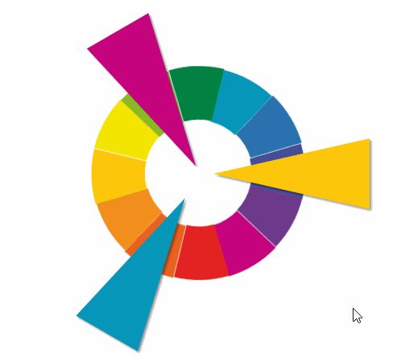
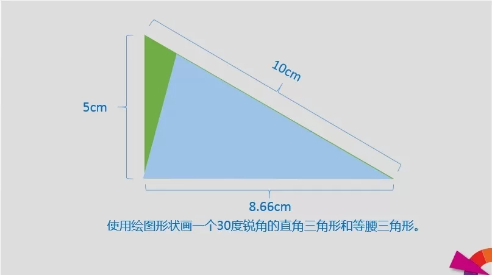
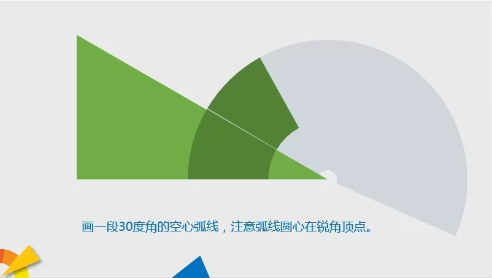
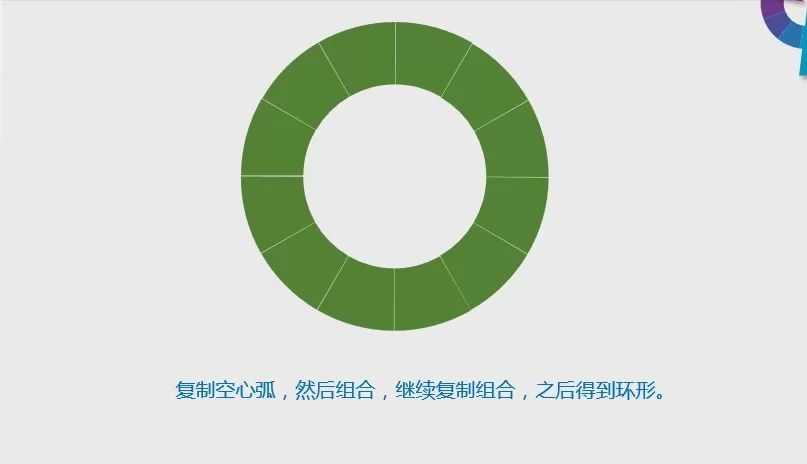
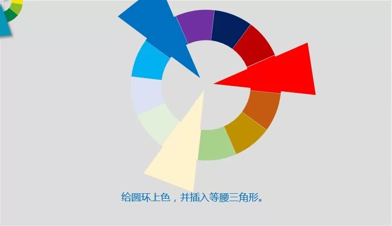
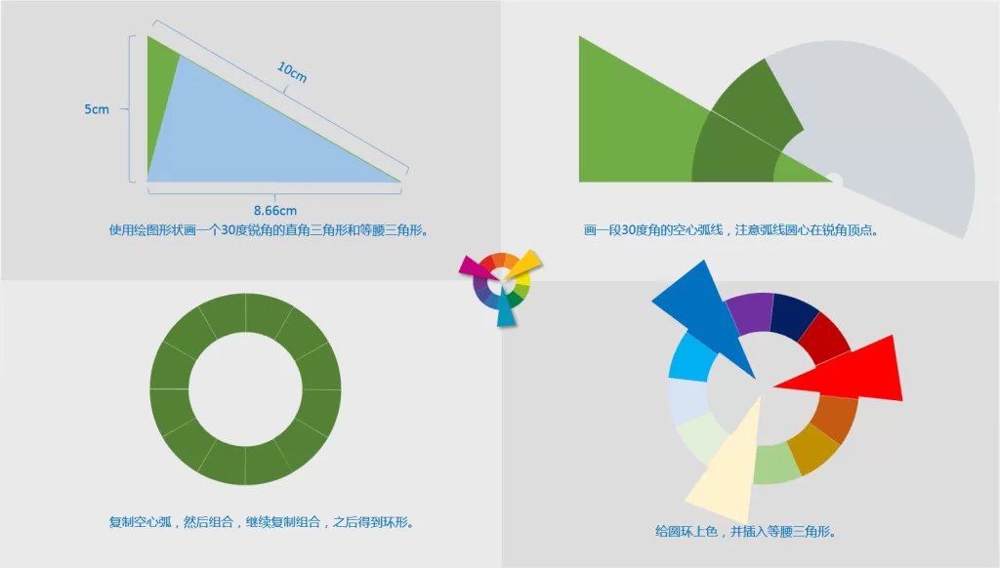
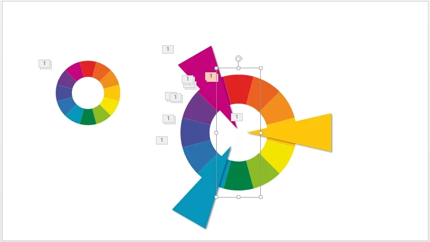
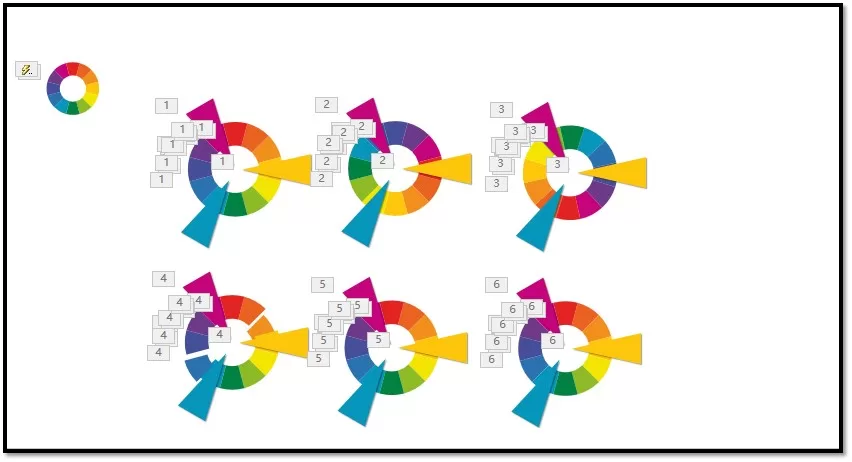

When watching some PPT tutorials, I found that many designs are more classic, so I tried to imitate them. What I imitated tonight is an arc-shaped circular color circle. Since the process is a bit cumbersome, I made a simple tutorial.

renderings

> ## Production process:

<!--more-->

### first step

Since the imitation is a 12-segment ring, each segment is 30 degrees. For accurate realization, it needs to be calibrated with the help of a triangle. What needs to be paid attention to when making an isosceles triangle is to ensure that the apex is on the midline.

### second step

The center of the hollow arc needs to be carefully calibrated, otherwise the next step will be difficult to do well.

### third step

Duplicate the combination three times to form a circle.

### the fourth step

When scaling the graphics, you need to hold down shift to ensure no deformation.

### the fifth step

Cancel all graphic combinations, then combine the opposite hollow arcs, and set the gyro emphasis animation. After animating the 6 pairs of hollow arcs according to the timing, insert and add the exit effect appropriately.

### step six

Setting animations of multiple color circles at the same time requires a lot of reliance on animation brushes. The process is extremely cumbersome (the total number of animations reaches an astonishing 150), but the effect is also remarkable.
