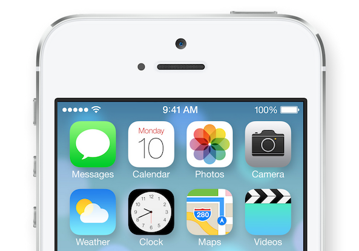
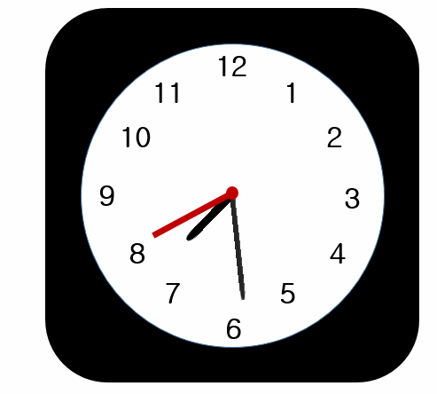
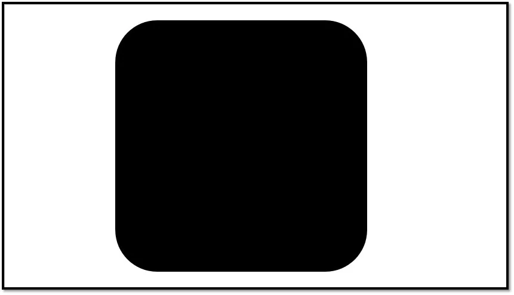
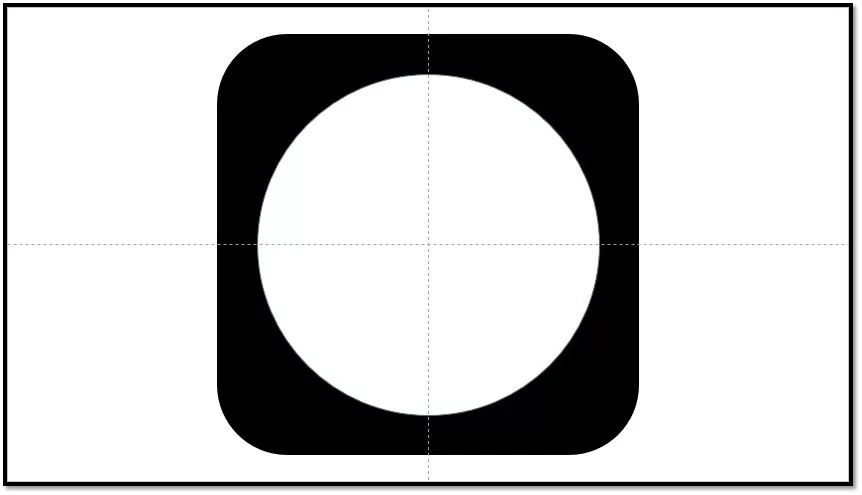
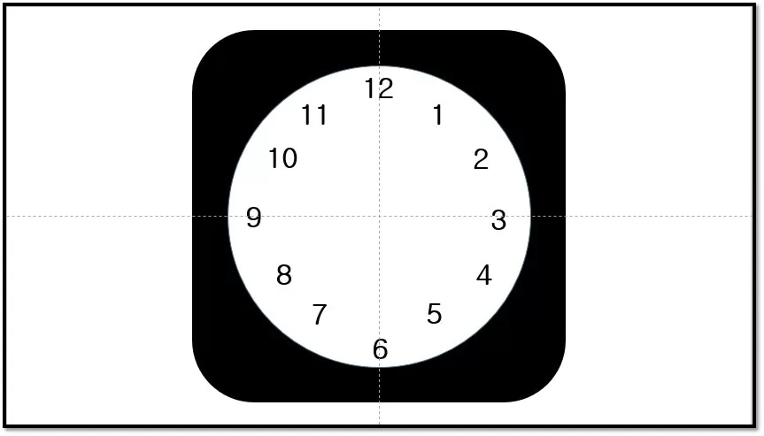
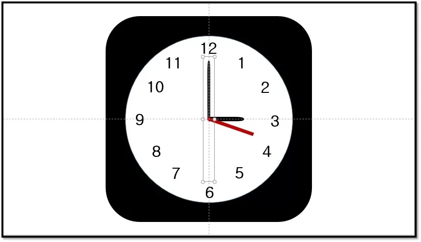
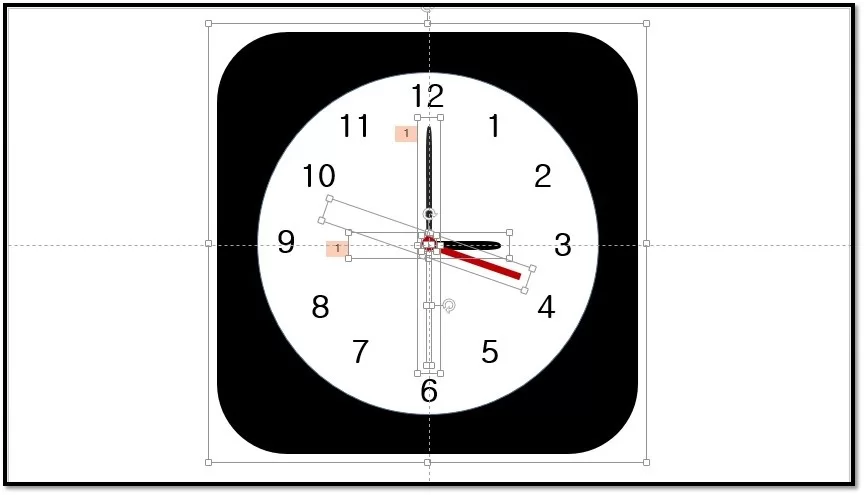
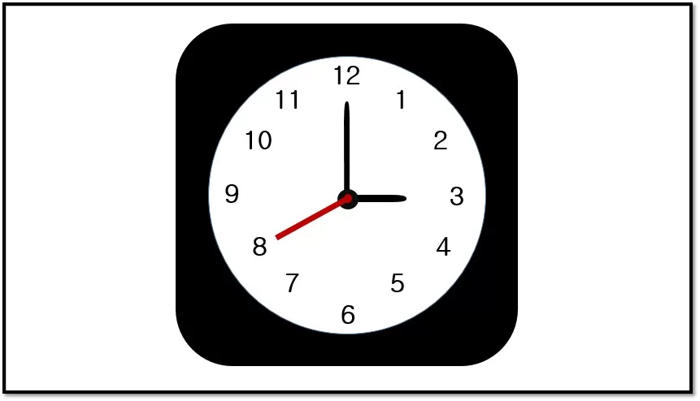
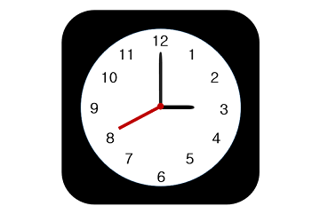

The dynamic clock icon on IOS7 is a rare dynamic icon in the IOS interface. Its design is indeed unique, but after careful observation, it is not difficult to find that the elements on this clock are indeed extremely simple.

On PPT, it is often necessary to use some eye-catching dynamic effects to enhance the taste of the entire PPT. The dynamic clock is a special element.

The picture below is the clock style in IOS7, and the following is the imitation of this clock on the PPT.

**IOS original CLOCK style**

* * *

> ##   Production process

###        Step 1: Use the drawing tool to draw a rounded square.

### Step 2: In the rounded square, create a new circle, set the white fill, and enable View-Guide for position correction.

### Step 3: Insert the number in the text box along the inner edge of the circle, and use the guideline or position tool to correct the position.

### Step 4: Insert the rectangular second hand and the round-headed rectangular minute and hour hands, copy the pointer and set no fill and rotate 180 degrees to combine with the colored pointer. Use the circle tool to add a pointer dot in the center of the circle.

### Step 5: Set the animation of the hour hand and minute hand respectively, select the gyro, and set the rotation amount of the minute hand to 360×12=4320 degrees, and the hour hand to 360 degrees.

### Step 6: The final clock effect, hold down Shift to maintain the ratio when zooming out, and select all the text boxes to reduce the text size.

### Step 7: After shrinking the clock, insert it into the required PPT page. (For the convenience of demonstration, the second hand rotation is removed)
