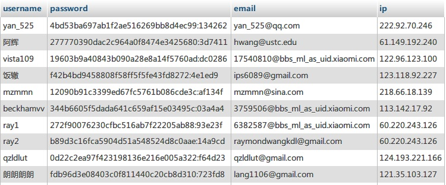

## 小米用户账号泄露事件

小米公司近日泄露千万级别用户数据，被公开可下载的数据类型大体如下图：

 

此批数据包中，包含小米论坛的用户名、MD5盐加密后的密码、邮箱、注册ip；其中，小米论坛的用户名目前已经无法登录小米服务，但是在邮箱一项中存储的个人邮箱账号以及系统自动生成邮箱账号的数字前缀（即小米用户的数字ID），都是可以用来登录小米服务的。

由于数据包中密码使用了Discuz自带的MD5盐加密算法，所以此数据包中的密码数据，对于普通人来说并没有多大意义。但Discuz树大招风，各大破解站点早有相应匹配方法对MD5加盐算法进行暴力破解，据说短时间对这种加密方式的破解成功率可以达到70%以上，在数天内即可完成90%左右的用户密码破解。所以，此种加密算法，对于专业黑客来说，算不上太高难度；普通人也可以通过网络付费方式购买破解服务，解析出密码。

小米账号目前已被小米统一用于小米所提供的全部服务之上，也就是说，大多数小米手机（或安装了miui系统的其他安卓手机）上用来进行数据同步的账号已存在非常大的风险。小米账号，不仅可以查看到小米网站上的购买记录、地址、身份信息，还可以用来获取手机上各种短信、通讯录、相片、GPS等信息的同步数据，甚至提供手机的远程锁定、擦除功能。如果黑客别有用心针对用户进行一对一诈骗，成功率将是极高的。

另外，在当前网络环境下，很多用户所采取的安全策略单一，即各种不同网络服务使用同一用户名、账号、密码；造成的结果往往是A平台账号密码泄露后，其他平台也纷纷沦陷，2011年11月，CSDN论坛的600多万用户密码泄露后，至今仍有大量用户受到影响。而此次小米泄露的两批账号数量更是达到1300万的规模，保守估计，至少有1000万以上账号密码会被黑客成功破解。本人的小米账号不幸在此次事件中泄露，更为悲催的是，我未曾购买过小米手机，而是在两部三星手机上使用过miui系统、以及小米宣称的云服务。

**加强账号防护以减少网络安全风险**

网络安全，在目前形势下，主要是账号安全问题，账号安全分为4个部分：用户名、密码、密码保护、安全邮箱/手机。

 **一、用户名**

在大多数网络应用情境下，用户名并不构成特别重要的安全问题，毕竟用户名只是一把锁，而密码才是钥匙，在不泄露钥匙的情况下，锁的存在并不会形成安全威胁。但某些特定情况下，用户名亦可能构成安全威胁，比如当整扇门都需要进行保护的时候。

路由器、网站管理权限、虚拟服务器权限、FTP权限等安全问题都适用于从用户名开始进行安全防范。为了防范黑客攻击，网站的服务器路径名、各管理员账号、FTP账号等用户名，尽可能不使用默认的admin、root、administrator等用户名。

一个一个的对单个用户密码进行破解的难度大、耗时长、效果差，但是破解管理员账号的难度则小得多，特别是那些只使用默认用户名的，只需要不断暴力破解，即可获得整个服务器内各种权限。对普通用户来说，路由器用户名的修改应当是最贴近生活应用实际的。

建议：修改网站管理员用户名、修改网站路径名、修改FTP用户名、禁用FTP匿名登录、修改路由器用户名等。

 

 **二、密码**

每个人都清楚密码是整个网络安全中最重要的环节，但密码存在着天生的易用性问题：需要人工记忆、单个字符输入。这也就给广大用户造成非常大的使用障碍，很多时候宁可使用简单密码方便记忆、输入，也不想用特别难记、难输入的密码，使得整个网络安全等级非常的低。

密码的设置并非易事。个人印象最深刻的是Godady的后台FTP密码设置，其对密码设置有多项要求：1，必须包含字母和数字；2，字母必须包含大写和小写；3，必须包含!@#%等特殊符号；4，不得含有其他特殊符号；5,密码大于8位；6，不得以数字开头。在费劲千辛万苦设置完密码后，等过了几天，就没有然后了。

个人认为，在密码的易用性与安全性之间，可以按照各种网络服务的不同，而设置不同的密码安全级别。

1. 对于娱乐消遣功能的网站来说，密码设置以易于输入为原则，比如000000之类。
2. 对于日常应用类服务来说，密码设置要易于输入，适当简化并形成规律。比如，QQ微信微博分别对应：qQ.10.24 , wX\_10\_24 , wB@10@24 。
3. 对于工作邮箱、密保邮箱、支付平台、网银平台的密码，一定要设置8位以上字符，且包含特殊符号，并形成独特的规则。比如支付宝、中国银行、Google邮箱、QQ邮箱分别对应：bOc.10.24.vIp , gOO!gle!10!24!vIp , tEn@Cent@10@24@vIp , aliPay\_10\_24\_vIp. 即将各服务密码联合起来，采用错位记忆方法，包含个人设置特定字符、数字，并形成规律。

总而言之，密码设置是一项长期艰巨的任务，个人可以拟制一套只有自己能够记忆的规律来创造强壮的密码，我目前采用的是家谱上的辈分排序来设置不同密码，正常来说，即使泄露一个密码，黑客也极难猜出另外的密码是什么。

 

 **三、密码保护**

密码保护功能在大多数平台都有使用，即在密码与邮箱、手机找回之外，提供一种自定义问答验证找回功能，此功能非常容易被黑客利用，特别是身边别有用心的人。

密码保护问题大同小异，大多数都是关于个人、亲友的信息验证题目，个人建议，在设置题目与填写答案时，尽量不要按照真实情况填写。由于个人信息安全形势严峻，而别有用心的人往往可以通过社会工程学获取用户个人信息（甚至很多“黑客”自己本身就知道待破解用户的很多个人信息），因而盗取用户密码。

比如：我的出生地在哪里？这类题目，可以填写为出生日期、自己最喜欢的格言、宠物姓名。

当然，密码保护问题最为严峻形势的显然是用户极难记住自己到底设置过什么答案，针对于此，最好是能拟定一种固定的规律甚至摘抄下来，简化记忆，密保问题所需要的是保障密码安全，而非考虑易用性，独特的密保答案是非常重要的。

 

**四、安全邮箱/手机**

网络安全，殊途同归都将最后一道防线交给了邮箱或者手机。也就是说，目前几乎全部的网络账号安全功能，最底层的设计，都是基于邮箱和手机号码而来。一旦邮箱密码泄露，或者手机被他人使用，所有安全设置都形同虚设。

邮箱的安全设置可以参考上述三步；手机的安全问题则是另一个广阔的领域。

安全邮箱的使用原则有两个：

1. 绝对不要将邮箱密码与其他密码混用！一旦丢失一个平台密码，其他平台均可能被攻击，比如这次小米账号的泄露，即可能导致至少数百万（猜测多数邮箱用户都会在小米账号上使用相同的密码）用户的邮箱账号密码被泄露。
2. 不要将所有网络服务都全部指向同一个安全邮箱，除非该你对该邮箱的安全性有绝对的把握。不要把鸡蛋都放在同一个篮子里。即使是邮箱，A账号依然需要采用B账号来作为备用安全邮箱，一旦B邮箱挂了，A邮箱保障的服务均面临风险。

至于手机安全，在保证手机不丢失的情况下，只要不安装来源不明的软件，不使用来源不明的ROM系统，适当安装安全防护软件清除病毒、木马程序，一般是难以被盗用的。手机丢失后，第一时间挂失补卡等挽救措施就不赘述。

 

**总结：**

网络安全需要引起足够重视，个人行为具有可预测性，在很多情境下，个人用户在使用用户名和密码时，在很长时间内都会具有连续性，一个密码被反复使用、多处使用的情况大范围的存在，而令人无奈的是，网络黑客的行为却不具有预测性，哪怕是很多年以前泄露的用户数据，现在仍然有黑客在不停的进行解析，不同的黑客拿到同一批数据，也能用作不同的用途，有的诈骗、有的盗窃、有些纯粹搞破坏。为了防范这些不可预测的风险，适当的对账号、密码进行安全管理是极为必要的。
