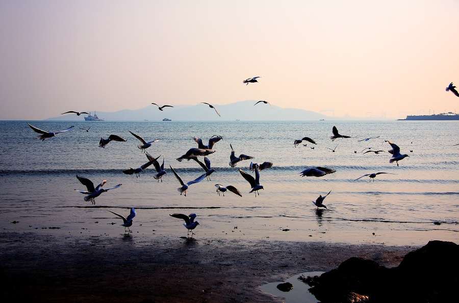

日子恍然而过，惊觉到了月末。事情繁杂之时，真想找个空旷之地朝天空大吼几句，城市里找个呼吸新鲜空气的地方都难，只好打点鸡血让心情保持敞亮。 大家都被愁云笼罩，总要一个人散点阳光。

```
致大海
　　——舒婷

　　大海的日出
　　引起多少英雄由衷的赞叹
　　大海的夕阳
　　招惹多少诗人温柔的怀想
　　多少支在峭壁上唱出的歌曲
　　还由海风日夜
　　日夜地呢喃
　　多少行在沙滩上留下的足迹
　　多少次向天边扬起的风帆
　　都被海涛秘密
　　秘密地埋葬

　　有过咒骂，有过悲伤
　　有过赞美，有过荣光
　　大海——变幻的生活
　　生活——汹涌的海洋

　　哪儿是儿时挖掘的穴
　　哪里有初恋并肩的踪影
　　呵，大海
　　就算你的波涛
　　能把记忆涤平
　　还有些贝壳
　　撒在山坡上
　　如夏夜的星

　　也许漩涡眨着危险的眼
　　也许暴风张开贪婪的口
　　呵，生活
　　固然你已断送
　　无数纯洁的梦
　　也还有些勇敢的人
　　如暴风雨中
　　疾飞的海燕

　　傍晚的海岸夜一样冷静
　　冷夜的山岩死一般严峻
　　从海岸的山岩
　　多么寂寞我的影
　　从黄昏到夜阑
　　多么骄傲我的心

　　“自由的元素”呵
　　任你是佯装的咆哮
　　任你是虚伪的平静
　　任你掠走过去的一切
　　一切的过去——
　　这个世界
　　有沉沦的痛苦
　　也有苏醒的欢欣
```

感同身受这回事是真的很难的。比如你是那种天生丽质，貌美如花的女纸，你就很难体会我这各种先天不足，敏感体质的盆友的恐慌。

被生活工作围困，并不影响内心的大致定位。偶尔回望过去，那些荒谬的，那些丑陋的，那些痛苦的，那些纠结的，那些珍视的都随着青春的逝去永远地被 写进历史。谁来问我，我大都会微笑地告诉你，那是很久很久以前的事了，久得我快忘得差不多了。

不动声色地幸福着，有如久旱逢甘雨的奖赏。原来世上真存在soul mate这么神奇的怪物。年轻的梦幻的不谙世事的姑娘们，睁大你们的眼睛去寻找吧。

接下来的两个月，我自愿变成更高速旋转的陀螺，在有限的时空里喷发最大的能量。待停下来的时候，我就去赴大海的约会。

第一次见到大海是在2012年4月。一个人飞去青岛，拖着沉重的心事带着阴沉的面孔，在海边，看海鸥飞散，潮起潮落。 ………… 



-by Jessie