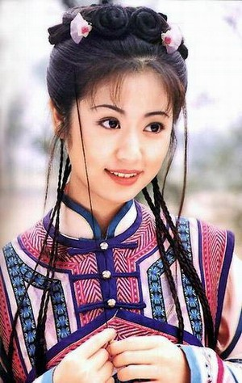
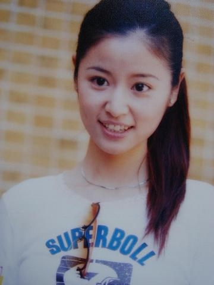
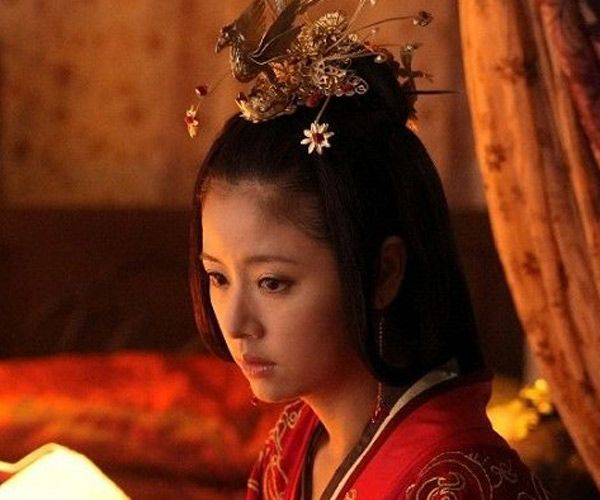
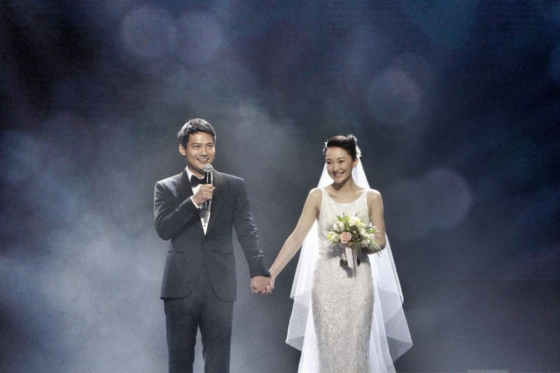
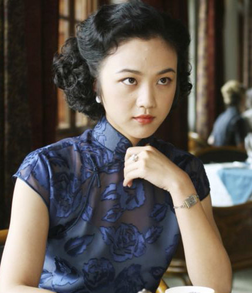
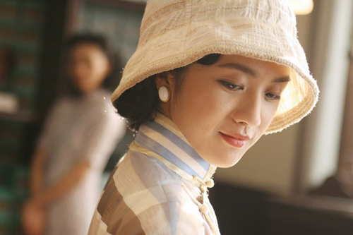

以前对芮成钢同志的印象只限于他是个英语说得很溜的傲娇的名记者，看到网上惊现他被检方带走的消息我才心里咯噔一下，此人非同凡响。如果也把他归为偶像一类，想必他原来的粉丝成千上万，特别是有点知识文化的热血青年。如今提起他恐怕又是另一番言论了。 

偶像坍塌已不是什么新闻。我们疯狂追过的闪亮的星，难保工作生活里不出点非常规的事件，再经强悍的媒体一炒，他/她们就的确热了。

偶像是什么？个人之见，偶像指的是一段比较长的时间内对你的精神带来冲击和影响的特定的人物，这种冲击和影响一般指好的方面。但是千万别期待你的偶像在生活这条漫长的河里永远一帆风顺。一帆风顺驰骋江湖的不称人，叫做神。很显然，你的偶像不是神。

我们怎样对待偶像？记得小学时，《还珠格格》红遍大江南北的时候，和班上很多同学一样，林心如就当之无愧成了我第一个影视偶像。商店里那些花花绿绿的贴纸就会被买来贴满心爱的笔记本。要是谁手里有她的高清图片，便会想法设法软硬兼施据为己有。那时候大抵是喜欢她在剧中的紫薇角色和她的楚楚动人。

后来初中高中认识更多喜欢她的同学好友，就大大拓展了交流的范围，重点会转移到她喜欢过什么人，正在和谁拍拖，她最近的状况等等。但同时开始听到质疑的声音，听到她的真真假假的不雅事件，从来没去争辩，仍是延续着这种喜欢。

这么多年过去，她早已告别了少女的青涩，走进了丰满的精彩人生。从演员成功进入制片人导演的行列，默默地做着公益，不动声色地散发着她一如既往的魅力。今年在徐若萱的婚礼上，她是那个最美的伴娘。当年追的是虚幻的星，如今欣赏的是真实的人。不管她发生什么，我感谢她给我最无暇的年华里增添的色彩。

 

随着年龄增长，判断力也有所增强。喜欢还是不喜欢一个明星，大体由自己的人生观，生活阅历和品味决定的。或者还有自己身上无法企及甚至尖锐对比的成分。因为没有，所以喜欢。

数数喜欢的国内女歌星中，除了大家都爱的菲女神，我挺钟爱莫文蔚。 “君子豹变，其文蔚也。”人如其名。她的星路，充满了新意，充满了对自身魅力的发掘。她的性感是那种从声音流进骨子里，再从外形展现出来的经久不忘的性感。她的歌不是那种无病呻吟，是在平常生活里提炼出来的有感而发。听起来不近不远的旋律，最适合有故事的人。可惜本身嗓子不出色，只好挑拣那些低难度的哼哼了。

喜欢周迅，似乎还是从若干年前那首《看海》开始的。她的穿衣风格，她的利落态度，她的明媚笑容，让我悄悄喜欢了这么多年。惊喜的是，小太平“周公子”幸福地婚了。看着她身着婚纱甜蜜的样子，我真的开始不由自主憧憬自己出嫁的佳期，不要盛大张扬，只要浓情蜜意。

如果可以说之最，这几年最喜欢的女星，非汤唯不可。她气质不凡，低调优雅，大能耐小架子，是个典型的优质实力偶像。她微微地笑着，“不争，也有你的世界。”一个女性，对外没必要争，一争就失了风度，丢了样子。要争，就往内争一争自身的水准和要求。一个没有自制和收敛的人，争来争去，连本心都能丢掉。说汤唯，不能不说色戒。说色戒，还不如说穿旗袍的汤唯。在我心中，她穿旗袍的颜，美得就像清晨朝露中静静绽放，清幽雅致的莲，可远观而不可亵玩。

我没好意思说自己喜欢的国内男星，都是些上了年纪的大叔。时间是个好东西，去蚌留珠。经过时间考验沉淀下来的趣味都堪称经典。在此，歌星影星各举一例。前者，张学友。后者，陈建斌。

说了这么多，其实平凡粉丝和偶像的联系仅在默默的关注中保持温度，你不知道我，我已把你放在心上。

己所不欲，勿施于人。偶像不是神，他们走的也是真实的人生旅程。
