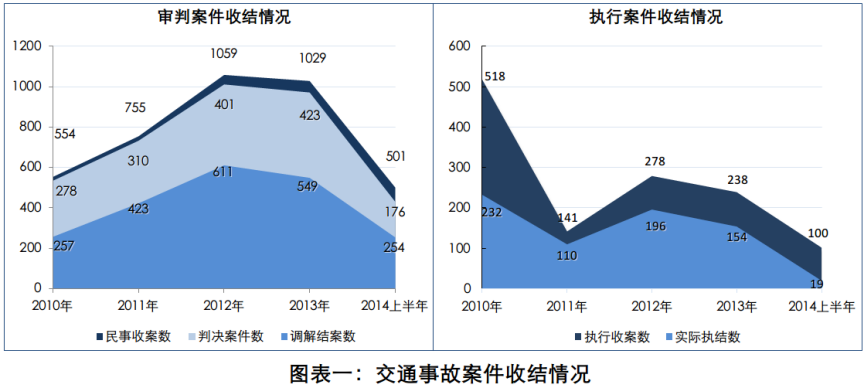
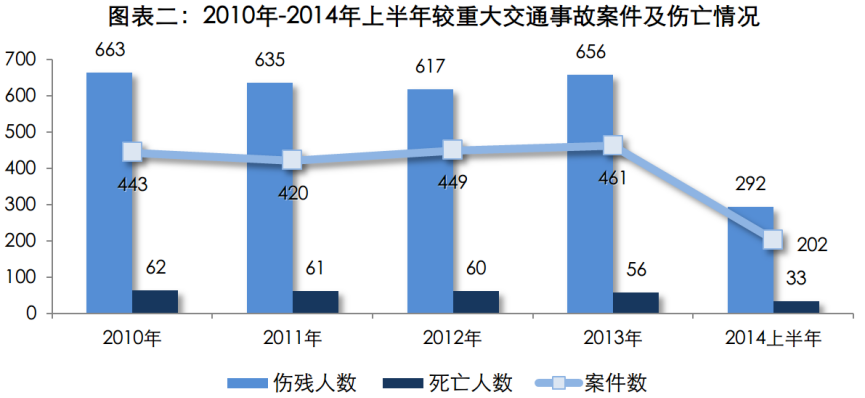
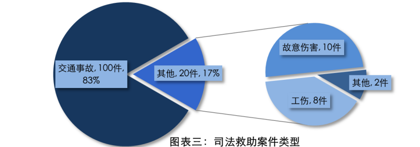
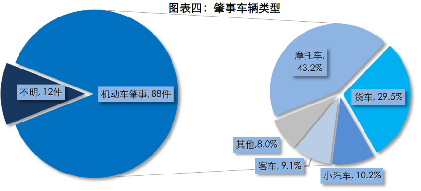
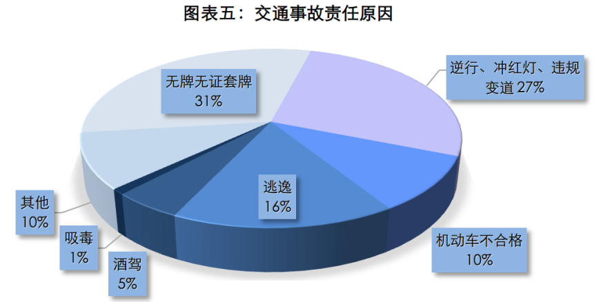
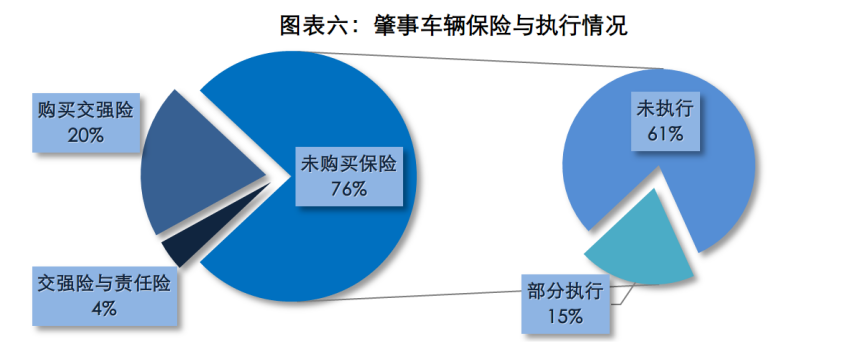
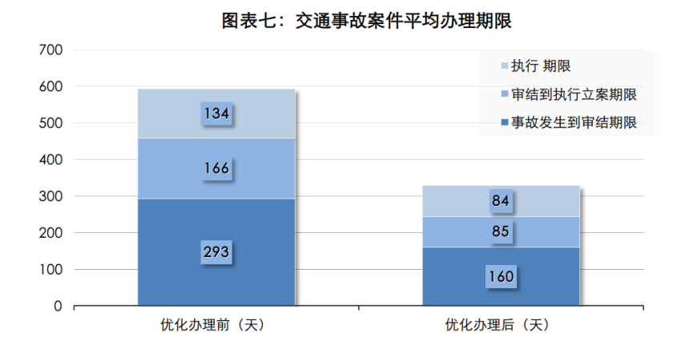

为有效破解群众特别关注的交通事故执法难题，2012年以来，A区先后在全区政法系统组织开展了交通事故优化办理活动及其上下延伸工作，收到了一定成效，尤其是交通事故办案效率和执法效果等方面明显提高。近期，本人参加课题组对A区近几年来办理的100件交通事故案件进行了详细调查，分析研究了肇事车辆、违章原因、执法情况等特征，相应提出几点破解对策和工作建议，期望进一步解决和减轻重大交通事故带来的伤害、困难和压力，更好地帮助社会群众解决“最后一公里”问题，同时为政法机关深入研究和解决交通事故执法难题抛砖引玉。
## 1. 目前A区交通事故案件的基本情况
近几年来，随着我国经济的快速发展，物质文化的不断提高，机动车保有量在全国范围内急剧增加，随之发生的机动车交通事故也呈不断上升态势。大量的交通事故案件发生及案件处理“三难”问题（破案难、诉讼难、执行难），不仅仅给基层政法部门带来了前所未有的困难和压力，还给广大受害群众和家庭造成极大的损失和伤害。
* 交通事故案件办理情况。由于案件数量较多以及其执行较难，近几年来，交通事故案件不仅仅让我区公安交警部门经常超负荷工作，也一直是基层法庭和执行部门执法的重点和难点。2010年至2014年上半年，A区累计收机动车交通事故责任纠纷案件3898件，占同期全区所有民商事收案的27.9%，交通事故案件总体呈上升趋势。其中，调解结案2094件，判决结案1588件；累计执行立案1275件，执结711件。（见图表一）  

* 交通事故人员伤亡情况。随着人流、物流、车流剧增，道路交通事故已成为全区乃至全国安全事故伤亡人数最多的类型，给许多受害人及其家庭造成极大的伤害。据统计，2010年至2014年上半年，A区累计发生较重大交通事故1975件，死亡272人，受伤2863人。（见图表二）  

* 交通事故案件救助情况。自2010年以来，A区委区政府和区政法机关高度重视司法救助工作，并专门设立司法救助基金。无论是司法救助的设立时间还是基金总金额，A区在佛山市五区中都处于领先水平。据统计，自2010年以来，区委政法委共为120件案件的217名困难当事人提供司法救助。其中交通事故案件100件，占救助案件总数的83.3%，故意伤害案件10件，工伤案件8件，其他案件2件。（见图表三）研究表明，无论是司法救助案件占未侦破和未执行交通事故案件的比率，还是司法救助金额占救助案件未执行标的的比率，目前都还相对比较低，均不足总数的十分之一。因此，每年仍有相当部分案件当事人因为交通事故而家庭陷入困境、生活极度困难。

## 2. A区重大交通事故的主要特征
为详细掌握交通事故的事故发生原因、执法办案效果等特征情况，课题组近期专门对A区2010年以来提供司法救助的100件交通事故案件进行详细调查分析。主要情况如下：
* 人员伤亡情况。据统计，在100件交通事故案件中，共伤亡121人，其中死亡56人、伤残65人；死亡一人以上的交通事故案件49件，仅出现人员伤残的51件。由于受害人死亡或重伤，交通事故不仅给受害方造成非常大的伤害和生活困难，其赔偿金额也超出普通家庭的承受能力。
* 肇事车辆类型。从肇事车辆类型分析，摩托车和货车是制造重大交通事故的主要车型。在已查明肇事车辆的88件事故中，肇事车辆共88辆，其中摩托车38辆，占肇事车辆总数的43.2%；货车26辆，占总数的29.5%；小汽车9辆（注：课题组于2013年底曾专门调查过2012年至2013年期间查获的71件交通肇事案件，当时小汽车发生肇事的31件，占肇事车辆的43.7%，要高于本次调查的10.2%。其主要原因在于，本次调查的案件主要是执行不到位案件，小汽车购买保险比率通常远高于其他车型，因此本次调研结果显示小汽车肇事比率偏低），客车8辆，其他车型共7辆，共占总数的23.3%。同时，受害方驾驶摩托车也是最容易发生事故的一类交通方式。据统计，在查明受害人交通方式的81件案件中，受害人驾驶摩托车45辆，占总数的55.6%；自行车17辆，步行10人，乘车9人。

* 事故发生原因。从肇事原因分析，肇事者无牌无证驾驶、驾驶不合格车辆以及不按规定行驶是事故发生的主要原因，共占查明肇事原因案件总数的75.6%。据调查，在100件交通事故案件中，无牌无证套牌驾驶的超过31件，逆向行驶、冲红灯、违规变道等不按规定行驶的27件，机动车不合格10件，事故后逃逸的16件，酒驾5件，吸毒1件，其他暂未查明原因的10件。另外，查明受害方无牌无证驾驶的也超过10件。

* 案件执行情况。在100件交通事故案件中，肇事车辆购买交强险并执行到位的24件，仅占肇事车辆总数的24%，其中4件买第三者责任险，执行到位的2件；全部未执行的61件，部分执行到位的15件；平均每件案件未执行标的21.9万。由此可见，肇事车辆无牌无证驾驶和未买保险是案件难以执行到位的重要原因之一。（见图表六）

* 案件流转情况。调研组共对86件交通事故案件的办案期限进行详细调查统计，其中2012年3月之前的案件67件，2012年3月该区开展交通事故优化办理之后的19件。从事故发生到执结时间，优化办理前平均办案期限为594天，优化办理后平均办案期限为330天，平均每一件案件缩短264天。（见图表七）

## 3. 进一步解决交通事故执法难题的对策与建议
针对交通事故发生规律和执法难点，建议政法各单位在进一步巩固和提升优化办理机制及其上下延伸工作成效的基础上，拿出更加具体的措施和办法，确立更加坚定的决心和信心，重点预防和整治重大交通事故隐患，重点打击和整治不履行责任行为，最大限度保障和维护人民群众生命财产安全，更好地维护全区交通安全秩序和良好法治环境。

* **加大交通违章整治力度。**
2014年开始，针对无牌无证摩托车交通安全隐患比较大问题，A区公安机关开展了无牌无证驾驶及摩托车等多项专项整治工作，仅今年6月份以来查处各类交通违法行为662起，暂扣违法车辆560多辆，其中无牌无证摩托车300余辆。针对当前几类突出交通安全隐患和违章违法行为，公安机关在进一步加大交通违章专项整治力度的基础上，要继续保持严查严治高压态势，重点整治无牌无证驾驶、酒后驾驶、货车超载行驶、驾驶不合格机动车、车辆不购买保险等交通违法行为，以及逆向行驶、违规变道、冲红灯、摩托车遮挡车牌等不按规定驾驶行为，坚决做到发现一起、教育一起、处罚一起，坚持从源头上消除交通安全隐患，确保人民生命财产安全和交通安全有序顺畅。  

* **严厉打击逃避责任行为。**
在本次调查的100件救助案件中，超过16%的肇事司机在案发后逃离了现场，法院判决后完全未履行赔偿责任的高达61%，履行部分赔偿责任的仅为15%。另外调查表明，2012年至2013年，A区交通肇事案件现场逃逸率超过60%；2010年至2011年，重大交通事故案件实际全部履行赔偿责任的不到10%。针对比较突出的肇事方不履行责任行为，政法机关务必用好法律手段，加大案件查破力度，提高打击震慑效果，严厉惩戒事故后逃逸现场和逃避执行等逃避法律责任行为。近期，针对拒不履行法院裁判行为，区委政法委还专门建立了联动平台和工作机制，组织开展清理拒不执行法院裁判案件专项行动。区政法各单位要按照全区统一部署和工作要求，充分参与和利用联动工作平台，综合运用民事制裁、刑事打击等手段，依法严惩拒不执行法院裁判行为，及时有效保障受害方的合法权益。  

* **巩固提升案件终结效率。**
2014年4月，按照区委主要领导批示精神和全区政法工作要求，A区政法机关在交通事故优化办理机制的基础上，将该项活动向两头延伸开展，重大交通事故“三难”问题得到有效破解，尤其是案件的流转速度和纠纷的终结水平均大幅提升。仅2014年4月开展优化办理机制上下延伸活动以来，A区政法机关在事故处理阶段直接调解结案62件，公诉阶段促成和解结案16件，“诉前联调”终结纠纷60件，审判环节调解结案29件。该项工作得到了区委和市政法部门的充分肯定。在今后的工作中，各办案单位要继续巩固和提升优化办理机制，进一步优化各项执法服务举措，尽可能提高案件办结效率、纠纷终结能力和主动服务水平，更好地为后续执法办案减轻压力，更好地保护受害群众合法权益。  

* **不断完善社会救助体系。**
按照中央涉法涉诉信访工作改革精神和区委“诉访分离”工作要求，区政法机关在确保执法措施、解释工作等及时到位的前提下，要结合案件情况和A实际，及时做好受害群众的司法救助和帮扶工作。针对部分比较特殊的交通事故案件，政法机关在及时做好司法救助的同时，还可协调区慈善、民政、妇联、各级信访或上级政法单位等政府部门和社会组织，进一步加大政府救助、社会援助力度，帮助更多受害群众更快地走出生活困境。2014年，A区委政法委、法院、公安分局积极同区社保、民政、工会、慈善机构以及杨和镇政府等部门协调沟通，成功对杜某、李某、姚某、万某等一批交通事故案件的受害人及其家庭进行社会救助帮扶。例如，2013年，被害人万某因交通事故高位截瘫，肇事司机被判刑，案件未执行标的高达一百多万元。2013年年底和2014年上半年，区委政法委和区法院先后两次对万某提供司法救助。由于司法救助只是杯水车薪，只能帮助万某解决一时之需。因此，区法院在穷尽执行措施之后，又积极同有关部门和新闻媒体联系，号召社会力量爱心接力，帮助万某渡过难关。  

* **加强法律宣传教育工作。**
实践表明，很多重大交通事故发生以及肇事方敢于逃避法律责任，主要是他们对交通规则、交通安全、法律责任及其不利后果等不了解、不重视，也未真正品尝到“法律后果”的严肃性。针对当前较多发的交通事故问题及其执法难点，政法机关要充分利用“一线”面对面释法说理平台及各自宣传阵地渠道和载体，灵活运用以案释法、个案报道、专题宣传等多种宣传方式，进一步加大交通安全及其执法方面宣传教育力度，不断增强社会群众的交通安全及守法意识，切实引导广大群众尊重事实、遵守法律、履行责任，最大限度减少和防止重大交通事故发生，并确保交通事故得到快速有效处理和终结。