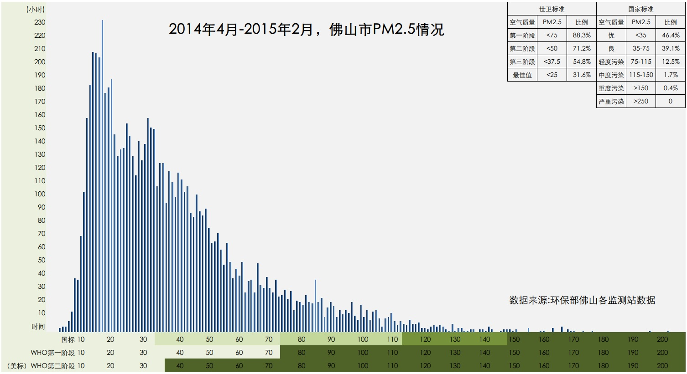
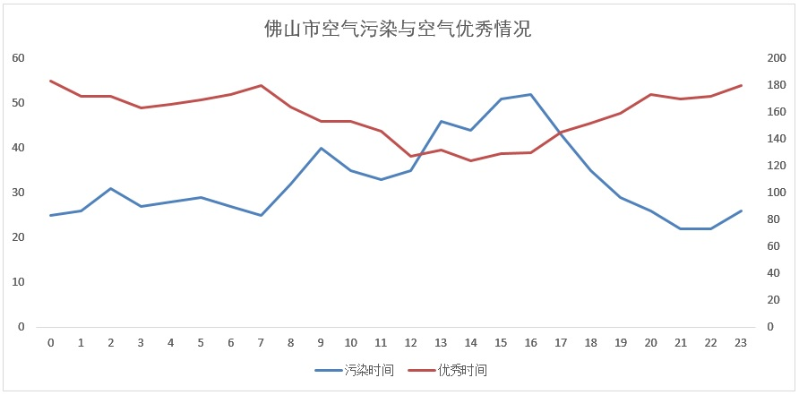

从环保部[网站](http://datacenter.mep.gov.cn/report/air_daily/airCityMain.jsp?city=%B7%F0%C9%BD%CA%D0)上将佛山市2014年全年监测数据逐月抠了下来，并进行了粗略统计，2014年全年，佛山有36%的天数，空气质量为优，52%的天数，空气质量为良，两者合计占88%。总共有33天，处于轻度污染水平，13天属于中度污染。

另外，从[http://air.epmap.org/](http://air.epmap.org/)这个网站，下载到2014年4月11日至2015年3月5日，佛山市各个环保监测站的全部监测数据，再次进行简单统计，如下：

可以看到的是，佛山虽然是珠三角环境最差的城市，但即使按照世界卫生组织第一阶段（目前的国标）的PM2.5控制方案，佛山全年PM2.5达标情况也接近90%了。而如果按照美国标准（WHO第三阶段标准），那佛山则只有55%的时间达标。

下载的数据太多，但分析完上边两个图后发现，其实自己真是多虑了，在当前这个经济发展水平下，如果一个城市的空气质量90%的时间都能达标，那还需要担心什么呢？真没啥必要纠结这个了，最后统计下本地空气污染时间与空气优秀的时间段情况，供户外活动参考。

