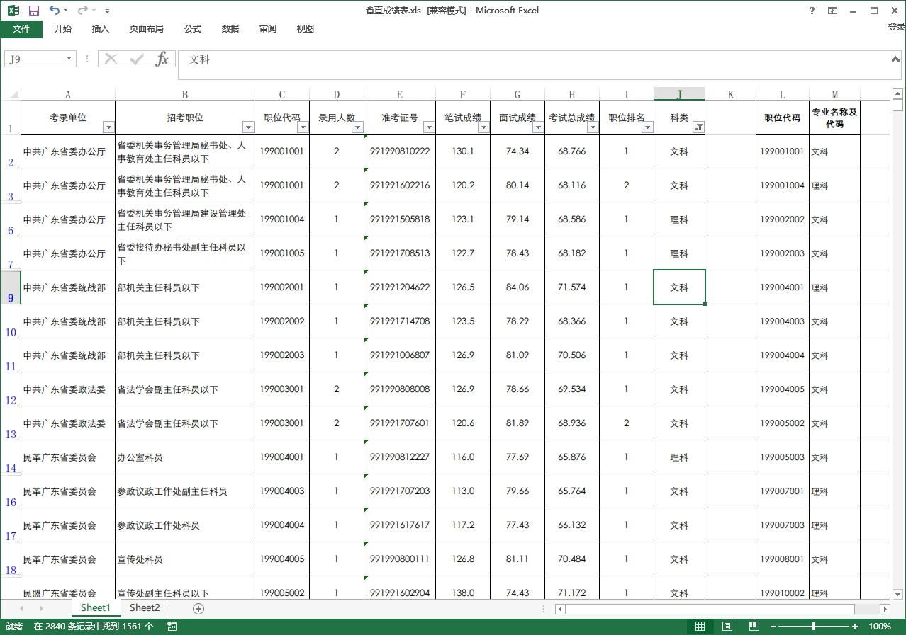
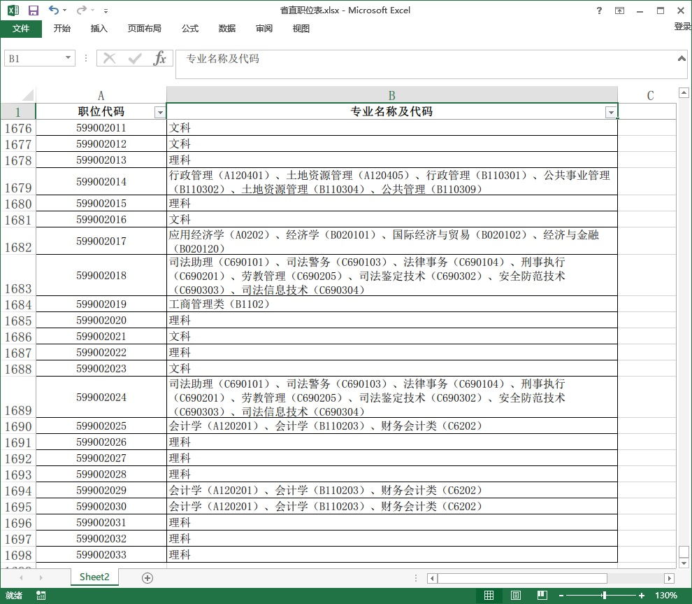
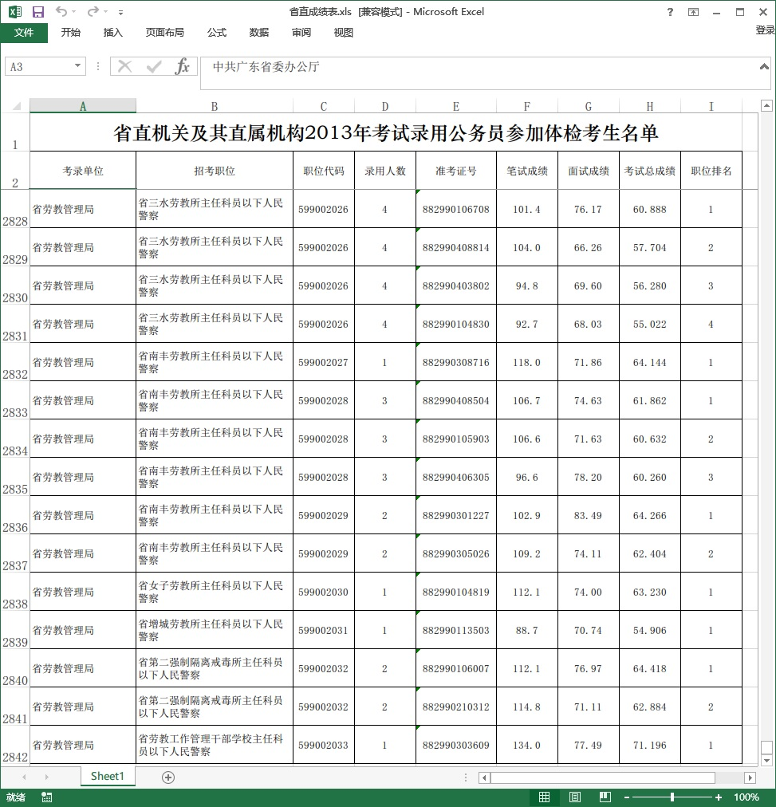
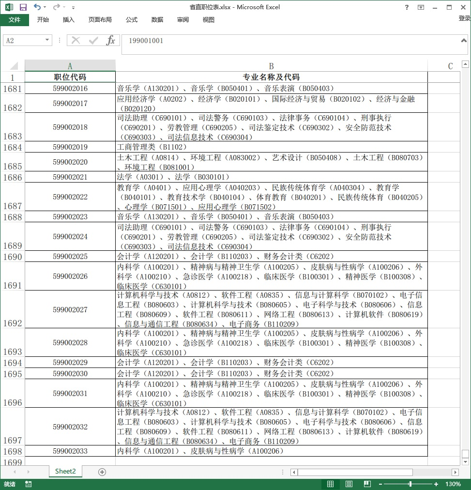
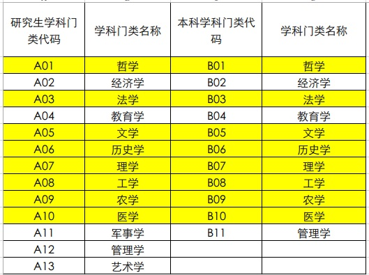
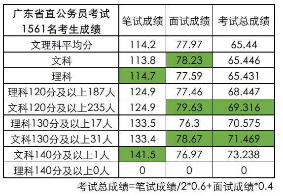

这是在知乎上的一个回答。个人认为，当前公务员考试，可以较为客观反映出部分文理科生的真实水平。

公考的几个特征： 1.公平。 2.竞争产生在同专业考生内部。 3.题目一致，可以进行横行比较。

笔试：行政能力测试+申论。其中行测有大量数学计算、逻辑推理题目，而申论偏向于时政分析和写作。 面试：广东省的公务员面试采取异地面试方式，广州考生去清远面试，韶关考生去广州面试。并且面试官在每一场考前都是随机分派考场，几乎不可能有作弊问题出现。

从网上搜索到2013年广东省公务员招录相关数据：

## 一：广东省公务员招录职位表

公务员考试，文科职位和报考人数都多于理科，多数文科专业以公务员职业为翘首，部分理科专业也以公务员为主要就业渠道，但理科人数基数大，在竞争激烈程度应该是相当的。

## 二、广东省直机关公务员职位表（仅筛选职位代码和专业）

2013年的广东省考试，省直机关共招录1697个职位，共2800余人。

## 三：广东省体检（拟录用）考生成绩表

这是广东省省直机关2013年公务员考试参加体检考生的名单（体检通过即可录用，体检不过的几率极低）。其中记载有考生详细的笔试、面试分数。如有需要可在后边链接下载数据。

## 四：专业目录

这是专业目录，但由于部分专业大类会出现文理科混读情形，如A02经济学、A12统计学等，为了撇除这些因素影响，在这里文科专业只取：哲学、文学、法学、史学；理科专业只取：理学、工学、医学、农学。

经过初步筛选，从1697个职位中，剩下921个。会计、金融与工管专业接近500个职位，很多学校文理科都可以报考这类专业，故不再计入。另外，专科未计入。

## 五：数据筛选

通过查找，在2840名考生中，筛选到1561名考生数据，其中文科932人（59.7%），理科629人（40.3%）。

## 六：文理科数据PK：

## 七：数据分析：

在这1561名考生对比中，文科生笔试成绩平均低于理科生0.9分，面试高于理科生0.62分。总分低于理科生0.015分，基本旗鼓相当。

 

但是：

在超过120分的考生中，文科生235人，占群体的25.21%；理科生187人，占群体的29.7%。

文科生，低分人数比例大于理科生，这是事实。

在这超过120分的考生中，文科生平均分跟理科生一摸一样，都是124.9分，而文科生的面试成绩优势继续扩大，到了2.17分。

在超过130分的优质考生中，文科生比例为3.3%，而理科生为2.7%。在平均分方面，超过130分的文科生，平均笔试成绩虽然比理科生略低0.1分，但面试成绩已经继续扩大到2.37分的优势。

而在高于140分的考生中，仅有1名考生入围，是文科生。

PS：最后我想说的还是原答案那种态度，文科生在大学入学阶段，已经经过了比理科生更加严格的竞争筛选，在进入到本科以后的层次上，文科生在基础智商等方面，不会跟理科生有什么差距。

 

涉及数据下载： 招考公告：[广东省人力资源和社会保障厅](http://www.gdhrss.gov.cn/publicfiles/business/htmlfiles/gdhrss/tzgg/201303/39664.html) 成绩表：[广东省人力资源和社会保障厅](http://www.gdhrss.gov.cn/publicfiles/business/htmlfiles/gdhrss/tzgg/201306/42898.html)

 

同省25万文科生，一本招7000人、二本2万；28万理科，一本35000、二本8万。 这种竞争比例下，某些知友还大谈平均智商，我就呵呵了。 能上一本的文科生已经是文科生里边前3％了，而上一本的理科生，在理科生里边大概前10%。

至于公务员能否作为一个恰当的代表群体，个人倾向于认为可以。周围985理工专业的同事也有大把嘛。
