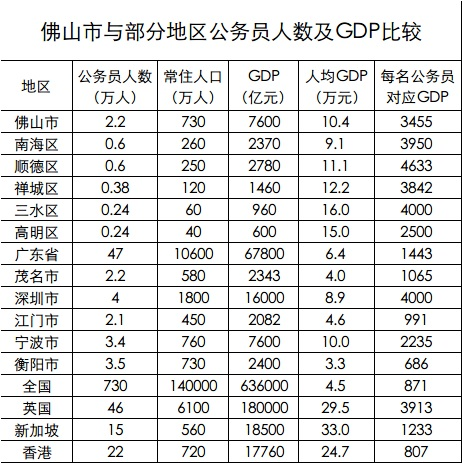

中午趁着闲暇，做了个表格，采用的都是公开数据，对比一下佛山与部分其他地区公务员人数和GDP数据。 需要说明的是：

1. 人口数据取的是2013-2014年公开常住人口数据；
2. 公务员人数，国内的按照各地十二五人才规划中，14-15年数据；国外的按照wikipedia上2013-2015年数据；
3. 国内GDP按国内2014年数据，国外按wikipedia国际汇率由美元按6.12比率换算成人民币；
4. 美国、日本等国家公务员人数计算方式与中国存在很大差距，美国计算公务员人数接近2400万，只要是财政负担的人员均计算在内。而中国的公务员只统计党政机关具有公务员法定义身份的人员，2014年约730万。
5. 英国的公务员涵盖人员与中国对的公务员的定义范围非常接近，从数据上来看，佛山部分地区以及深圳等地已经基本达到该国比例水平，其实，以人均GDP来看，国内部分领先城市追赶上英美平均水平，应该也只需要二三十年了。

