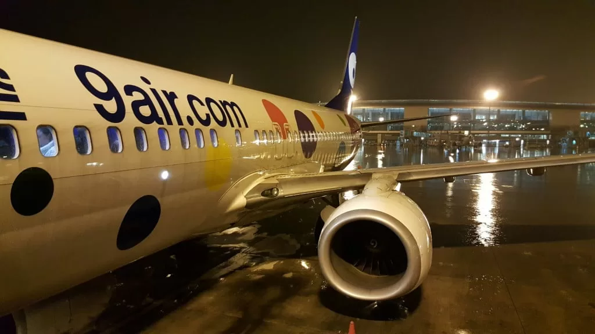

Jiuyuan Airlines, as the name suggests, is named after the nine yuan Renminbi ticket as a gimmick. After Xiangpeng, it is the second time to take a low-cost airline flight. However, the various restrictions of 9 yuan are more stringent, and all bags over 40 cm need to be checked in. The boarding pass staff should have been scolded by passengers a lot.
