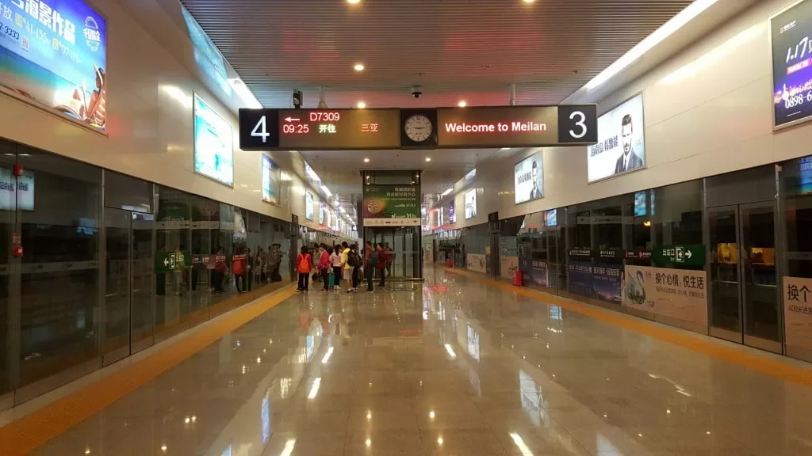

从广州到海口的机票平均比到三亚的便宜50%，而从海口到三亚的高铁只需80元，耗时两小时。对于我们工薪阶层来说，能省一点是一点，毫无疑问我们会选择在海口转机。起初我没有做好功课，以为海口机场必须打车到海口火车站才能坐火车。到了机场才发现火车站就在机场内。作为全国十大机场之一，海口与三亚争夺商业机会。这个火车站的一个特点是，其结构完全是地铁站的模型，不仅线路在地下，而且站台屏蔽门也是地铁站的设计方式。