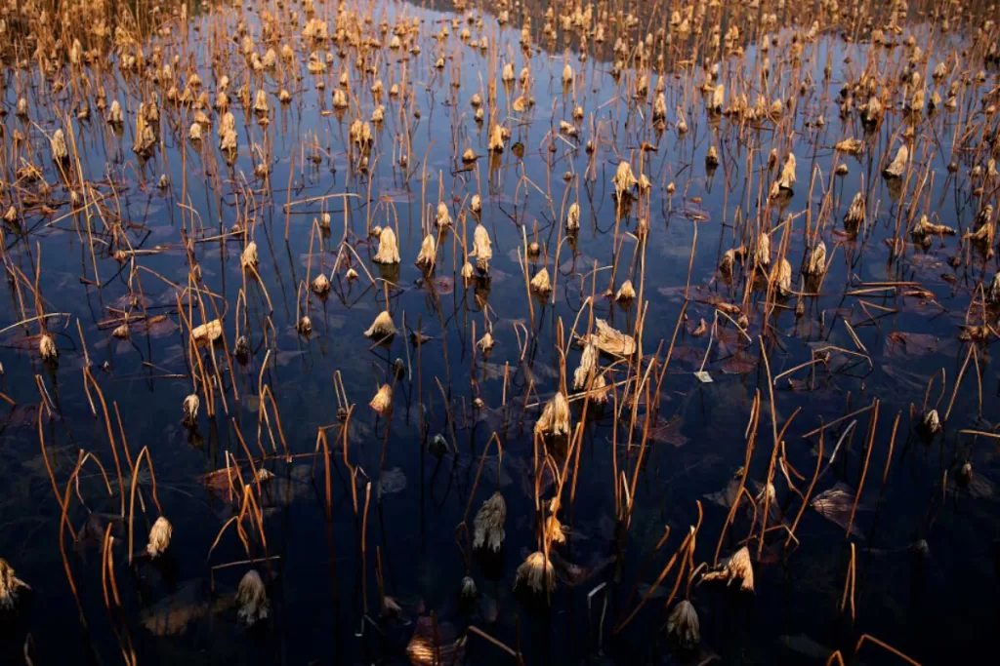
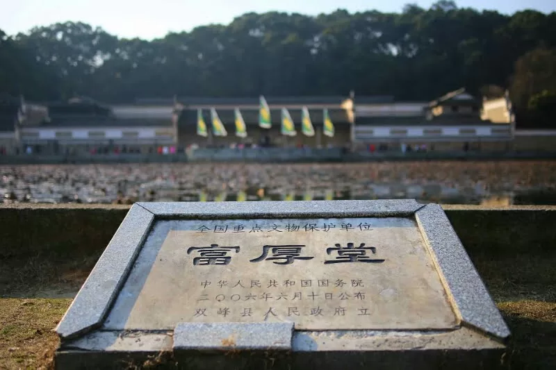
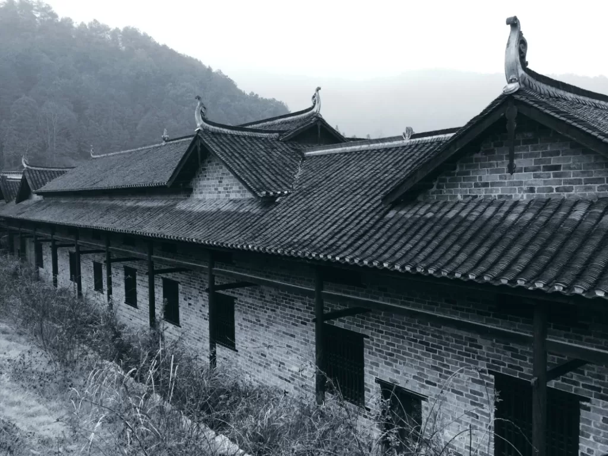

The lotus pond in the former residence of Zeng Guofan once witnessed the glory of the landlord class in the feudal society. Thousands of acres of fertile land have now been converted into a lotus pond for tourism purposes.

