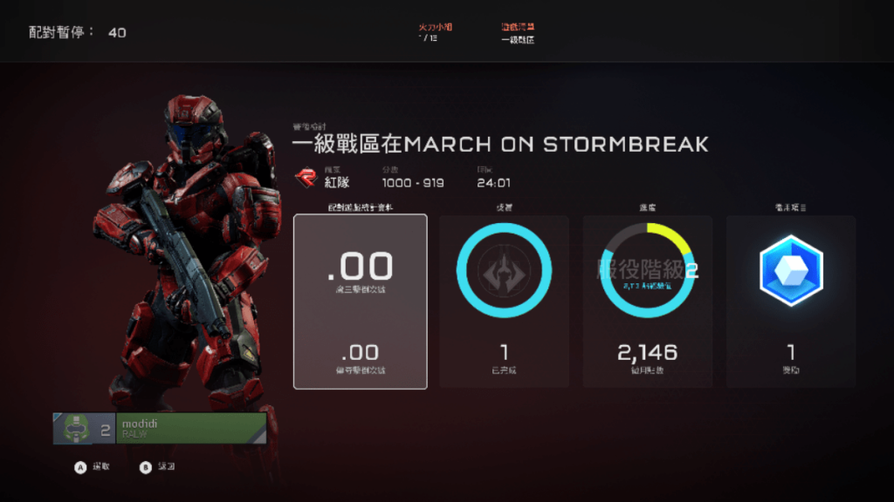
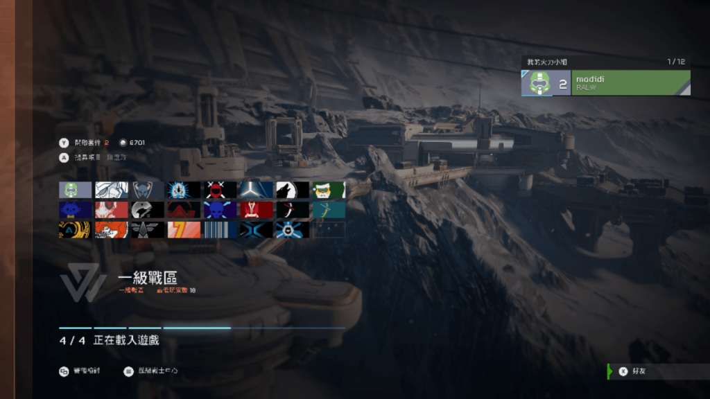
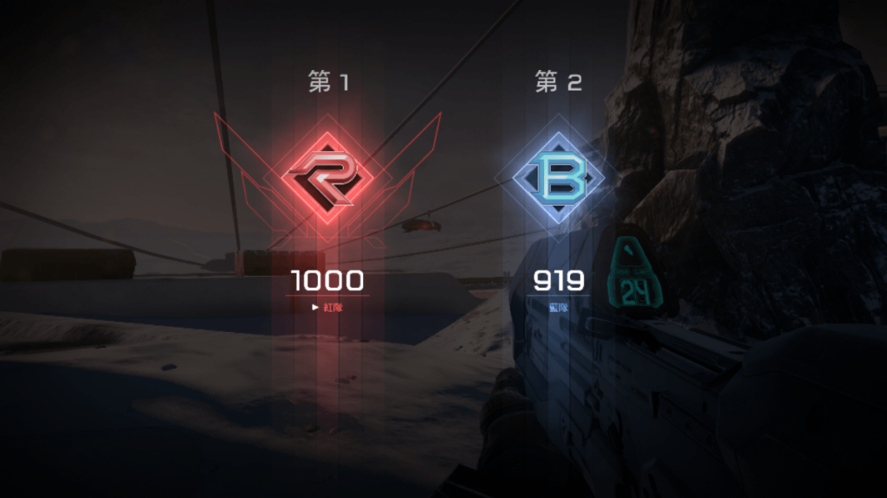

The chinese version of xbox one seems to be no longer region-locked. After unlocking the game disc in the second half of last year, all other regional version discs can be supported, and after unlocking the Chinese display of the traditional Chinese disc, I tried Halo 5 tonight. The foreign server is directly online, and the online speed is extremely fast. It takes half a minute for a 10-player competitive game, and even for an 18-player war zone game, it only takes about two minutes. It really feels like the sun is coming out of the west. I hope that Microsoft can continue to maintain it, and try titan fall when I have time in a few days.

