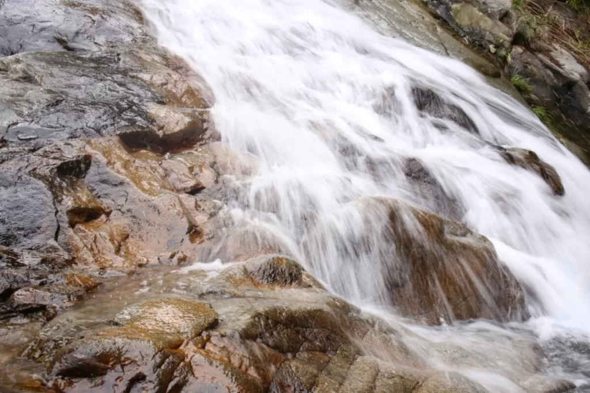
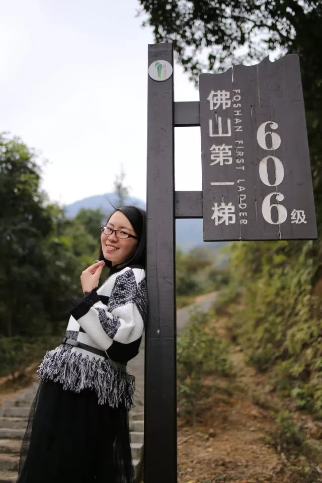
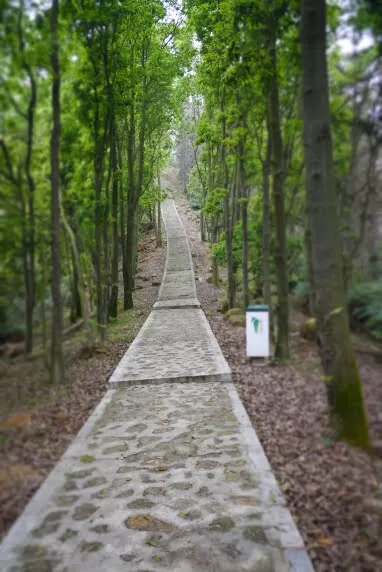
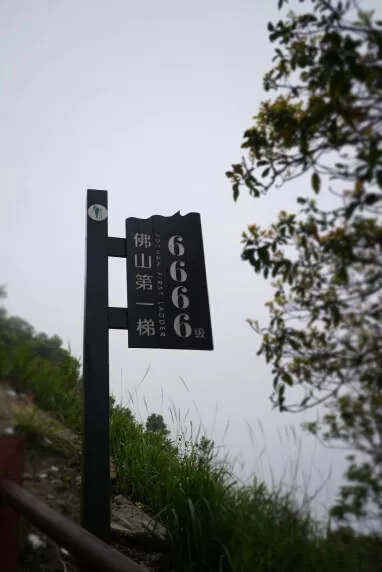
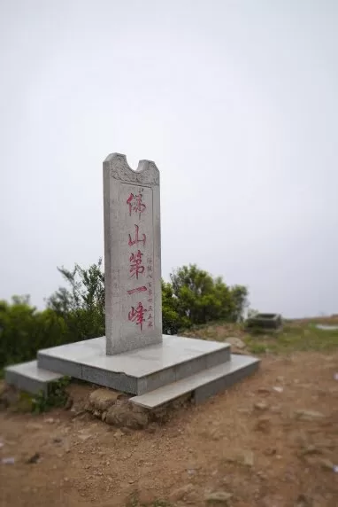

The stream at the foot of the mountain is turbulent, and the steep slopes stand continuously on the mountain. Although the number 6666 may not be true, the overall slope and difficulty are still worthy of the title of No. 1 in Foshan, although this title does not have much gold content. .

