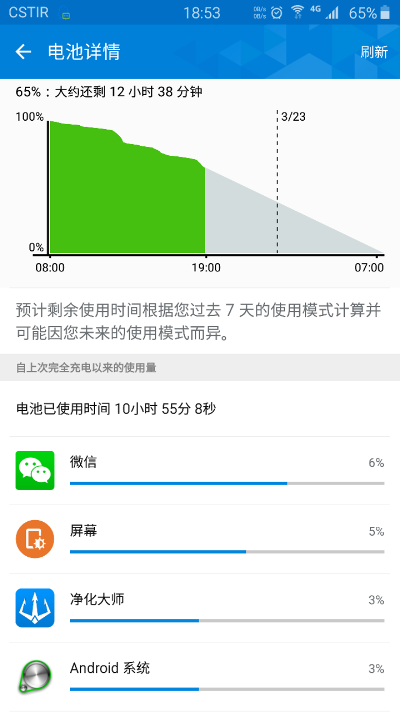
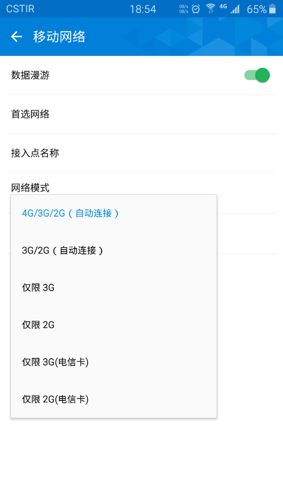

三星的安卓手机经常会有莫名耗电快的情况，经过使用better battery stats查看，罪魁祸首就是gpsd与lli_pm_wlock，这两个进程加起来待机一个小时就得耗电10%以上，经过多番查找终于找到解决办法。 

## gpsd 

这个原因就是很多app会自动激发定位功能，即使在关闭定位、禁用app调用定位权限掉也没用，app自然会在后台激活gpsd不断尝试定位。解决办法是将gpsd文件设置权限，按照链接中做法，使用gscript控制gpsd开关。 

http://download.csdn.net/detail/o8xv0123/6881219?web=web

## lli_pm_wlock

这是个待机进程，本意是节电的，但是在某种特殊情况下，比如当设置手机信号为仅限4G或者3G，它会不断搜索信号，造成耗电量飙升，解决办法是将手机信号设置为和当地实际情况相符，4G的一定要设置4g/3g/2g自动选择。 

http://forum.xda-developers.com/showpost.php?p=62519112&postcount=1254
