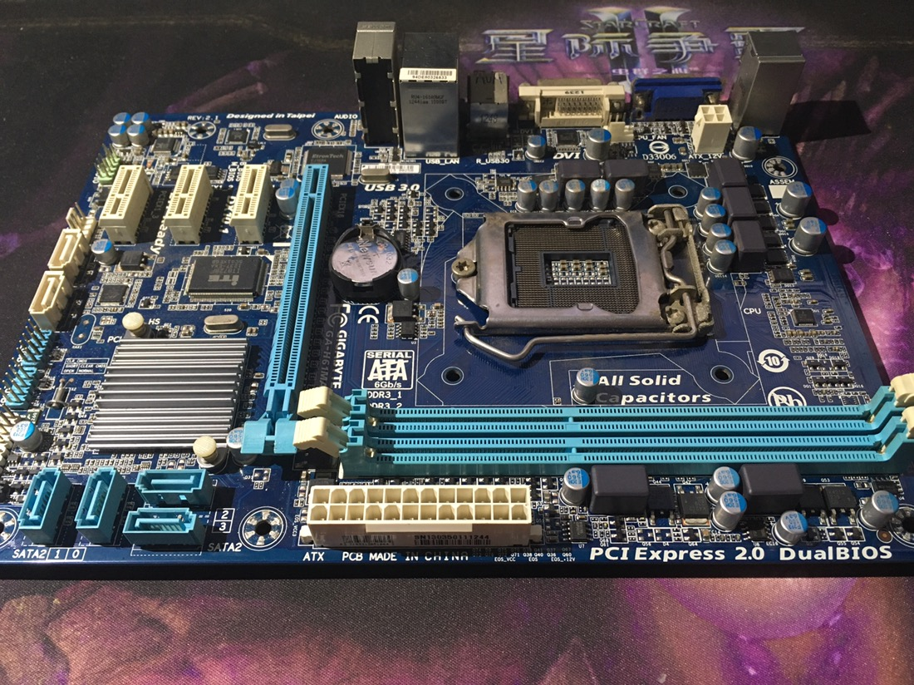

未知原因，这块技嘉主板出现了多次故障，那些USB3.0驱动不兼容都是小事了，SATA3接口出问题才是核心，之前因为升级win8.1和win10系统，导致SATA3的控制芯片驱动长期不兼容，使得HDD一直100%占有率，由于是双硬盘，一直没留意到HDD的问题，等到发现时，硬盘已经基本报废。后来，陆续因为这个驱动问题，多次导致系统报废，最后换了硬盘，换回SATA2接口，续命至昨日，终于是因未知原因毁掉了bios芯片，整块主板进入报废状态。

[] 

H61本不支持sata3和usb3.0，技嘉弄了几个第三方芯片才实现，然而几年过来，这个平台真是用得心力憔悴。当初选H61真是太失误了，没有考虑到升级需求，导致后来各种局限。

1是LGA1155接口，一开始买的是G620的CPU，用了一段时间升级到E3-1230v2，虽然后者性能现在还可以用，但无奈市面上已经几乎没有支持LGA1155接口的主板，如欲升级，CPU只能换。

2是H61只支持到DDR3-1333，如果升级电脑，也必须换掉。

无奈下，只能继续购买H61的主板。但不知道什么原因，现在市面上留存的几块H61主板，都已经恢复了基础规格，均只搭载SATA2/USB2.0接口，价格也都在300上下，估计能再战几年吧。传输速度问题，只能忍忍了。
