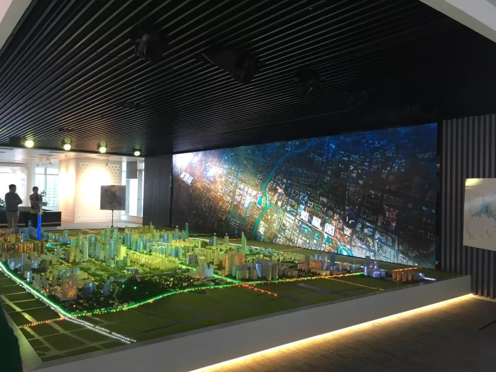
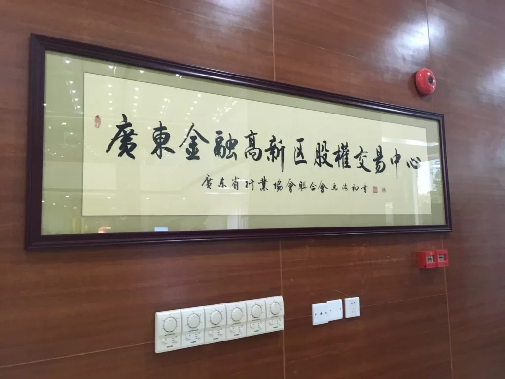

In the training at the Party School of the Municipal Party Committee, part of the course is arranged for outdoor learning, mainly to visit and learn the working mode and construction experience of the Sino-German Industrial Service Zone and the Financial High-tech Zone. I feel that Foshan has finally paid attention to urban construction in the past few years, otherwise the appearance of the city really does not match its economic status.

