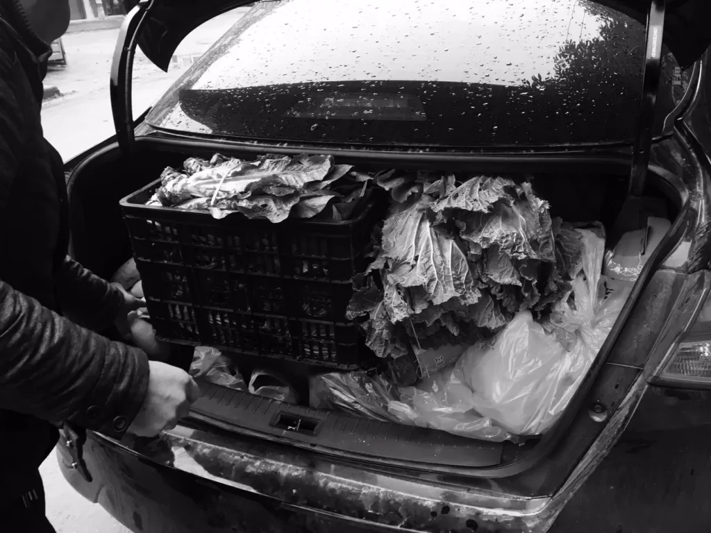

It was the first time I ran a long distance, and I brought back dozens of bottles of wine and hundreds of catties of vegetables. More than 1,500 kilometers back and forth, a total of 16 or 17 hours of driving, the spirit was highly concentrated, and I couldn't squint my eyes when entering the service area.

The only regret is that the tire was scratched on the rural concrete road at night, and hundreds of dollars were pitted.
