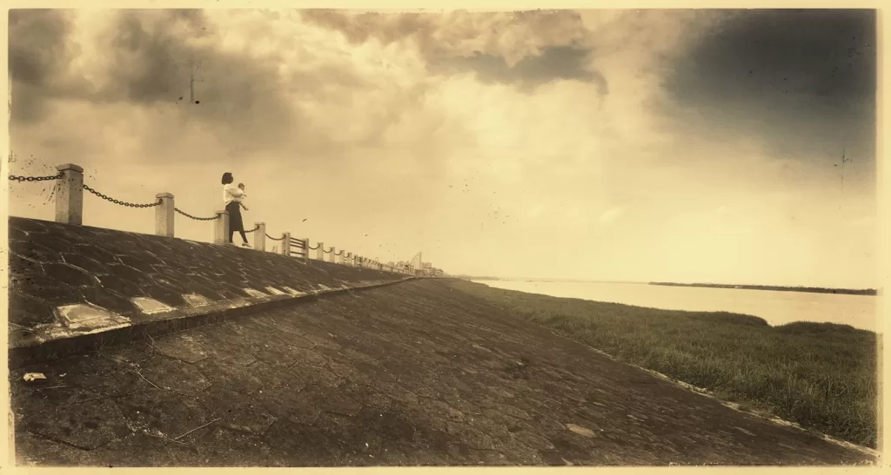

On weekends, I took my wife and children out to enjoy the wind. The Xijiang River is the fourth longest river in China (the first three are the Yangtze River, the Yellow River, and Heilongjiang River), the second in shipping (second only to the Yangtze River), and the second in overall water flow (the main stream of the Pearl River, which is the third separately)

