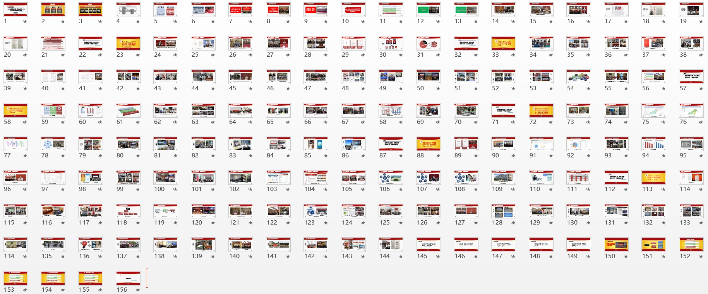
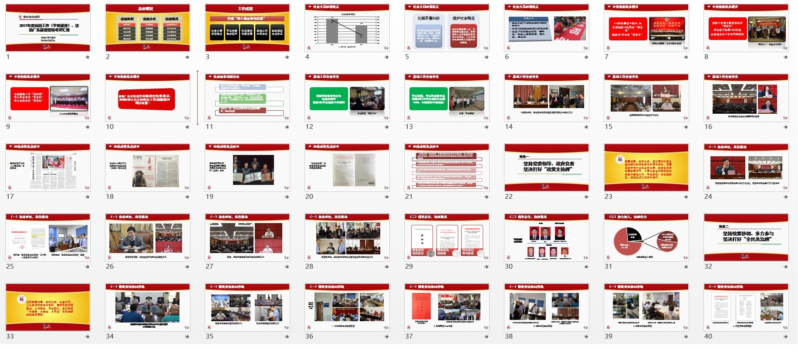
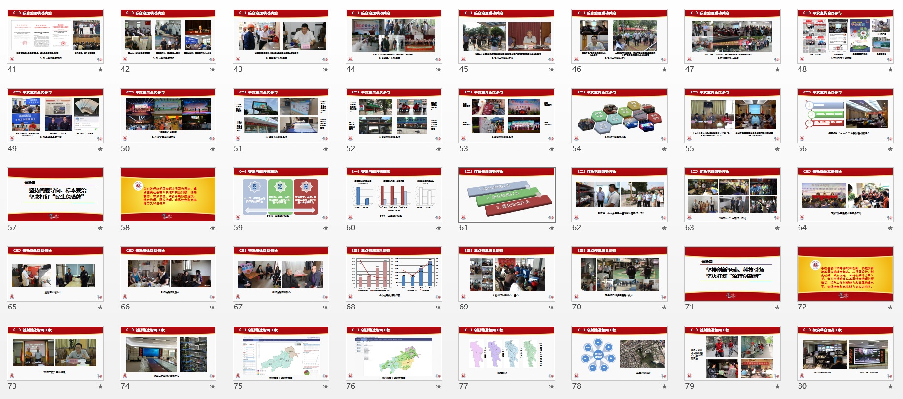
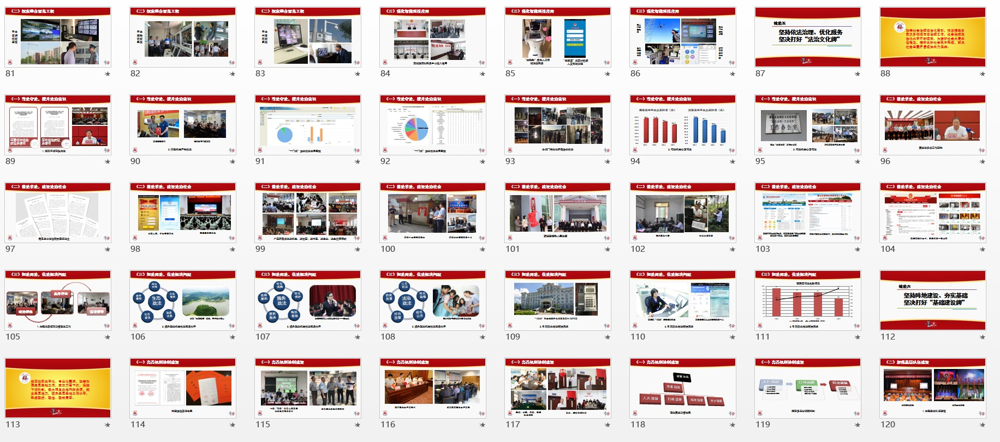
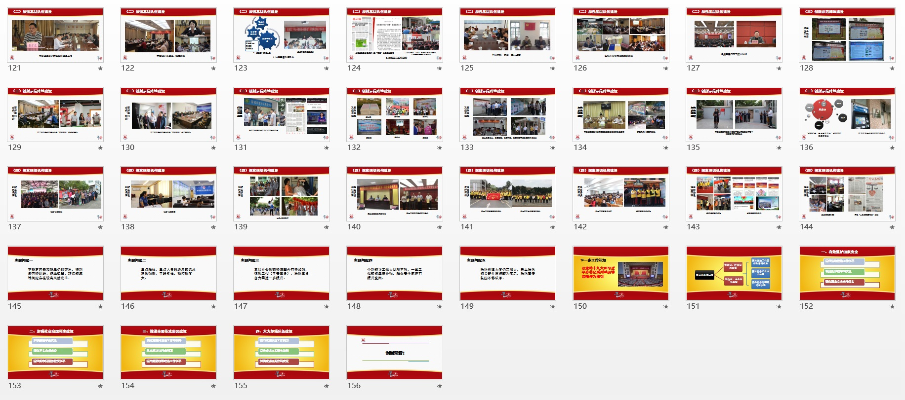
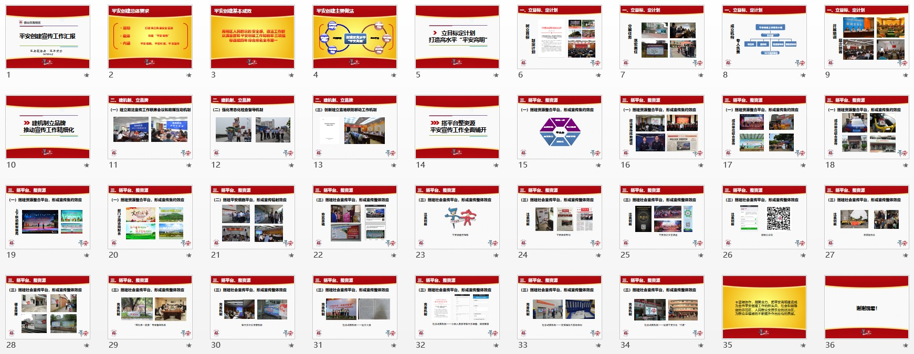
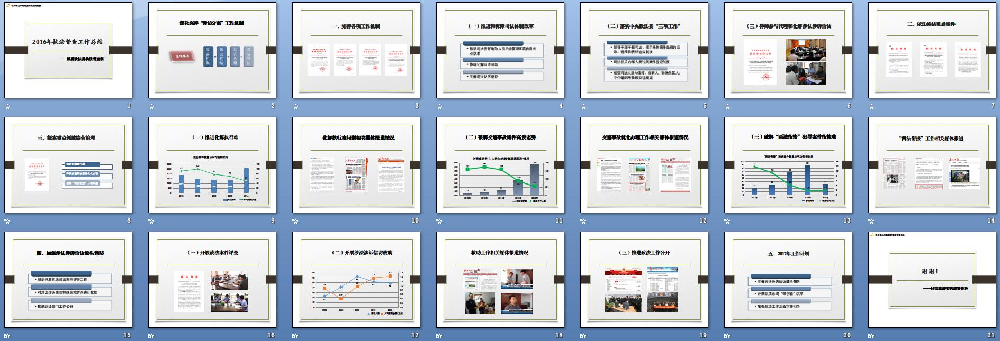

最近几年在“能者多劳”的迷魂汤下，做了很多不属于自己部门的工作，其中一个就是帮单位各部门搞PPT。做PPT的辛苦，真的只有做过的才懂，但也只仅限于此，至于花了多少心思，用了多少心血，并不会换来等价的评价，做多错多，做的好是应该的，一旦有人不如意，一不小心就会让自己陷入泥坑。

2017年主要做了4份PPT，其中两份所在部门工作总结汇报，分别只有10多页，而另外两份则分别是30+页和180+页。

总结经验下来主要有这么几点：

**1，善用模板，一套合理设计的模板，几乎可以通吃机关汇报PPT**

这个模板只有3页，用的是国家机关惯用的红黄白配色，已经连续用了3年，在各种不同会议上展示过。第一页用于大标题和一级标题展示；第二页用于重要内容强调；第三页用于普通页面。

**2，慎用字体，机关会议PPT字体最好与公文一致**

常见党政机关公文字体只有4种：方正小标宋、仿宋GB2312、黑体、楷体GB2312，宋体都只在公文页码等少数场合使用。

为了体现公务PPT的严肃性，经过对多种字体进行测试，适合用于PPT的字体主要是黑体、楷体、方正小标宋体。

例如本人最喜欢用黑体，整份PPT甚至只需要黑体一种字体，搭配阴影、粗体等效果，体现不同的层级。

**3.善用母版，选定模板后第一时间是编辑母版**

PPT母版设计代表着整个PPT的结构层次，一般公务PPT都会有明确的文稿，内容层次一目了然。将大标题小标题融入母版设计，可以有效避免幻灯片切换过程中，标题部分不必要的切换。

一二级标题都可以直接做进母版，另一个好处是可以做到位置固定，避免出现同级标题位置不一等问题。

**3.勤用微信，这是当前最为便捷的查找图片方式之一**

做PPT最怕的是没素材，因为在制作之前，很难预料到到底需要什么内容。例如本人所在单位各部门提供素材，要么一个移动硬盘甩过来几万张照片自己选，要么简单几张不知所云。如果单位统筹能力强的，这方面问题小点，但就个人体会而言估计都是通病。没做过PPT的几乎都不会找素材，不会用素材，让他们提供素材通常都是做无用功。

幸好这几年微信横行，各机关单位基本都在以微信为主开展对外宣传，大多数微信公众号上的照片都已经筛选过，并且内容具体。此时只要善用微信搜索，可以很快找到对应内容。

例如在制作这个PPT过程中，各部门提供照片数以万记，但绝大多数都是有量无质，最终使用的300多张照片几乎都是在微信找到的。

**4.多用图表，图片只是证明干了什么事情，图表才能证明工作成效**

在这么多年反四风、执行八项规定过程中，一个明显抬头的趋势就是不管干什么工作都需要佐证材料，而最佳作证材料都是照片。仿佛不拍照、不看照片就没干事一般。因此一般领导都会非常重视PPT或者类似宣传片中的照片，哪些必须要放的画面，基本一早就确定好了。

但图片太多很容易视觉疲劳，适当的图表加入，实际上更能体现工作成效。

例如在这份PPT中，我前后做了大概四十个图表，尽量让幻灯片不那么连续枯燥。

**5.避免遗漏，机关最重要的工作哲学之一就是不能把人、把工作给漏了**

一次工作汇报，不可避免有侧重领域，但绝不能因为侧重在某个领域，就一点都不提起同单位的其他部门工作。本人所在单位大小可分成10多个板块，分别由6个领导分管。在一些较为全局性的汇报工作中，虽然重点放在某少数几个部门，但尽量做到让每个板块都有画面，哪怕是一张图、一句话都好。避免产生很多不必要的烦恼。

机关都是追求大而全，内容不怕多，就怕有缺漏。毕竟大多数人没有实操制作过PPT，认知停留在”把文字跟图片贴上去就行了“的阶段。

**6.少用文字，这几年领导审美也逐渐提高，文字太多已经不适应时代需要**

在几年前，多数机关汇报PPT都是以文字为主，有时候甚至将汇报文字稿全文贴上，听得累，看得也累。但又不能像发布会那般，只打几个小标题，毕竟绝大多数机关汇报都是对着稿子读的，不需要太多发挥。

**7.避免大包大揽**

这个就是本人这几年来最为深刻的教训，深陷泥潭，无法自拔。
