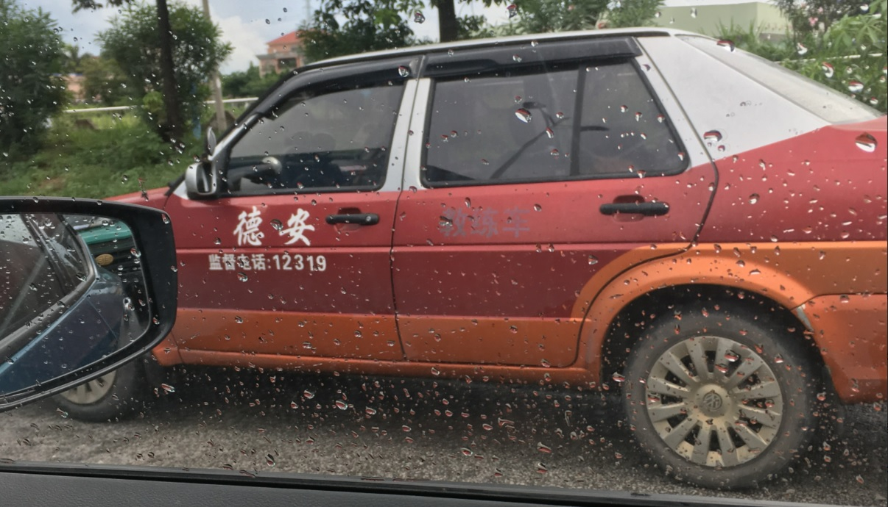
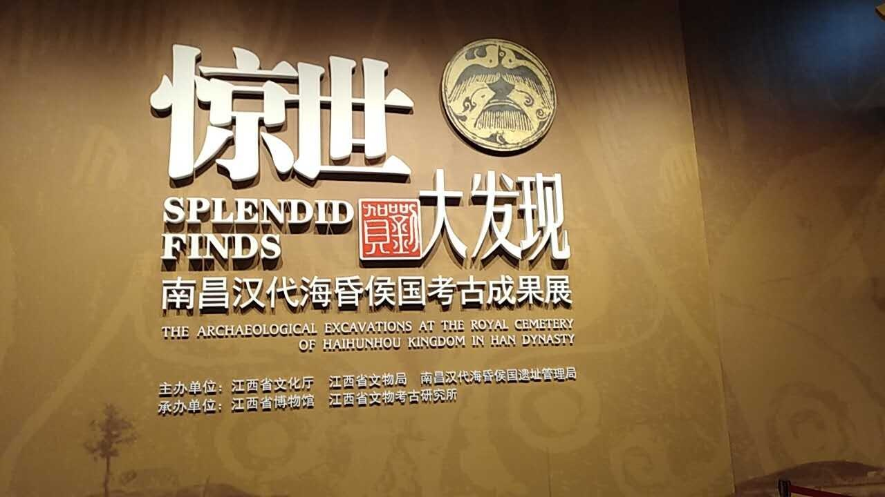
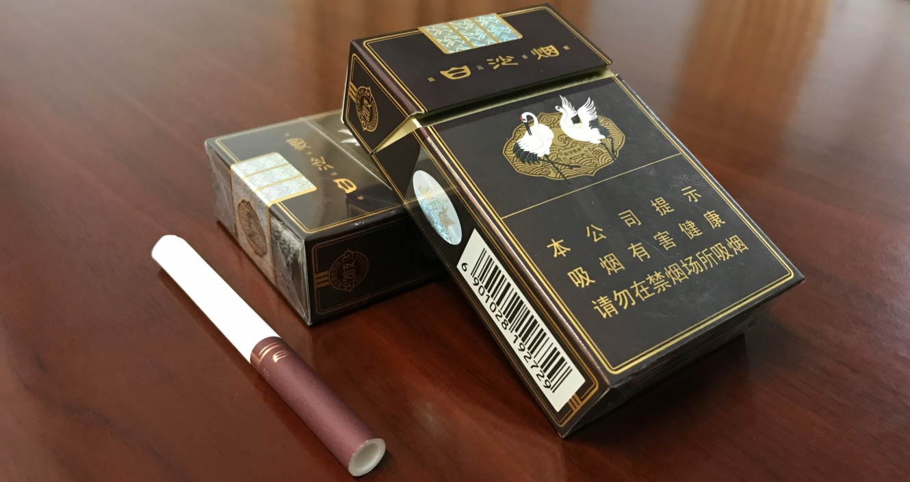
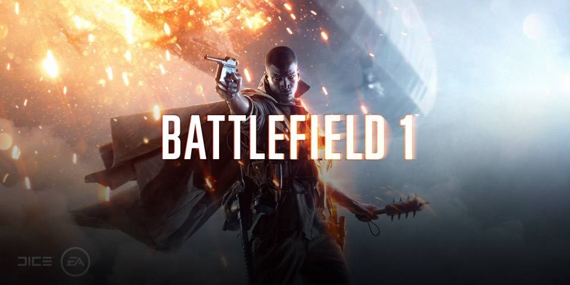
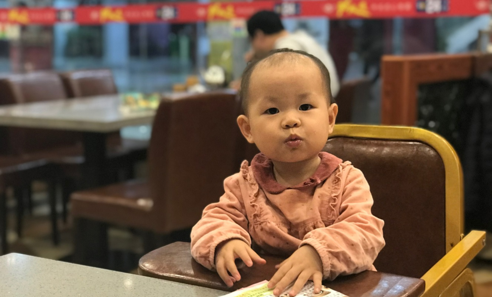

2017就那么走了，甚至还没来得及开完年终总结大会，就已经是大半个月以前的事情。这一年有一些收获，也有一些遗憾。对未来影响最大的估计是在28岁这年终于学会了游泳，山里出来的旱鸭子，能跨出这一步，也算是弥补了多年来的短板，当然成本也不低，夫妻俩一共花了2000多块钱学费。

第二个比较有意义的是第一次在本单位系统的中央杂志上发了一篇短稿子，也算是单位这一年唯一一篇中央级的文章。

 > **《长安》杂志**由中央政法委主管的政治、法律、社会综合性新闻月刊，是中央政法委、中央综治委的机关刊物，是党在政法、综治战线和法治意识形态领域的宣传主渠道、主阵地。

第三是开了个好头，年初第一次长途自驾后，发展到全年跨省跑了五趟。2万公里没违章。也算是对得住驾校教练了。

###### 路上偶遇教练

第四是瞻仰了一下汉代遗迹，继马王堆之后，第二次感受到2000年前老祖宗们带来的震撼，明白了什么叫文化自信。

第五是看了几本闲书。包括700万字的长篇网络小说《权力的巅峰》，以及炙手可热的科幻小说《三体》三部曲等等，自感读书越来越少，生活越来越油腻，理论和储备都慢慢被掏空了。

第六是大幅增加了烟酒槟榔的摄入量，脂肪越堆越多，身体一直维持在亚健康状态，一年一度的献血也不敢上了。

第七是换了一堆电子设备，手机从iPhone5s 换到iPhone SE，然后觉得小屏幕用久了不爽，换了iPhone 7Plus，之后又因为领导指示因为132联通的手机号码长得太像诈骗电话，换了139的移动号码，同步买了个Smartisan坚果Pro2。iPad mini被女儿天天摔得不成样子，而且速度太慢，也换成了大容量iPad Pro，游戏机从xBox One升级到了xBox one X，并且还加了台PS4 Pro，VPN从原来的Linode跟Virmach换成了香港的HostKVM和UFOVPS，主力电脑从E3-1230V2/960GTX/8GB/128G+2TB/U2412M的HTPC台式机换成了i7-2820QM/Quadro1000M/8GB/128G+1TB的戴尔M4600工作站+Thinkpad X220改装本（其实就是把以前的老笔记本改装升级了一下），总体感觉是现在玩不动了，没时间玩，游戏机都没时间打开，更何况电脑了。年度最佳游戏是BF1，玩的最长时间的是全境封锁，最佳手机是坚果Pro2，用得最多的是7Plus。

第八是带着小家伙跑了很多地方，努力做好父亲这个角色。

第九是做了几件好事，在领导层接近完成审批的情况下，临时加码将年度资金使用率从94%提高到了99.6%，为几个特殊困难的群众提早申请到救助金，尽量避免他们因贫失学、没钱过年等问题吧。

第十是做了几件以前想做而做不到或没有做到的事，主要都是工作层面的，具体就不多说了。
