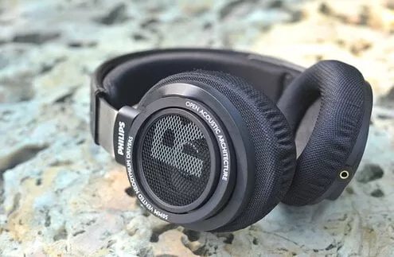
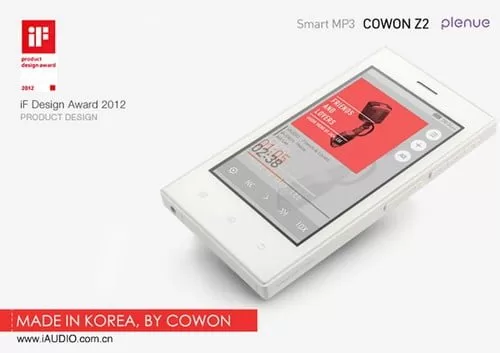
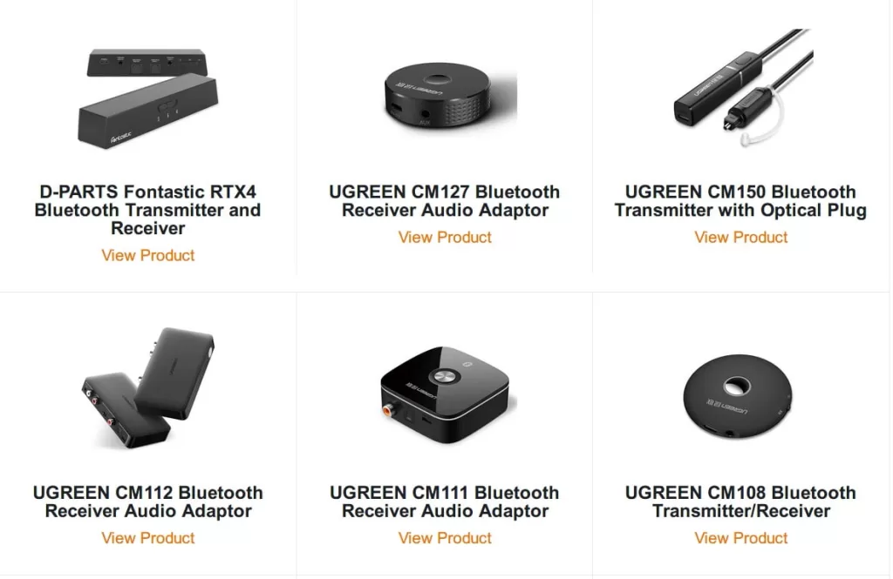
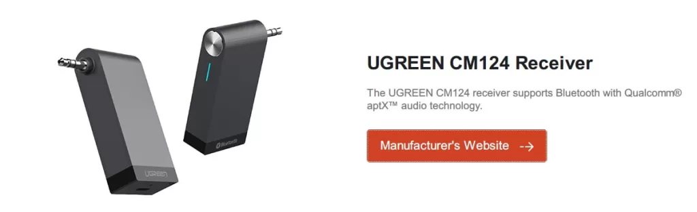
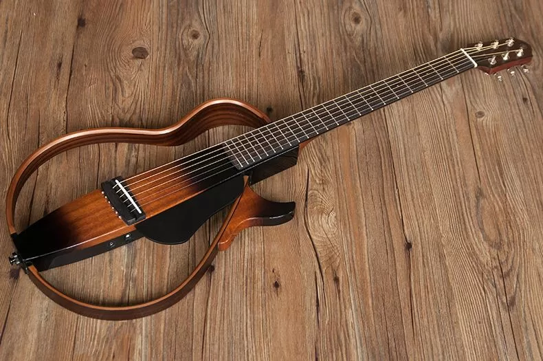
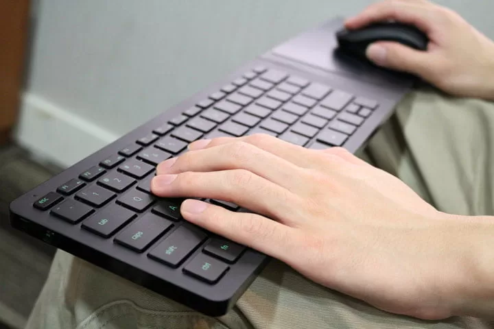

With iPhone and Android canceling the 3.5mm audio interface one after another, Bluetooth devices ushered in a new round of explosion. Recently, I am playing Tencent’s new PlayerUnknown’s Battlegrounds: Stimulating the Battlefield. The foundation of years of fps is still there, and I can get started very quickly. Both 80% can enter the top 10. But this game has a very unfriendly problem - extremely fast power consumption, iPhone 7P 100% power, only open the default effect, the average power consumption per 20 minutes is about 20%-25%, full power is enough to play for more than 1 hour.

The most basic requirement of FPS games is - headphones. But the current iPhone can no longer charge while playing games after using wired headsets, forcing users to upgrade to Bluetooth headsets.

Bluetooth headsets are not just needed. Although airpods are good, the price/performance ratio is too low for my needs. Sports Bluetooth headsets already have sony sbh70, and there is also a rambler that has been in the dust for a long time, but after trying it, it is necessary to play FPS. For games with a strong sense of positioning, there is still a big gap between earplugs and fully-wrapped headphones. It just so happens that I have a SHP9500 that has been in the dust for a long time. Back then, it was known as the king of cost-effective earphones under 1,000 yuan, so I wanted to use it as a chicken earphone.

So I started looking for a bluetooth receiver.

Many years ago, when I was playing with monitor speakers, I paid attention to the field of Bluetooth receivers. At that time, I used i-audio’s Z2 as the sound source. I can’t remember the brand’s power amplifier and M-audio’s bx5a speakers to play. It just so happens that the player also has Bluetooth. , and it is said that it also supports the popular aptX protocol at that time, so I bought a Tianyi BTS-1 Bluetooth receiver online. However, it was later confirmed that the receiver was suspected of false advertising. After detailed packet capture tests, the receiver did not actually support aptX.

After years of development, aptX has fallen from the altar, and the original CSR company has long been acquired by Qualcomm. It is estimated that most of the new Qualcomm chips can support aptX. However, aptX still maintains the original tradition, listing all authorized manufacturers and products on the aptx.com website in detail. After some searching, I found that Lulian, a domestic civilian brand, has many products listed, so I placed an order decisively.

I chose the two most compact ones - CM150 and CM124, a transmitter and a receiver, for different purposes.

Of course, the receiver is used on the front SHP9500 to transform the wired headset into a Bluetooth headset, while the transmitter is used on the Yamaha SLG200s, which can be easily connected to several Bluetooth speakers and headsets at home.

However, in fact, aptX is useless for the iPhone, because the iPhone only supports AAC and SBC, but the receiver + transmitter both support aptX, so you can easily connect the Yamaha SLG200s wirelessly. After all, aptX is already the pinnacle of Bluetooth. The default support order of these two receivers and transmitters of Greenlink is also aptX, AAC and SBC, so there is no need to worry about transmission standards.

But in actual use, I still found a little problem, like the guitar, which uses Bluetooth to transmit the signal, and occasionally there will still be a little stuck, just like the Razer Fortress Spider that was upgraded in order to play games with the HTPC small steel cannon in the living room. Even with a touching price, it does not bring a smooth experience, and some sacrifices have to be made between portability and usability.

