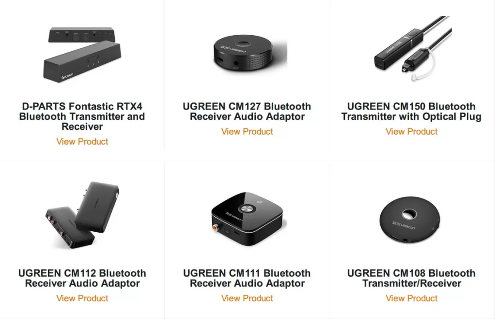
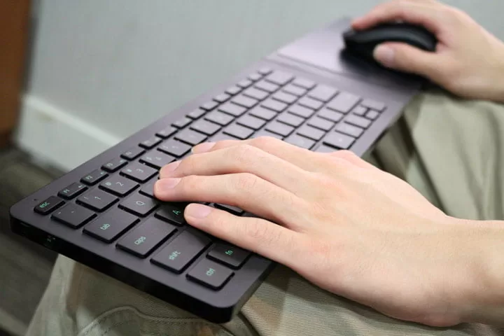

随着iPhone和安卓相继把3.5mm音频接口取消，蓝牙设备迎来了新一轮爆发。最近在玩腾讯新出的绝地求生：刺激战场，多年浸淫fps的基础还在，上手也很快，80%都能进前10名。但这游戏有一个非常不友好的问题——耗电极快，iPhone 7P 100%电量，只开默认效果每局平均20分钟耗电约20%-25%，满电量也就够玩1个多小时。

FPS游戏最基本的需求是——耳机。但现在的iPhone在使用有线耳机后，毫无疑问无法再边游戏边充电了，强迫用户升级蓝牙耳机。

蓝牙耳机并不是刚需，airpods虽好，但就本人这个需求来说，性价比太低，运动蓝牙耳机早有sony sbh70，还有个吃灰很久的漫步者，但试了下，玩FPS这种需要强定位感的游戏，耳塞相比全包裹式耳机还是有很大差距。刚好自己还有个吃灰很久的SHP9500，当年号称是1000元以下耳机的性价比之王，于是想着将其利用起来，作为吃鸡耳机使用。

于是开始找蓝牙接收器。

多年前在玩监听音箱的阶段，曾关注过蓝牙接收器领域，那时候用i-audio的Z2作为音源，接不记得牌子的功放和M-audio的bx5a音箱玩，刚好播放器也带蓝牙功能，并且据说还支持当时热门的aptX协议，于是上网买过一款天逸BTS-1的蓝牙接收器。但后来证实这个接收器有虚假广告嫌疑，经过详细抓包测试，接收器实际上并不支持aptX。

经过多年发展，aptX已经从神坛走下，原来的CSR公司也早就被高通收购，现在新出的高通芯片，估计大多数都能支持aptX了。但是aptX还是保持了原来的传统，在aptx.com网站上详细列出了授权的所有厂商和产品。经过一番查找，发现绿联这个国产平民品牌倒是有不少产品在列的，于是果断下单。

选择的是最小巧的两款——CM150和CM124，一个发射器、一个接收器，不同用途。

接收器当然就是用在前边SHP9500上，将有线耳机改造为蓝牙耳机，而发射器则用于Yamaha SLG200s，可以方便接入家里几个蓝牙音箱和耳机了。

不过，其实aptX对iPhone是没卵用的功能，因为iPhone只支持AAC和SBC，但接收器+发送器都支持aptX，则可以方便的将Yamaha SLG200s无线连接了，毕竟aptX已经是蓝牙的巅峰。绿联的这两款接收器、发射器默认支持顺序也是aptX、AAC和SBC，所以丝毫不用担心传输标准问题。

但在实际使用中还是发现一点问题，像吉他这种，用蓝牙转发信号，偶尔还是会有点卡，就像之前为了实现在客厅用HTPC小钢炮玩游戏，而升级的Razer堡垒神蛛，纵使有着感人的价格，也并没有带来流畅的体验，在便携性和使用效果之间，还是得作出一些牺牲的。

