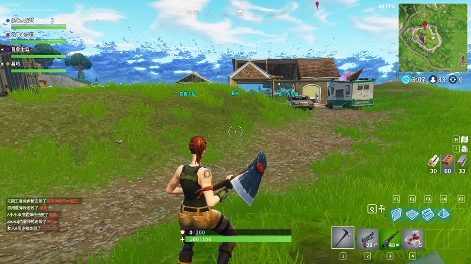
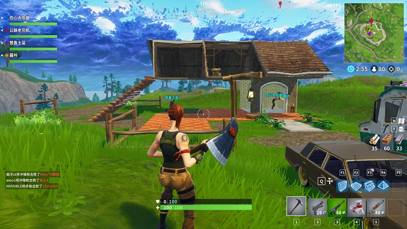
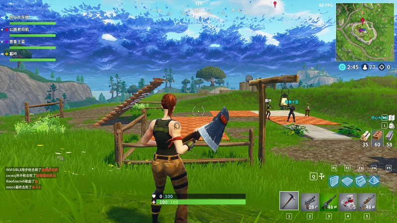
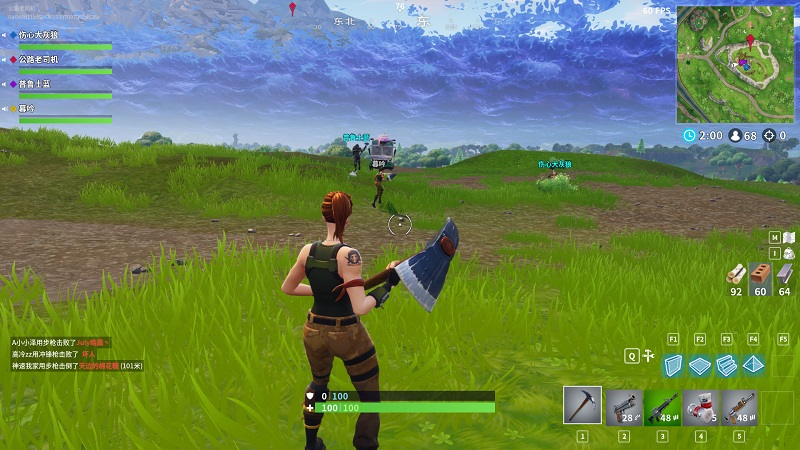
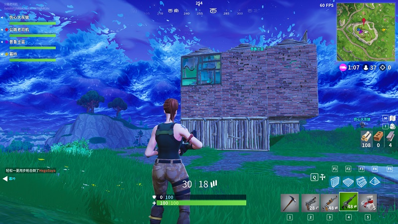
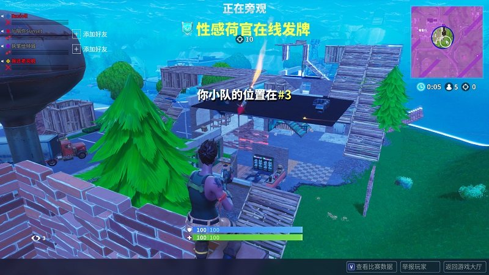
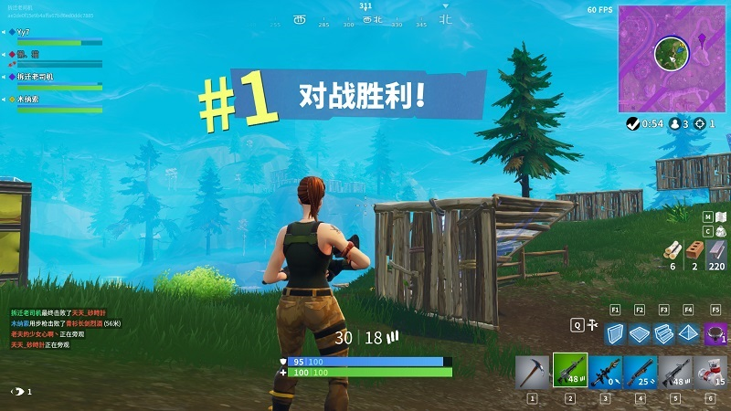

最近换了笔记本显卡，从K2000M升级到GTX 980M，原因么，自然是为了玩游戏。本来想着玩吃鸡的，结果试了下H1Z1，幻灯片卡的不行。于是转而到steam看统计信息，据说吃鸡人数已经比前几个月大幅下降了，这不看还好，一看数据就点游戏看了下评论，发现评论都在讲Fortnite，好奇心驱使，立马下载了Fortnite（堡垒之夜），一玩就是三天，不愧为IGN测评最好玩游戏。

分分钟房子就被拆光

 

 

 

分分钟又盖起一座堡垒

 艰难猥琐到最后被一个4人队用火箭炮围攻

终于赢了一次

最后，希望国内ios和安卓尽早上架，希望ps4港服上架。吃鸡哪有这么好玩。。。
