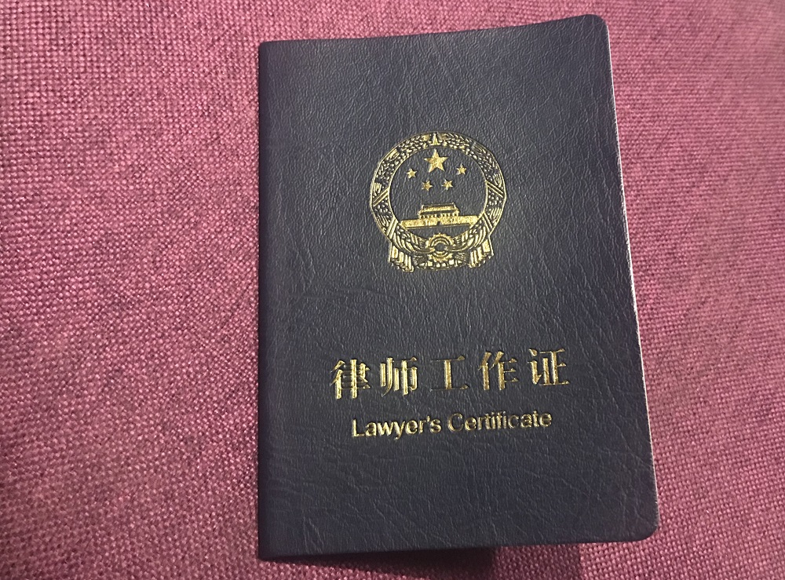
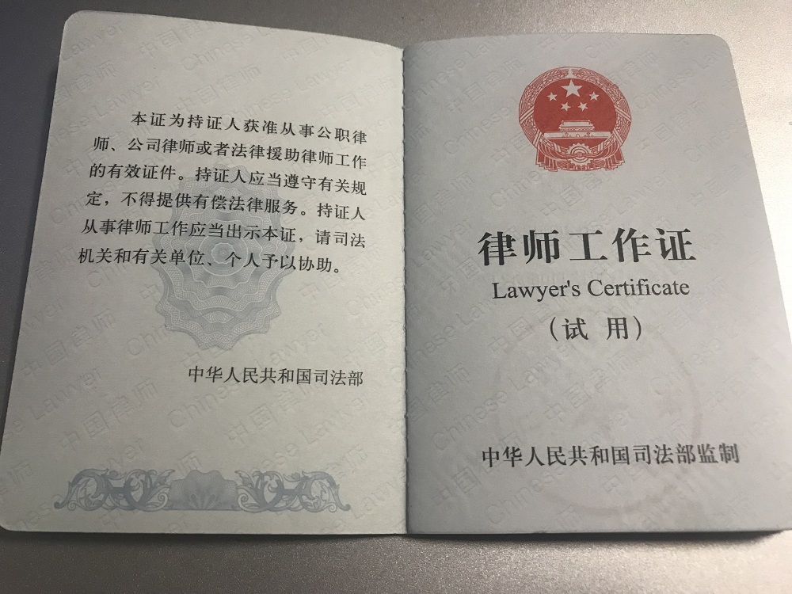

年前在上级领导鼓动下（“怎么其他区的都有，就你们没有”），开始申请律师资格。以前也关注过这个方面，但是一直觉得用处不大，所以法律职业资格证拿到手之后，一直在箱底吃灰、发霉。这次申请律师资格，也算是对那上百个日日夜夜的汗水有个交代了。 

说来也惭愧，司法考试考了3次才通过。第一次是2010年，大四开学即考，由于当年战线拉得太长，边玩边看，断断续续没形成记忆体系，只考了346分。第二次2011年，从3月份开始离校工作到9月份考试，中间换了3份工作，随便应付了一下，再次打酱油320分。2012年的主要精力都放在考公务员上，从4月笔试到11月底上班，拖了7个月时间，中间虽然有报名，但没去参加考试。2013年工作终于稳定下来，在司法所上班，每天还是能挤出来七八个小时看书，花了4个月，总算是一雪前耻拿下400分通过。当时还写了个小结：[个人司法考试通过经验](http://note.hyruo.com/6253.html)

这次申请的公职律师资格主要受益于2016年中办、国办印发的《关于推行法律顾问制度和公职律师公司律师制度的意见》，之前在工作中也接触到这份文件，参与过市、区相关工作调研和会议筹备，还在多个报告中提到过这方面内容。但蹊跷的是，自己当时还真没怎么想过要注册公职律师。这次申请，除了之前因为材料不齐全被市司法局退回了一次，总的来算还是很顺利，从申请（2月6日）到制证（3月1日）也就不到一个月时间，倒是从制证日期（3月1日）到拿证（4月15日）花了1个半月。

公职律师跟普通意义上的律师最大区别恐怕就是收不收费的问题，公职律师发的是律师工作证，普通社会专职律师发的是律师执业证，公职律师工作证里边明确写着“不得提供有偿法律服务”。

既然是无偿服务，那公职律师证对于普通公务员来说就没什么太大吸引力了，毕竟本职工作已经够头疼，再加上无偿法律服务，岂不是没事找事。现实中很多单位也很抵制这个工作，法律专业又过了司法考试的，几乎都是各单位业务骨干力量，如果再被拉出去分担法律援助工作，多少对单位主体工作有不利影响。

总的算下来，公职律师的好处一是能加入律师这个群体参与一些培训和学习，特别是很多行政机关的工作人员，确实有必要从头学习法律实务工作；二是个别富有余力、业务熟识的还可以与法援部门加强沟通去代理法援案件，虽然办案补贴不多，但对基层公务员来说，蚊子也是肉，算是合法增收途径；三是对于那些志愿将来脱离公务员队伍出去从事专职律师的群体，公职律师工作证可以随时转换为专职律师执业证，省去了申请律师职业资格还需要从实习律师干起的痛苦。

最后就是实际工作中的用途，本人所在部门承担了很多直接面向群众的工作，拿这个证应该能在这块发挥出比较大的作用。当前国内的环境下，律师在一定程度上承担了政府和群众之间沟通的“减压器”、“缓冲器”作用，很多工作的开展，以律师为名义参与会比以政府名义参与要顺畅得多。例如深圳这种财政大市，甚至在城管、环保等执法过程中，都全程聘请了律师参与，有效解决了当前公权力公信力不足带来的一系列突出问题。
