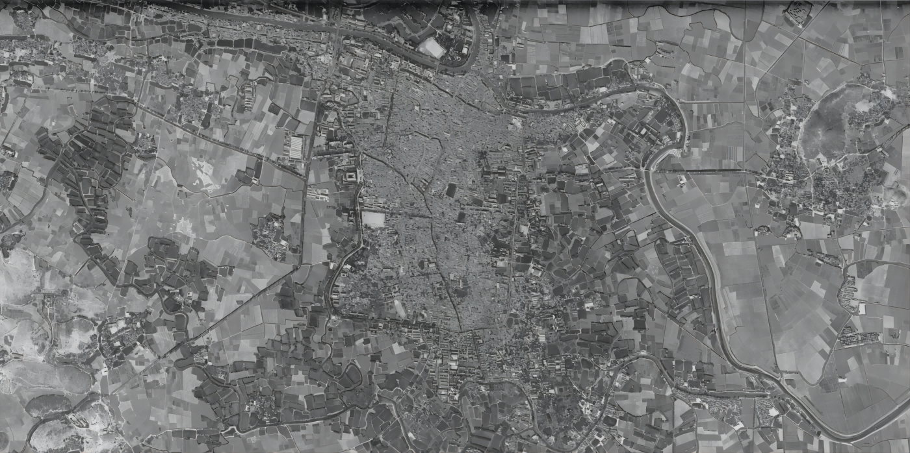
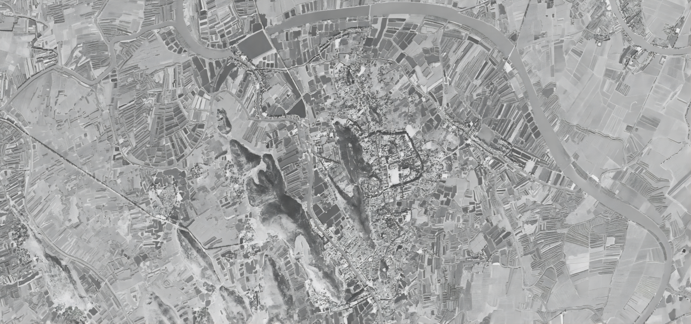
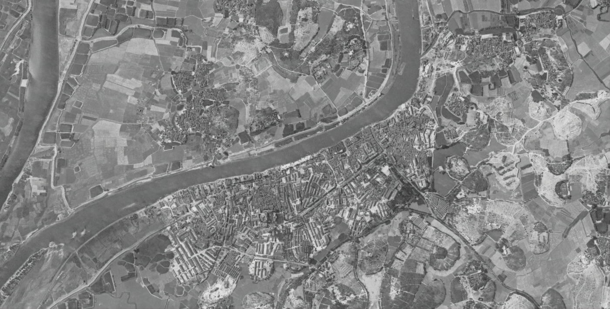
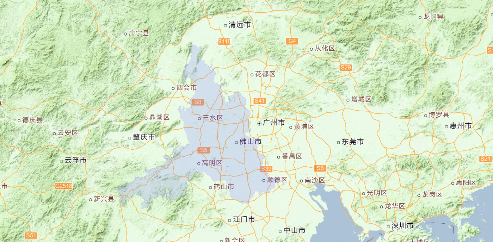

我是06年来佛山的，当时佛山GDP接近3000亿，排名全国11。南京、成都、武汉、宁波都在佛山后边，长沙、郑州更是看不到影。时至今日，佛山GDP未破万，而武汉、成都都上了15000，佛山常年对比对象无锡也11500了。

## 一、佛山经济问题，还得从1983年说起。

1983年，地级市佛山正式成立，原佛山地区12个县市分家为两个地级市：江门市、佛山市。在这之前，佛山市一般指现在佛山市禅城区除南庄镇以外的三个街道范围，先后为镇级市、县级市。在这场市县改革大潮中，佛山和江门各分得1市5县，佛山为：佛山市（县级）、南海县、顺德县、中山县、三水县、高明县。

改革开放前的县级佛山市

改革开放前的顺德县（大良）

改革开放前佛山石湾的陶瓷产业

1983年佛山建成区面积超过了15平方公里，城市人口规模在省内仅次于广州，同时代南海、顺德、中山等地基本还是大农村，县城规模则多在一平方公里以下。

随着改革开放的东风，珠三角迅速开启了村村点火户户冒烟+桑基鱼塘的工农业变革，集体土地被大量划片发包成为新型工农业用地，原有低效农业用地的价值被巨量释放，顺德、南海作为传统珠三角平原最核心的地区，自然禀赋高、开发难度小，加之当地人气魄胆识超前，个体和私营经济呈爆发式发展。

佛山在珠三角的地理位置

在这场大变革中，佛山城区的陶瓷、纺织、不锈钢等产业集聚发展，产生强大规模效应，并在全国市场占据了一定的领先地位。

但在佛山如日中天之际，下辖5县更是惊为天人，各路诸侯纷纷做大，并诞生了分家的念头：

1. 83年中山县率先改为中山市，由佛山市管县变为佛山代管县级市；
2. 88年中山市升格地级市；
3. 92年顺德县、南海县完成县改市；
4. 93年三水县改为三水市；
5. 94年高明县改为高明市。

> 到1994年底，佛山市实际管辖范围只剩下城区77平方公里。

---

## 二、顺德、南海的地级市梦。

77平方公里的佛山城区，在改革开放前就早已奠定了发展格局，石湾（陶瓷）、张槎（纺织）、澜石（不锈钢）三个乡镇合计50平方公里。相比较，南海18个乡镇、顺德12个乡镇，合计有2000多平方公里。

城区太小，县域太大，加上原属佛山地区的珠海县升级为特区，四小虎的东莞升级地级市、中山升级地级市，风头正盛的南海、顺德开始有了想法。

1. 1991年第一届百强县排名南海县第4，顺德县第9；
2. 1992年第二届百强县排名南海县第3，顺德县第5；
3. 1994年第三届百强县排名南海县第3，顺德县第4。

顺德的努力终于有了回报，2000年前夕，广东确定将顺德作为率先基本实现现代化试点市，并给予了顺德地级市管理权限，顺德离地级市只差最后一步。

1. 2000年第四届百强县排名顺德县第1，南海县第2；
2. 2001年第五届百强县排名顺德县第1，南海县第2；
3. 2002年第六届百强县排名顺德县第1，南海县第2。

顺德的后续发展虽然势头依旧高涨，但升格地级市一事竟然久拖未决。而同时期广东省则开始酝酿做出从经济大省向经济强省转变的战略决策。

2002年6月，佛山出现重大机遇转折。广东省要求佛山在广东从经济大省向经济强省的跨越中起到重要带动作用，跳出77平方公里的框框，加强对3800平方公里的整合力度，建成广东第三大城市，与国内苏州杭州等城市直接竞争。

* 一个月后，顺德书记冯润胜调离。
* 两个月后，黄龙云兼任佛山书记。
* 三个月后，南海、顺德、高明、三水4市上交了“市改区”方案。
* 五个月后，批复同意佛山行政区划调整。

## 三、大佛山的战略选择。

大佛山合并后，为了平衡顺德、南海落差，佛山主动放弃了一部分管理权限，开启了大规模简政放权序幕，市级权限被直接下放到区、镇，赋予各区较大的经济、财政、民生事业和社会管理自主权。例如，财政方面，市与区镇大概按照1:9进行分配。手握财权的乡镇立即打出了30万年薪聘请镇长的广告，在当时全国干部年收入普遍不足三万的情况下，轰动一时。

简政放权是佛山合并后作出的重大战略选择，并为之配套了三个重要变革：

1. 大规模的乡镇合并。佛山由合并前的58个镇街合并为32个（2002年以前顺德已撤并两个），几乎压缩了一半。
2. 大规模行政机构合并。例如顺德的党政机构数量从41个被压缩到16个，其力度之大，被外界称为“石破天惊”。
3. 镇街一级事权实体化。佛山的乡镇参照了东莞、中山等直筒子市（地级市管镇）模式，基本与县级机构设置无异。

但此种选择亦导致了三个突出问题：

1. **市、区两级空心化。** 全市日常行政执法几乎都由镇街包办，日常财政支出镇街占了一半以上，日常民生和社会管理等事物甚至直接压到了村、社区一级。市、区两级事权都出现空心化问题。例如，悦伦任市长时曾在会上坦言，佛山全市一年有1200亿财政收入，但市一级可支配财政资金不到全市1/10，偿还工程利息后，可支配资金甚至还不如辖区某些镇多。
2. **镇一级东施效颦。** 如按平均人口来计算，佛山辖5区、32镇街的这个行政区域架构，应该是全国大中城市里边最为精简的。同级别的长沙有9县市区170个镇街、无锡7个区县80个镇街、大连10区县市110个镇街、宁波有10县区市150个镇街、郑州12县区市100个镇街。佛山32个镇街，平均每个地区生产总值达到300亿，南海、顺德经常说自己是“大人穿童衣”，但其实整个佛山的镇街也都面临着“大人穿开裆裤”的窘境。佛山的镇与东莞、中山的镇在行政体制上存在本质不同，将在未来产生重大难题。
3. **发展格局跟不上发展需要。** 以一环和广佛地铁完工这两剂强心针为标志，在县域竞争逐渐退出历史舞台，市域竞争成为主流的时候，佛山陷入了持续“衰退期”，城市排名不断下跌，每新增一个地铁城市佛山地铁里程就要退后一位，GDP增长速度下降明显，城建品质长期被各类新兴城市在网上吊打，全市上下似乎都找不到明确方向。而东莞的松山湖和广深科技走廊，中山的深中通道和翠亨新区，珠海的横琴新区和港珠澳大桥都不可限量。
4. **面向未来的发展动能不足。** 佛山高新区（主体是南海高新区）面临散而不强（全国排名30左右），三龙湾仍处于概念阶段（所在土地分属顺德、南海、禅城三个区）前途不明，珠三角新枢纽机场也尚未确定选址。佛山仍然没有一个能够支撑“国家制造业创新中心”的拳头产品。例如高等教育方面，佛山自合并以来严重错失发展机遇，高等教育几乎毫无建树（华南师范大学南海校区建于2000年，广东财经三水校区建于1999年），1995年升本的佛山科技学院，至今排位仍在全国300名以后，在全国GDP前30城市（甚至前50）里边，高教水平稳居倒数第一。

## 四、佛山当前的主要问题。

1. **区划顽疾难以根治。** 市难管区、区难管镇、镇难管村，市级有名无实，上下合力缺失。之前佛山也想了很多办法，先后采取了“权力下放”、“广佛同城”、“代建新城”、“人事清理”等办法，近年也提出了加强“市级统筹”，软硬兼施，各条路都探了个遍。但说实在的，佛山要在不动区划的前提下真正把五区拧成一股绳，难度登天。
2. **工业发展过于分散。** 32个镇，镇镇有产业集聚，镇镇产业模式不一，统筹难度大，升级阻力多，难以做强。大量的工厂散布在村级、村小组一级的工业园中，园区内外交通、居住环境与时代脱节。
3. **产业结构过于传统。** 作为民营经济为主的工业大市，当前佛山的大多数产业在国内都具有相当程度的可替代性，包括白色家电、陶瓷、家具、建材、地产、纺织、饮料、调味品、汽车等等。在国家面向未来的5大战略新兴产业中，少有涉及。
4. **先发优势消耗殆尽。** 随着全国各地经济发展的水平差距将逐步缩小，大城市之间竞争也将更加白热化。佛山的很多创新、创意，其他地方分分钟就可以效仿，甚至做的更好。而佛山在教育、人才、财政资金、基础设施和科技等方面的弱点，将导致未来很长一段时间，都不会再有机会进入全国GDP前15位了。

## 五、佛山未来怎么办。

2018年，恰好就是40周年这么一个重要关头，佛山名义GDP增长率降至40年来最低。没破万亿或许也是对佛山一个忠告，站在万亿关口，再冷静一下，再好好想想，到底这几十年发生了什么，哪些地方要改，哪些地方绕不过去，好好想想未来30年的发展方向，或许这才是“高速”发展向“高质量”发展过渡的关键一步。

1. **尽快启动行政区划改革。** 增设乐从区、狮山区、西樵区（西樵、丹灶），镇一级适当拆分到50个左右；市、区、镇财政资金配比要全面调整，按照3-5-2，4-4-2甚至5-3-2来分配。
2. **加快建设重大交通项目。** 城市发展交通先行，7条地铁，15条远期规划要加快脚步。珠三角新枢纽机场必须尽快落地投入运营。大型河港整合得提上日程，散而不强不是好事。
3. **加大高等教育投入。** 狮山大学城应该扩容、提质了，全力引进两到三所双一流重点高校开办分校才是正道。佛山科技、佛山理工也要加快步伐，不能给佛山太丢脸。
4. **加快产业转移。** 刮骨疗毒，忍痛割GDP，对村级工业园来一次彻底的改革，能迁的坚决迁，把土地从低效产业中解放出来，为面向未来发展的重要产业、重点项目尽早腾出空间。
5. **正确处理广佛关系。** 广佛是不可能合并的，这辈子都不可能合并。佛山都不要想这条路。40年来的实践证明，佛山的发展只能靠自己。广州从来都只是锦上添花，绝非佛山安身立命之本。近期火热的“珠三角枢纽（广州新）机场”提法，又引起无数人遐想了。