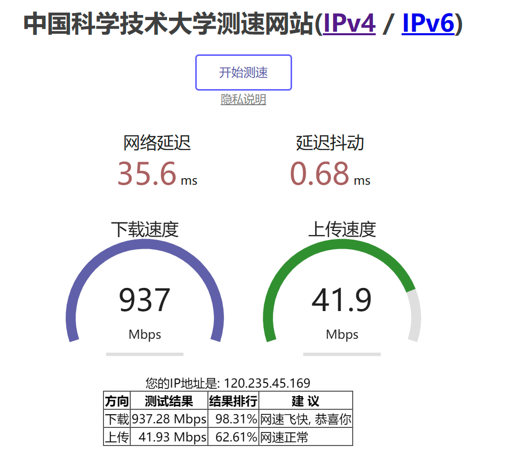
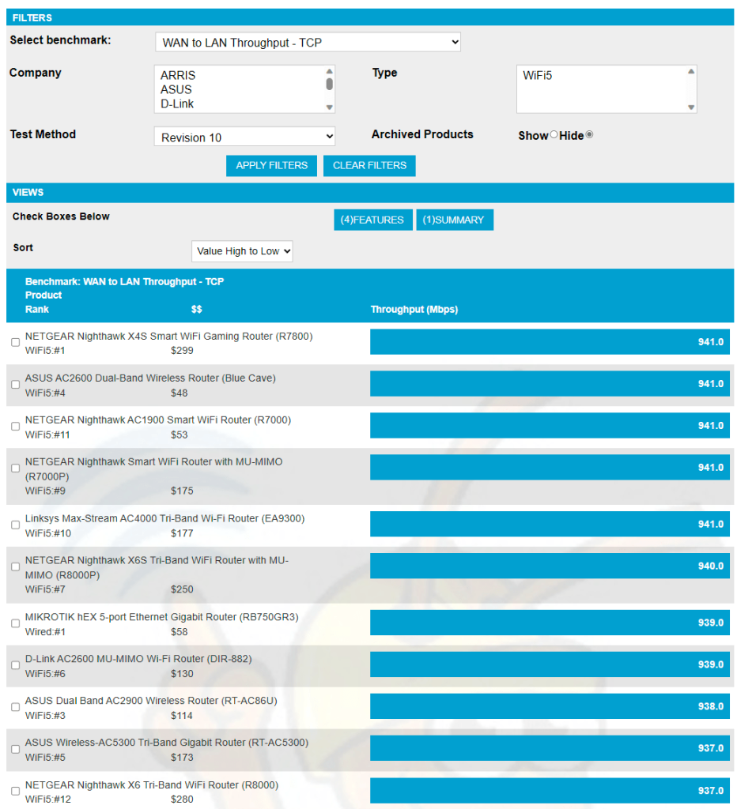

I wrote this question mainly because I searched all kinds of information on Baidu, and it was basically the same content. There were few articles that clarified this question. Most of them were nonsense. Sarcasm and personal attacks have no idea of solving the problem. Since I just encountered this problem, I will write a solution here.

## 1. Why is the speed of 1000M fiber optic broadband only 300M?**

Possible reasons: WAN TO LAN rate limit of the router; hardware acceleration is not enabled on the router.

1. Confirmation of prerequisites: The network has been upgraded to 1000M optical fiber, the optical modem supports Gigabit output, and the router WAN and LAN ports both support 1000M Gigabit speed.

2. to[http://Smallnetbuilder.com](http://Smallnetbuilder.com)Query the router WAN TO LAN rate.

  ​For example:
  > Netgear r7000 WAN TO LAN rate: 931Mbps   
  > Netgear r6300v2 WAN TO LAN rate: 806Mbps   
  > ASUS ac68u WAN TO LAN rate: 754.5Mbps   
  > TP TP-LINK TGR1900 WAN TO LAN rate: 631Mbps   
  > Netgear r6100 WAN TO LAN rate: 93.1Mbps

  Other no-name routers may have insufficient hardware capabilities, and the WAN to LAN rate itself is low. It is not surprising that the wan port accesses 1000M and the LAN port outputs 300M.`

3. Whether to enable NAT hardware acceleration in the router settings.

According to the actual measurement, when the R6300V2 does not enable NAT hardware acceleration, the WAN port can only input 1000M, and the LAN port can only output 300M.

When the NAT hardware acceleration is turned on, the WAN port can input 1000M, and the LAN port can output 800M.

## 2. Why is the speed measurement only 800M or 920M for 1000M fiber optic broadband?

For example, on nga someone asked "[Telecom gigabit broadband speed measurement is only 800~900M](https://ngabbs.com/read.php?tid=24003618&rand=981)"Many answers below basically miss the point. The core problem is that the maximum WAN to LAN rate of mainstream 1000M wifi6 routers is only about 920Mbps. You can check the relevant test results on the above website.

