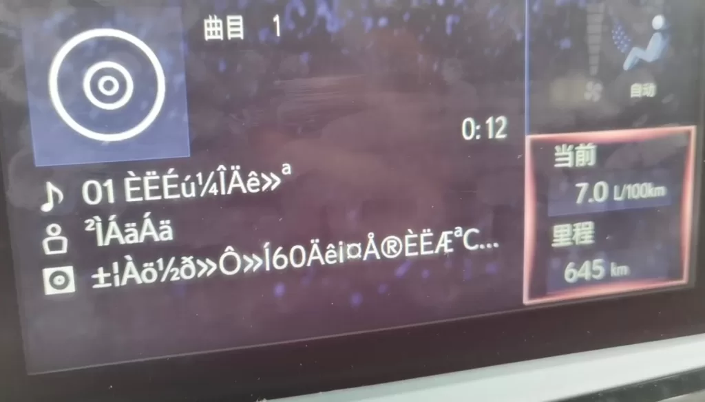

最近在刻录CD时遇到一个棘手的问题，在雷克萨斯的车载CD播放器上，无法读取中文音乐标签。
现在回头看看，这个问题或许在当下是无解的，这里只是记录下解决过程：

## 刻录程序选择。
在选择刻录CD前，详细搜索了各种刻录教程，主要区别是刻录软件的选择。先后选择过Nero、Brunatonce和ImgBurn。这三者，第一个为老牌收费软件，第二、三个为免费软件。但Brunatonce因为开发者已经十多年没更新，最新版停留在2004年的0.99.5，虽然可以在windows 11上采用xp兼容模式使用，但还是会遇到莫名的错误问题。另外，据说这三者间，Brunatonce是低速刻录效果最好的软件，可由于现在的CD刻录机已经没有低速刻录的说法，起步都是10x以上，所以意义也不大。这里主要还是推荐使用ImgBurn，虽然程序已经很久没更新，但开发者一直在http://forum.imgburn.com线上答疑，有任何问题都能在短时间内得到回复。

## 刻录方式选择。
即现有的音频资源以及需要实现的刻录目标。主要有三种区分方式：
1. 音频CD和音乐CD的选择。其中音频CD是指通过WAV格式逆转的无损模拟音频格式*.cda，为非数字音乐，默认购买的CD唱片都是此种格式。音乐CD为数字音乐格式，一般支持mp3/wma/aac等压缩音乐格式。就2022年的当下来说，刻录CD一般都是追求前者，后者的效果不会比蓝牙听歌好上多少。
2. 音频CD资源的选择。一般有三种可刻录为音频CD的音乐格式：WAV、FLAC、APE。而同一种格式的音乐文件又有整轨和分轨的区别，即单张CD为一整个400-700MB左右的文件，或10多个30-50MB左右的单曲文件。如果是在资源网下载的，比较多的是整轨文件，而在QQ音乐等平台只能下载单曲，无法将整个CD作为一个文件下载下来。一般建议选择整轨文件刻录，一方面不用担心CD容量不够用，另一方面整轨文件一般都会自带CUE文件，或者ape这种格式也可以直接通过foobar2000提取出CUE文件。自选歌曲组合刻录的时候，主要需要计算的是CD容量，一般不要超过750MB。
3. 音频CD-TEXT制作。上边已经提到，音频CD是1982年推出的模拟音乐格式，当时的CD同歌曲磁带一样，都是不可能记录歌曲信息的。但在1995年索尼联合飞利浦推出了CD-TEXT标准，可以在CD文件的最前段嵌入CD相关曲目信息，此后，1997年Jeff Arnold在CD-TEXT基础上发展了CUE Sheet文件，并被后续几乎所有主流播放器支持。当然，问题也就在此，不管是CD-TEXT标准的*.cdt文件，还是后续的*.cue文件，在上个世纪90年代windows 95时代，几乎是没有考虑过原生支持中文的。前者*.cdt文件只支持ASCII（英文字母）、8859（英语和欧语字母）、MS-JIS（部分日文字符）三种字符编码，后者CUE则仅支持ANSI字符编码。其中，ANSI编码最为坑，这个编码在北美自动识别为ASCII，在中国大陆自动转换为GB2312，在日本自动转换为Shfit-JIS。即，如果在一台设置为中文环境下的Windows电脑中制作一份ANSI编码的CUE文件，在英文环境下的Windows电脑中打开是乱码的。
  
> 本次我遇到的最大问题就是雷克萨斯的CD播放机不支持中国大陆的的GB2312模式ANSI，因此采用通行的cue文件刻录法，在遇到中文时必然乱码。除非是采取cdt文件编辑模式，但目前网上几乎没有现成的cdt文件编辑器，即便NERO中可以写入cd-text文件，但它依然采取的NERO开发的*.nra文件来转换，实测并没有效果。个人能找到的方法，只有使用索尼官方1995年发布的cdt编辑器来编辑，但如果想置入中文，只能在MS-JIS日文环境的Windows 95中来编辑，借助MS-JIS中包含的2500个日文中常用的中文字符来实现。这种办法就有点太折腾了，我在跟ImgBrun的开发者讨论时，他也建议我还是放弃算了。

## 刻录过程思路。
第一次刻录发现乱码现象时，我找遍了中文圈中关于CUE文件方面的信息，得出了三个结论：
1. CUE必须使用ANSI格式；
2. 不同地区的ANSI编码不一样（如上"2."）；
3. 刻录的CD在电脑上播放时，除非使用专门插件，否则一般无法看到中文CD-TEXT的效果，例如在Foobar2000中，通通显示为乱码。
第二次刻录时，我选择安装hyper-v虚拟机测试英文Windows 11环境下cue文件编码问题，发现了三个问题：
1. 中文ANSI编码的文件在英文环境下显示为乱码（如上"2."）；
2. windows 11上的记事本打开的UTF-8编码跟windows XP记事本中打开的UTF-8编码不是同一个东西，XP的UTF-8对应的是windows 11中的UTF-16 LE，这点在ImgBurn中体现的比较明显，只有使用转换为UTF-16LE的cue文件才能在英文环境的ImgBurn中正常加载，否则显示为乱码。
3. 虽然使用UTF-16 LE编码的CUE文件能被ImgBurn识别，但这种编码的CUE文件不可能成功刻入，因为CUE文件本身只支持ANSI编码，即便是在ImgBurn中选择在识别UTF-16 LE编码文件后强制输出ANSI，亦显示为乱码。

## 总结。

CD已经是过去式了。如今无论是U盘、手机蓝牙还是CarPlay、HiCar、CarLife等连接模式，均比CD方便易用很多倍，作为一种可以称之为过时的技术，现在再来寻求技术支持已经非常之难。难得的是在解决问题的过程中，还是遇到很多互联网上的有用信息，比如在日文网站上搜索到2002年关于CD-TEXT如何支持日文的数百页讨论，在ImgBurn上看到开发者20年如一日，一直在默默的给予小众用户支持，在GNU、SONY官网看到近30年前的技术文档链接依然保存完好。相比较下，中文互联网上搜索有用的信息真是太难了，别说20年前的网页链接能否正常打开，光是正常搜索信息都牛头不对马嘴，几篇文章抄来抄去，最后也没发现个所以然。例如，在很多关于CUE的中文技术文档中显示，CD-text文件支持8种语言，但具体支持哪8种，是否包含中文编码，没有一个地方能找到信息，通过英文搜索发现，这个说法的来源是GNU上一篇技术原稿，基本是原文照抄的，但GNU上的技术文稿给出了准确的依据来源，即SONY DADC上的官方文档，从里边发现这所谓8种语言，除了日文外，其他都是英文、德文、法文等欧语区语言，不包含中文。就此才断了念想。