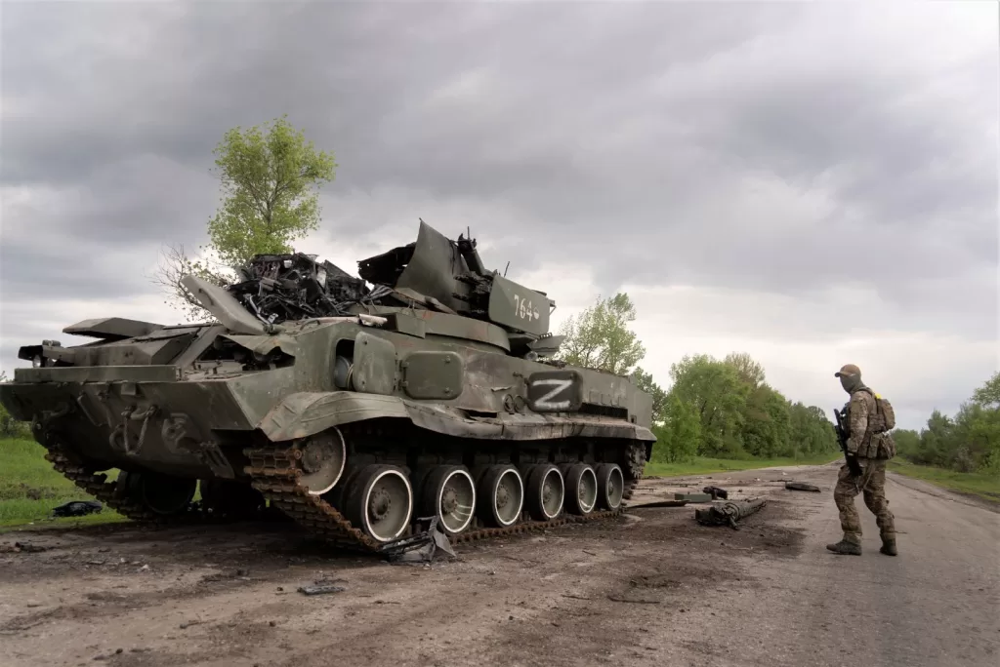

## What is the nature of the Russia-Ukraine war?

Regarding the causes of the Russia-Ukraine war, there have been very detailed analyzes on the Internet. Some have been counted since the Crimean War in 2014, some have been counted since the disintegration of the Soviet Union in 1991, some have been counted since Lenin established Ukraine, and some even date back to the era of Tsarist Russia and even Kievan Rus. But just looking at this Russia-Ukraine war, the direct reason is that Ukraine wants to join NATO, unilaterally change the security status quo of Russia and Ukraine, and wants to use the power of NATO to fully confront Russia. NATO, headed by the United States, regards Ukraine as a pawn and continues to provoke Russia in terms of security, putting unprecedented pressure on Russia's security situation. Referring to Maslow's need principle, security and survival are the most fundamental and bottom-line needs of a country. If they pose a huge threat to a country's security, they will inevitably lead to fierce resistance, and this war is exactly the result that NATO, led by the United States, would like to see.

According to the theory of justifiable self-defense in the Criminal Law, it is "instigation to defend" (Instigation of Defense) to intentionally irritate the other party and induce the other party to infringe oneself by using improper means such as provocation and provocation, and then use "justifiable self-defense" as an excuse to carry out the harm. of Defense), which is an illegal act and is not protected by law. NATO, headed by the United States, essentially adopted a defensive method in the Russia-Ukraine war, deliberately angering Russia, luring Russia to invade Ukraine, and then using "launching war" as an excuse to impose comprehensive sanctions on Russia.

## As Chinese citizens, what attitude should we take towards the Russia-Ukraine War?

     Russia and China are a comprehensive strategic partnership of coordination, which I believe most people have heard of. But Ukraine also has a profound friendship with China. Ukraine is China’s first strategic partner in Central and Eastern Europe, and it is also the third country to establish a strategic partnership with China after Russia and Kazakhstan in the post-Soviet era. Regarding the Russia-Ukraine war, China, as a friend of both sides, is extremely unwilling to see it, but since the war has already happened, as Chinese citizens, we should also correctly view the war from the perspective of national interests, and not casually stand in line. It mainly includes 3 aspects:

- We must respect the integrity of a country's territory and sovereignty, and do not support unilateral changes to another country's sovereignty and territory from the outside, that is, we do not support Russia's occupation of the Donbas region by means of war and its inclusion in its own territory.

- It is necessary to respect the settlement of international disputes through peaceful means and not to support the settlement of international disputes through war, that is, to support the two sides to resolve current issues through negotiation instead of continuing to expand the scale of war or even linking external forces to join the war.

- We must resolutely oppose wars that are against humanity and inhumane means, that is, the warring parties must not resort to attacking civilians, genocide, or using weapons of mass destruction to achieve their war goals. Both warring parties should try their best to protect Chinese nationals from the war.
