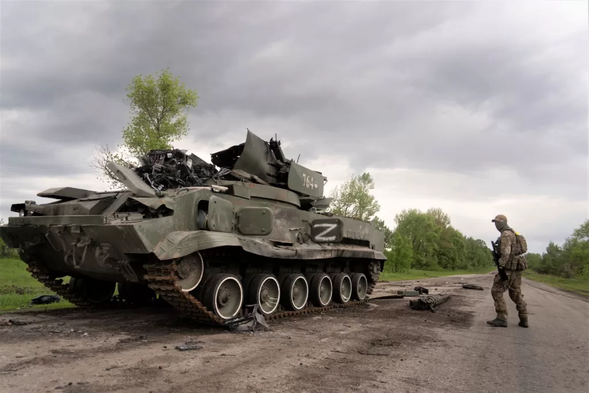

## 俄乌战争是什么性质？

关于俄乌战争的起因，网上已经有很详细的分析。有从2014年克里米亚战争以来起算的，有从91年苏联解体起算的，有从列宁建立乌克兰起算的，甚至还有追溯到沙俄乃至基辅罗斯时代起算的。但单就本场俄乌战争来看，直接原因是乌克兰想加入北约，单方改变俄乌安全现状，欲借北约之力，全面对抗俄罗斯。而以美国为首北约视乌克兰为棋子，在安全方面不断挑衅俄罗斯，对俄罗斯安全局势造成前所未有压力。参照马斯洛需求原理，安全和生存是国家最根本最底线的需求，对一国安全造成巨大威胁，势必引发剧烈抵抗，而这场战争正是美国为首北约乐于见到的结果。

按照刑法中关于正当防卫的理论，对于以挑拨寻衅等不正当手段，故意激怒对方，引诱对方对自己进行侵害，然后以“正当防卫”为借口，实行加害的行为，是“挑拨防卫”（Instigation of Defense），为违法行为，不受法律保护。以美国为首的北约，在俄乌战争中实质采取的就是挑拨防卫方式，故意激怒俄罗斯，引诱俄罗斯对乌克兰进行侵害，然后以“发动战争“为借口，对俄罗斯实施全面制裁。

## 作为中国公民，我们对待俄乌战争应当持何种态度？

俄罗斯与中国是全面战略协作伙伴关系，这个相信大多数人都听说过。但乌克兰与中国也有着深厚的友谊，乌克兰是中国在中东欧地区建立的第一个战略伙伴，也是后苏联时代，继俄罗斯和哈萨克斯坦之后，第三个与中国建立战略伙伴关系的国家。对于俄乌战争，中国作为双方的朋友，是极不愿意看到的，但既然战争已经发生，作为中国公民，我们也应当从国家利益出发来正确看待这场战争，不随便站队。主要包括3个方面：

1. 要尊重一国领土和主权完整，不支持从外部单方面改变另一国家主权和领土，即不支持俄罗斯通过战争方式占领顿巴斯地区并将其纳入自己版图。

2. 要尊重通过和平方式解决国际争端，不支持通过战争方式解决国际争端，即支持双方通过谈判解决当前问题，而不是继续扩大战争规模，甚至勾连外部力量加入战争。

3. 要坚决反对反人类、不人道方式的战争，即交战双方不得采取攻击平民、种族灭绝，以及使用大规模杀伤性武器等反人类方式达成战争目的。交战双方都应尽力保障我国侨民不受战争侵害。