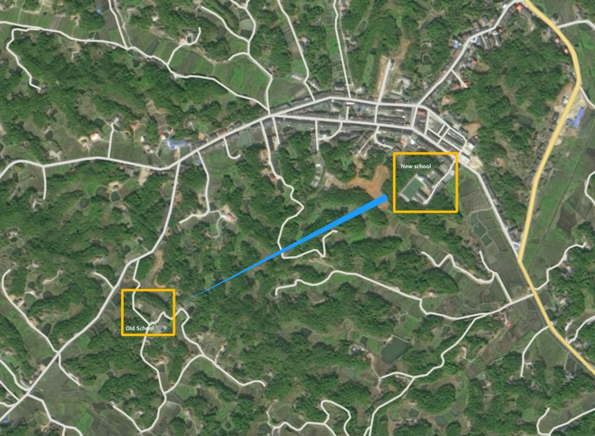

This is my junior high school alma mater, and I spent 3 happy years here from 2000 to 2003. The building was built before 1980, when it was built on top of a remote hill because arable land could not be occupied. At that time, the building standards were not high and the quality was not very good, but as a rural middle school, it was not easy to do this. Unfortunately, with the urbanization of China, this school was abandoned after 2005 and a new school was built in the center of our town.

