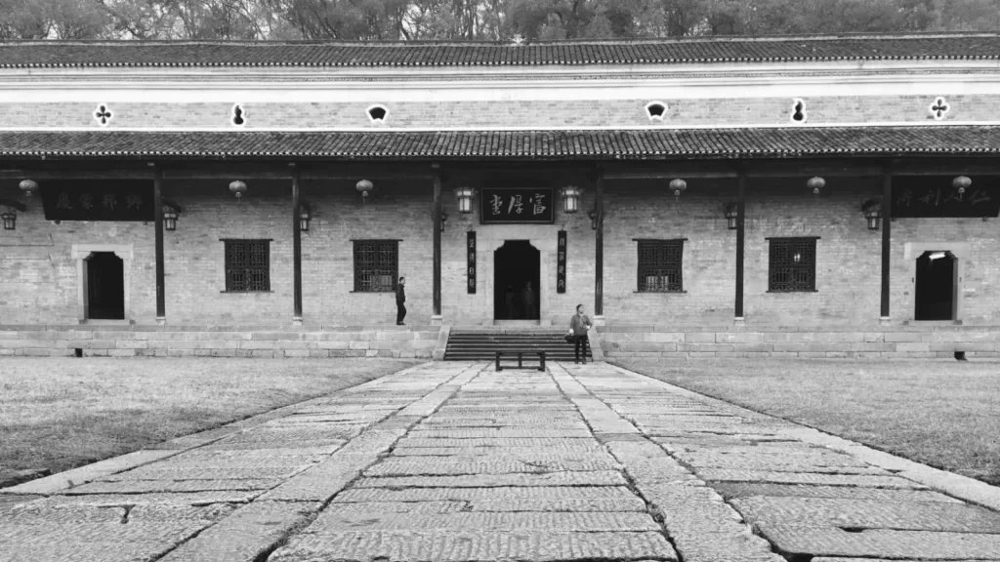
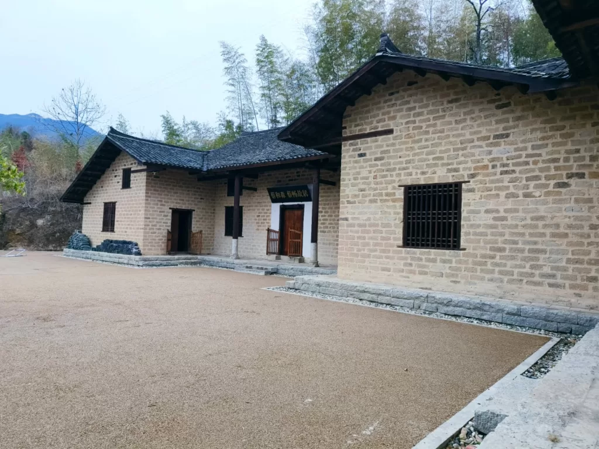
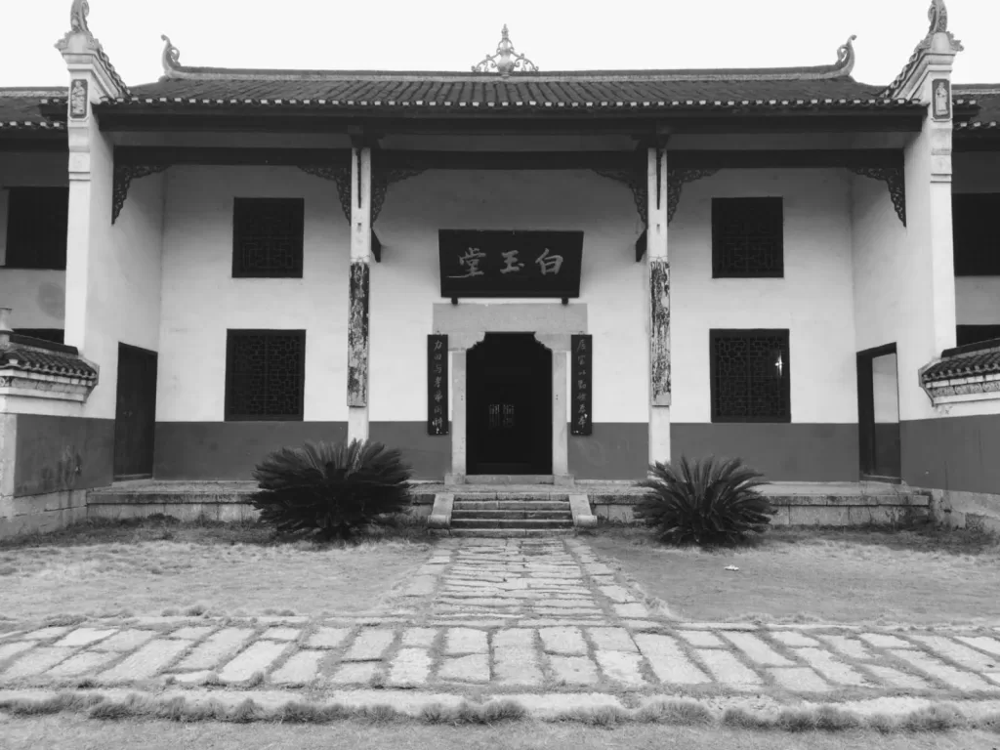
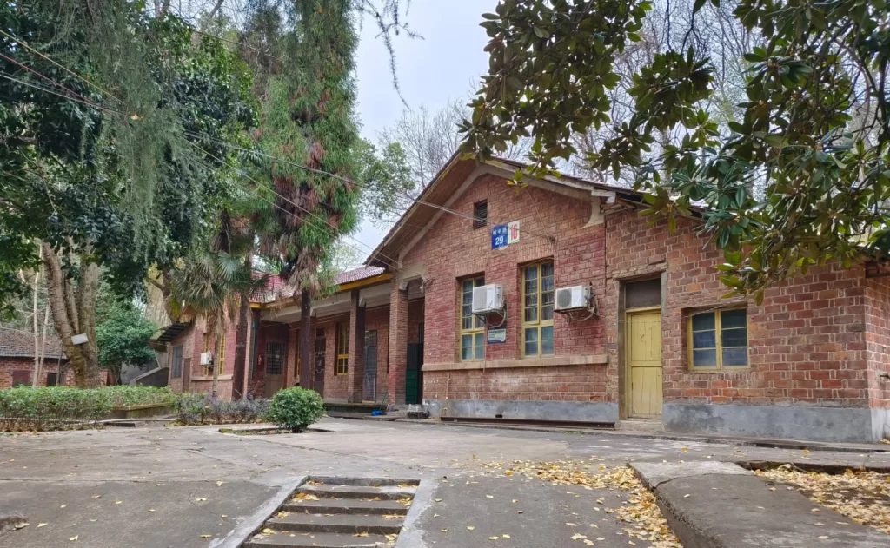

<figure>

<figcaption>

in Shuangfeng country,Hunan Province , build in 1860s

</figcaption>

</figure>

 

<figure>

<figcaption>

in Shuangfeng country,Hunan Province , build in 1920s

</figcaption>

</figure>

<figure>

<figcaption>

in Shuangfeng country,Hunan Province , build in 1950s

</figcaption>

</figure>

<figure>

<figcaption>

in Shuangfeng country,Hunan Province , build in 1980s

</figcaption>

</figure>